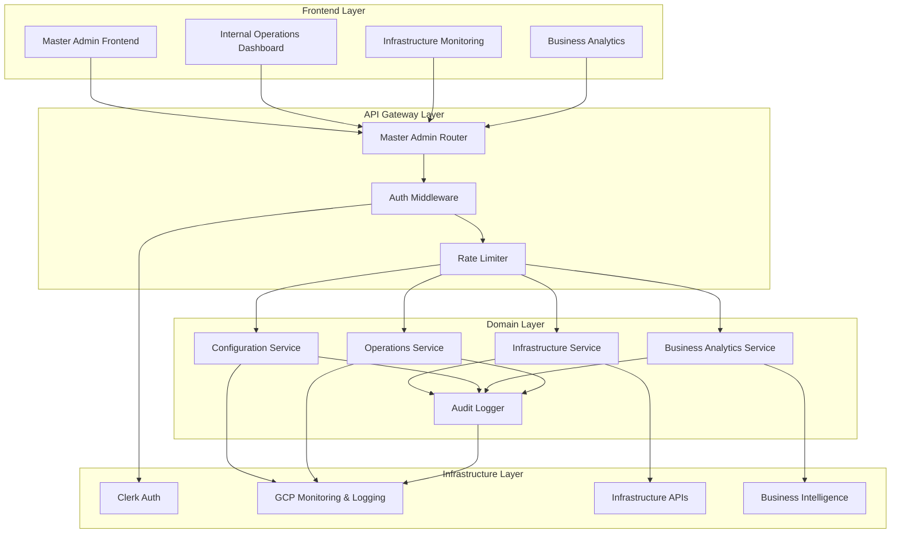
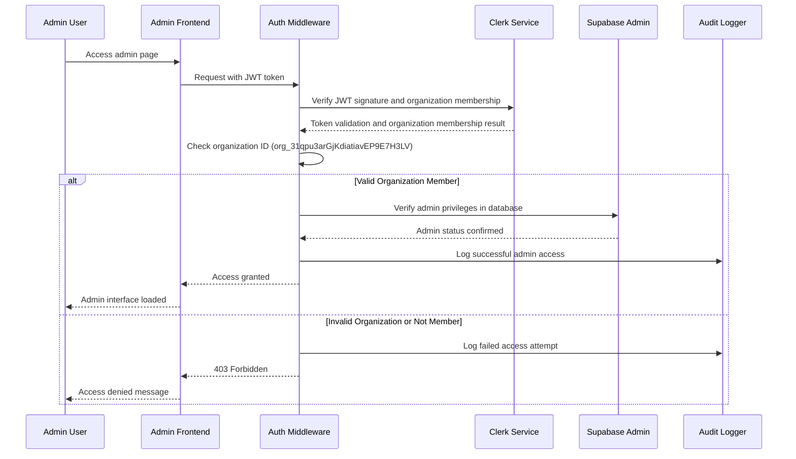

# 設計ドキュメント

## 概要

マスター管理者認証および内部運営システムは、サービスプロバイダーの管理機能に対して、Clerk組織ベースの安全なアクセスを提供します。このシステムは、認可されたサービスプロバイダー担当者へのアクセスを制限するために、Clerkの組織メンバーシップと検証済みドメイン機能を活用し、インフラ管理、ビジネスインテリジェンス、およびサービスプロバイダーワークフロー用の集中認可ミドルウェアと内部運営ダッシュボードを実装します。

設計はドメイン駆動アーキテクチャパターンに従い、認証の関心事、インフラ監視、システム設定、ビジネス分析、およびサービスプロバイダー運営を別個でありながら統合されたコンポーネントに分離します。システムは認証のためにClerk組織メンバーシップ（org_31qpu3arGjKdiatiavEP9E7H3LV）と検証済みドメイン「shintairiku.jp」を活用し、顧客管理よりも内部サービスプロバイダー運営に焦点を当て、インフラ監視およびビジネスインテリジェンスツールと統合します。

## アーキテクチャ

### 高レベルアーキテクチャ



### 認証フロー



## コンポーネントとインターフェース

### 1. 認証コンポーネント

#### Clerk組織バリデーター
**Location**: `backend/app/common/auth.py`

**責任**:
- ClerkからのJWTトークンの検証
- 組織メンバーシップクレームの抽出と検証
- 指定された管理者組織IDとの照合
- 組織メンバーシップステータスの検証

**インターフェース**:
```python
class ClerkOrganizationValidator:
    def __init__(self, admin_org_id: str)
    async def validate_admin_token(self, token: str) -> AdminUser
    async def extract_organization_from_token(self, token: str) -> Optional[str]
    def is_admin_organization_member(self, org_id: str) -> bool
```

#### 管理者認可ミドルウェア
**Location**: `backend/app/middleware/admin_auth.py`

**責任**:
- @require_admin デコレーターの提供
- 自動監査ログ記録
- エラー処理とレスポンス形式設定
- セッション管理

**インターフェース**:
```python
@require_admin
async def admin_endpoint(current_admin: AdminUser = Depends(get_current_admin)):
    # Admin-only endpoint logic
    pass

class AdminAuthMiddleware:
    async def verify_admin_privileges(self, request: Request) -> AdminUser
    async def log_admin_action(self, admin: AdminUser, action: str, details: dict)
```

### 2. ダッシュボードコンポーネント

#### ダッシュボードサービス
**Location**: `backend/app/domains/admin/dashboard_service.py`

**責任**:
- システムメトリドクスの集約
- KPIと統計の計算
- 頻繁にアクセスされるデータのキャッシュ
- リアルタイム更新の提供

**インターフェース**:
```python
class DashboardService:
    async def get_user_metrics(self) -> UserMetrics
    async def get_subscription_metrics(self) -> SubscriptionMetrics
    async def get_organization_metrics(self) -> OrganizationMetrics
    async def get_system_health_metrics(self) -> SystemHealthMetrics
    async def get_api_usage_statistics(self) -> ApiUsageStats
```

#### メトリデクス計算機
**Location**: `backend/app/domains/admin/metrics_calculator.py`

**責任**:
- ユーザー成長率の計算
- サブスクリプション収益の算出
- API使用パターンの分析
- トレンドデータの生成

### 3. ユーザー管理コンポーネント

#### ユーザー管理サービス
**Location**: `backend/app/domains/user/admin_service.py`

**責任**:
- 管理者権限でのユーザーCRUD操作
- アカウントの停止/有効化
- 一括操作とエクスポート
- Clerk同期

**インターフェース**:
```python
class UserAdminService:
    async def list_users(self, filters: UserFilters, pagination: Pagination) -> UserList
    async def get_user_details(self, user_id: str) -> UserDetails
    async def suspend_user(self, user_id: str, reason: str) -> None
    async def activate_user(self, user_id: str) -> None
    async def export_users_csv(self, filters: UserFilters) -> bytes
```

### 4. 組織管理コンポーネント

#### 組織管理サービス
**Location**: `backend/app/domains/organization/admin_service.py`

**責任**:
- 管理者権限での組織CRUD
- メンバー管理操作
- 所有権の移転
- Clerk組織同期

**インターフェース**:
```python
class OrganizationAdminService:
    async def list_organizations(self, filters: OrgFilters) -> OrganizationList
    async def get_organization_details(self, org_id: str) -> OrganizationDetails
    async def manage_members(self, org_id: str, operation: MemberOperation) -> None
    async def transfer_ownership(self, org_id: str, new_owner_id: str) -> None
```

### 5. インフラコンポーネント

#### Supabase管理者クライアント
**Location**: `backend/app/infrastructure/supabase_admin.py`

**責任**:
- サービスロールキー認証
- 管理者操作のRLSバイパス
- コネクションプールとエラー処理
- トランザクション管理

**インターフェース**:
```python
class SupabaseAdminClient:
    async def __aenter__(self) -> SupabaseClient
    async def __aexit__(self, exc_type, exc_val, exc_tb)
    async def execute_admin_query(self, query: str, params: dict) -> Any
```

#### 監査ロガー
**Location**: `backend/app/infrastructure/admin_audit.py`

**責任**:
- 構造化監査ログの作成
- GCP Cloud Logging統合
- 改ざん防止ログ記録
- ログ保持管理

**インターフェース**:
```python
class AdminAuditLogger:
    async def log_admin_action(self, action: AdminAction) -> None
    async def log_security_event(self, event: SecurityEvent) -> None
    async def query_audit_logs(self, filters: AuditFilters) -> AuditLogList
```

## データモデル

### コア管理者モデル

```python
@dataclass
class AdminUser:
    user_id: str
    email: str
    full_name: str
    organization_id: str
    organization_slug: str
    admin_privileges: List[str]
    last_login: datetime
    session_id: str

@dataclass
class AdminAction:
    timestamp: datetime
    admin_user_id: str
    admin_email: str
    action: str
    target_resource: str
    target_type: str
    details: dict
    ip_address: str
    user_agent: str
    session_id: str

@dataclass
class DashboardMetrics:
    active_users: int
    new_registrations: RegistrationStats
    subscription_metrics: SubscriptionStats
    organization_metrics: OrganizationStats
    system_health: SystemHealthStats
    api_usage: ApiUsageStats
    last_updated: datetime
```

### データベーススキーマ拡張

システムは既存のデータベーステーブルを活用し、管理者固有のビューと関数を追加します:

**管理者ビュー**:
- `admin_user_summary`: Aggregated user data for admin interface
- `admin_organization_summary`: Organization data with member counts and subscription status
- `admin_subscription_metrics`: Revenue and subscription analytics
- `admin_system_metrics`: System-wide usage statistics

**管理者関数**:
- `calculate_user_growth(period)`: User registration trends
- `get_subscription_revenue(period)`: Revenue calculations
- `get_api_usage_stats(period)`: API usage analytics

## エラー処理

### 認証エラー

```python
class AdminAuthenticationError(Exception):
    """Raised when admin authentication fails"""
    pass

class InvalidOrganizationError(AdminAuthenticationError):
    """Raised when user is not member of admin organization"""
    pass

class OrganizationMembershipRequiredError(AdminAuthenticationError):
    """Raised when organization membership is required but not found"""
    pass
```

### エラーレスポンス形式

```json
{
  "error": {
    "code": "ADMIN_AUTH_FAILED",
    "message": "Authentication failed: Not a member of admin organization",
    "details": {
      "user_organization": "org_user123",
      "required_organization": "org_31qpu3arGjKdiatiavEP9E7H3LV"
    },
    "timestamp": "2025-01-20T10:30:00Z",
    "request_id": "req_123456"
  }
}
```

## テスト戦略

### ユニットテスト

**認証コンポーネント**:
- JWT token validation with various domain scenarios
- Google Workspace domain verification logic
- Personal Gmail rejection functionality
- Admin privilege checking

**ダッシュボードサービス**:
- Metrics calculation accuracy
- Data aggregation performance
- Cache invalidation logic
- Real-time update mechanisms

**ユーザー管理**:
- CRUD operations with proper authorization
- Bulk operations and export functionality
- Clerk synchronization handling
- Error scenarios and rollback

### 統合テスト

**認証フロー**:
- End-to-end admin login process
- Token validation with Clerk service
- Database privilege verification
- Audit logging integration

**APIエンドポイント**:
- Admin API response formats
- Error handling consistency
- Rate limiting behavior
- CORS configuration

### パフォーマンステスト

**ダッシュボード読み込み**:
- Metrics calculation under load
- Database query optimization
- Cache performance
- Concurrent admin user handling

**スケーラビリティ**:
- Large dataset handling (10,000+ users)
- Bulk operation performance
- Export functionality with large datasets
- Real-time update performance

## セキュリティ考慮事項

### 認証セキュリティ

- **JWT Signature Verification**: Mandatory in production environments
- **Domain Validation**: Strict checking against allowed Google Workspace domains
- **Session Management**: Secure session handling with appropriate timeouts
- **Token Refresh**: Automatic token renewal for long admin sessions

### 認可セキュリティ

- **Principle of Least Privilege**: Admin operations require explicit authorization
- **Operation Confirmation**: Critical operations require additional confirmation
- **Audit Trail**: Complete logging of all administrative actions
- **IP Restrictions**: Future implementation of IP-based access control

### データセキュリティ

- **RLS Bypass Control**: Careful management of Service Role Key usage
- **Data Encryption**: Sensitive data encryption at rest and in transit
- **Access Logging**: Detailed logging of all data access operations
- **Backup Security**: Secure backup and recovery procedures

## パフォーマンス最適化

### データベース最適化

**インデックシング戦略**:
- Composite indexes for admin queries
- Partial indexes for active users/organizations
- Covering indexes for dashboard metrics

**クエリ最適化**:
- Materialized views for complex aggregations
- Query result caching for dashboard data
- Connection pooling for admin operations

### キャッシュ戦略

**ダッシュボードメトリックス**:
- Redis caching for frequently accessed metrics
- 5-minute cache TTL with background refresh
- Cache invalidation on data changes

**ユーザー/組織データ**:
- Application-level caching for user details
- Cache warming for frequently accessed data
- Distributed cache for multi-instance deployments

### APIパフォーマンス

**レスポンス最適化**:
- Pagination for large datasets
- Field selection for reduced payload size
- Compression for large responses

**並行処理**:
- Async/await for I/O operations
- Connection pooling for database access
- Rate limiting to prevent abuse

## 監視と可観測性

### メトリックス収集

**システムメトリックス**:
- Admin login frequency and success rates
- API response times and error rates
- Database query performance
- Cache hit/miss ratios

**ビジネスメトリックス**:
- Admin operation frequency
- User management activity
- System configuration changes
- Security event frequency

### アラート

**セキュリティアラート**:
- Failed admin authentication attempts
- Unusual admin activity patterns
- Privilege escalation attempts
- Data access anomalies

**パフォーマンスアラート**:
- API response time degradation
- Database query timeout
- Cache performance issues
- High error rates

### ログ記録

**構造化ログ記録**:
- JSON format for all log entries
- Consistent field naming and types
- Correlation IDs for request tracking
- Log level appropriate filtering

**ログ保持**:
- Admin audit logs: 7 years retention
- Security logs: 3 years retention
- Performance logs: 90 days retention
- Debug logs: 30 days retention