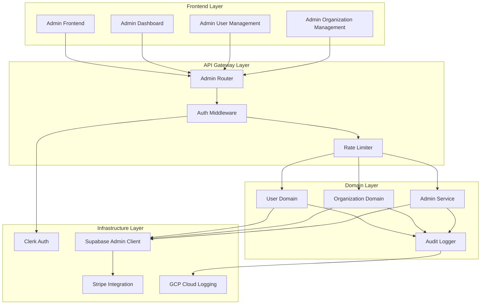
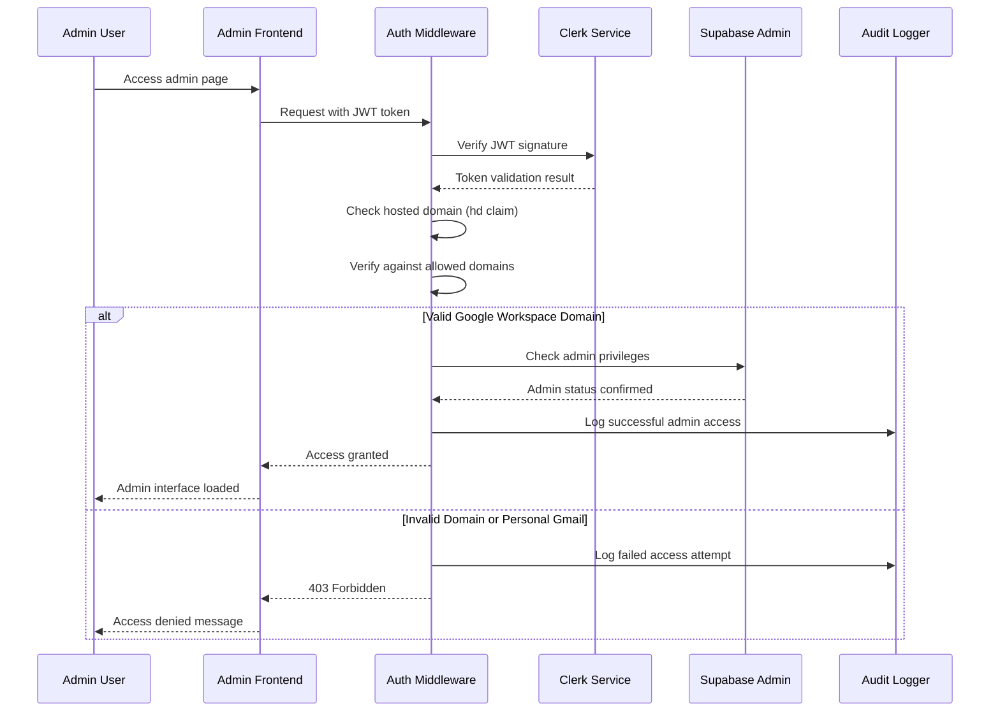

# Design Document

## Overview

The admin authentication and dashboard system provides secure, Google Workspace SSO-restricted access to platform administrative functions. The system implements a comprehensive authentication layer, centralized authorization middleware, and a monitoring dashboard that serves as the foundation for the broader administrative interface.

The design follows a domain-driven architecture pattern, separating authentication concerns, user management, organization management, and system monitoring into distinct but integrated components. The system leverages existing infrastructure including Clerk for authentication, Supabase for data persistence, and integrates with Stripe for subscription management.

## Architecture

### High-Level Architecture



### Authentication Flow



## Components and Interfaces

### 1. Authentication Components

#### Google Workspace SSO Validator
**Location**: `backend/app/common/auth.py`

**Responsibilities**:
- Validate JWT tokens from Clerk
- Extract and verify hosted domain (hd) claim
- Check against allowed Google Workspace domains
- Reject personal Gmail accounts (@gmail.com)

**Interface**:
```python
class GoogleWorkspaceValidator:
    def __init__(self, allowed_domains: List[str])
    async def validate_admin_token(self, token: str) -> AdminUser
    async def extract_domain_from_token(self, token: str) -> Optional[str]
    def is_personal_gmail(self, email: str) -> bool
```

#### Admin Authorization Middleware
**Location**: `backend/app/middleware/admin_auth.py`

**Responsibilities**:
- Provide @require_admin decorator
- Automatic audit logging
- Error handling and response formatting
- Session management

**Interface**:
```python
@require_admin
async def admin_endpoint(current_admin: AdminUser = Depends(get_current_admin)):
    # Admin-only endpoint logic
    pass

class AdminAuthMiddleware:
    async def verify_admin_privileges(self, request: Request) -> AdminUser
    async def log_admin_action(self, admin: AdminUser, action: str, details: dict)
```

### 2. Dashboard Components

#### Dashboard Service
**Location**: `backend/app/domains/admin/dashboard_service.py`

**Responsibilities**:
- Aggregate system metrics
- Calculate KPIs and statistics
- Cache frequently accessed data
- Provide real-time updates

**Interface**:
```python
class DashboardService:
    async def get_user_metrics(self) -> UserMetrics
    async def get_subscription_metrics(self) -> SubscriptionMetrics
    async def get_organization_metrics(self) -> OrganizationMetrics
    async def get_system_health_metrics(self) -> SystemHealthMetrics
    async def get_api_usage_statistics(self) -> ApiUsageStats
```

#### Metrics Calculator
**Location**: `backend/app/domains/admin/metrics_calculator.py`

**Responsibilities**:
- Calculate user growth rates
- Compute subscription revenue
- Analyze API usage patterns
- Generate trend data

### 3. User Management Components

#### User Management Service
**Location**: `backend/app/domains/user/admin_service.py`

**Responsibilities**:
- User CRUD operations with admin privileges
- Account suspension/activation
- Bulk operations and exports
- Clerk synchronization

**Interface**:
```python
class UserAdminService:
    async def list_users(self, filters: UserFilters, pagination: Pagination) -> UserList
    async def get_user_details(self, user_id: str) -> UserDetails
    async def suspend_user(self, user_id: str, reason: str) -> None
    async def activate_user(self, user_id: str) -> None
    async def export_users_csv(self, filters: UserFilters) -> bytes
```

### 4. Organization Management Components

#### Organization Admin Service
**Location**: `backend/app/domains/organization/admin_service.py`

**Responsibilities**:
- Organization CRUD with admin privileges
- Member management operations
- Ownership transfers
- Clerk organization synchronization

**Interface**:
```python
class OrganizationAdminService:
    async def list_organizations(self, filters: OrgFilters) -> OrganizationList
    async def get_organization_details(self, org_id: str) -> OrganizationDetails
    async def manage_members(self, org_id: str, operation: MemberOperation) -> None
    async def transfer_ownership(self, org_id: str, new_owner_id: str) -> None
```

### 5. Infrastructure Components

#### Supabase Admin Client
**Location**: `backend/app/infrastructure/supabase_admin.py`

**Responsibilities**:
- Service Role Key authentication
- RLS bypass for admin operations
- Connection pooling and error handling
- Transaction management

**Interface**:
```python
class SupabaseAdminClient:
    async def __aenter__(self) -> SupabaseClient
    async def __aexit__(self, exc_type, exc_val, exc_tb)
    async def execute_admin_query(self, query: str, params: dict) -> Any
```

#### Audit Logger
**Location**: `backend/app/infrastructure/admin_audit.py`

**Responsibilities**:
- Structured audit log creation
- GCP Cloud Logging integration
- Tamper-proof logging
- Log retention management

**Interface**:
```python
class AdminAuditLogger:
    async def log_admin_action(self, action: AdminAction) -> None
    async def log_security_event(self, event: SecurityEvent) -> None
    async def query_audit_logs(self, filters: AuditFilters) -> AuditLogList
```

## Data Models

### Core Admin Models

```python
@dataclass
class AdminUser:
    user_id: str
    email: str
    full_name: str
    workspace_domain: str
    admin_privileges: List[str]
    last_login: datetime
    session_id: str

@dataclass
class AdminAction:
    timestamp: datetime
    admin_user_id: str
    admin_email: str
    action: str
    target_resource: str
    target_type: str
    details: dict
    ip_address: str
    user_agent: str
    session_id: str

@dataclass
class DashboardMetrics:
    active_users: int
    new_registrations: RegistrationStats
    subscription_metrics: SubscriptionStats
    organization_metrics: OrganizationStats
    system_health: SystemHealthStats
    api_usage: ApiUsageStats
    last_updated: datetime
```

### Database Schema Extensions

The system leverages existing database tables and adds admin-specific views and functions:

**Admin Views**:
- `admin_user_summary`: Aggregated user data for admin interface
- `admin_organization_summary`: Organization data with member counts and subscription status
- `admin_subscription_metrics`: Revenue and subscription analytics
- `admin_system_metrics`: System-wide usage statistics

**Admin Functions**:
- `calculate_user_growth(period)`: User registration trends
- `get_subscription_revenue(period)`: Revenue calculations
- `get_api_usage_stats(period)`: API usage analytics

## Error Handling

### Authentication Errors

```python
class AdminAuthenticationError(Exception):
    """Raised when admin authentication fails"""
    pass

class InvalidWorkspaceDomainError(AdminAuthenticationError):
    """Raised when user domain is not in allowed list"""
    pass

class PersonalGmailNotAllowedError(AdminAuthenticationError):
    """Raised when personal Gmail account is used"""
    pass
```

### Error Response Format

```json
{
  "error": {
    "code": "ADMIN_AUTH_FAILED",
    "message": "Authentication failed: Invalid workspace domain",
    "details": {
      "domain": "personal-domain.com",
      "allowed_domains": ["company.com", "subsidiary.com"]
    },
    "timestamp": "2025-01-20T10:30:00Z",
    "request_id": "req_123456"
  }
}
```

## Testing Strategy

### Unit Testing

**Authentication Components**:
- JWT token validation with various domain scenarios
- Google Workspace domain verification logic
- Personal Gmail rejection functionality
- Admin privilege checking

**Dashboard Services**:
- Metrics calculation accuracy
- Data aggregation performance
- Cache invalidation logic
- Real-time update mechanisms

**User Management**:
- CRUD operations with proper authorization
- Bulk operations and export functionality
- Clerk synchronization handling
- Error scenarios and rollback

### Integration Testing

**Authentication Flow**:
- End-to-end admin login process
- Token validation with Clerk service
- Database privilege verification
- Audit logging integration

**API Endpoints**:
- Admin API response formats
- Error handling consistency
- Rate limiting behavior
- CORS configuration

### Performance Testing

**Dashboard Loading**:
- Metrics calculation under load
- Database query optimization
- Cache performance
- Concurrent admin user handling

**Scalability**:
- Large dataset handling (10,000+ users)
- Bulk operation performance
- Export functionality with large datasets
- Real-time update performance

## Security Considerations

### Authentication Security

- **JWT Signature Verification**: Mandatory in production environments
- **Domain Validation**: Strict checking against allowed Google Workspace domains
- **Session Management**: Secure session handling with appropriate timeouts
- **Token Refresh**: Automatic token renewal for long admin sessions

### Authorization Security

- **Principle of Least Privilege**: Admin operations require explicit authorization
- **Operation Confirmation**: Critical operations require additional confirmation
- **Audit Trail**: Complete logging of all administrative actions
- **IP Restrictions**: Future implementation of IP-based access control

### Data Security

- **RLS Bypass Control**: Careful management of Service Role Key usage
- **Data Encryption**: Sensitive data encryption at rest and in transit
- **Access Logging**: Detailed logging of all data access operations
- **Backup Security**: Secure backup and recovery procedures

## Performance Optimization

### Database Optimization

**Indexing Strategy**:
- Composite indexes for admin queries
- Partial indexes for active users/organizations
- Covering indexes for dashboard metrics

**Query Optimization**:
- Materialized views for complex aggregations
- Query result caching for dashboard data
- Connection pooling for admin operations

### Caching Strategy

**Dashboard Metrics**:
- Redis caching for frequently accessed metrics
- 5-minute cache TTL with background refresh
- Cache invalidation on data changes

**User/Organization Data**:
- Application-level caching for user details
- Cache warming for frequently accessed data
- Distributed cache for multi-instance deployments

### API Performance

**Response Optimization**:
- Pagination for large datasets
- Field selection for reduced payload size
- Compression for large responses

**Concurrent Handling**:
- Async/await for I/O operations
- Connection pooling for database access
- Rate limiting to prevent abuse

## Monitoring and Observability

### Metrics Collection

**System Metrics**:
- Admin login frequency and success rates
- API response times and error rates
- Database query performance
- Cache hit/miss ratios

**Business Metrics**:
- Admin operation frequency
- User management activity
- System configuration changes
- Security event frequency

### Alerting

**Security Alerts**:
- Failed admin authentication attempts
- Unusual admin activity patterns
- Privilege escalation attempts
- Data access anomalies

**Performance Alerts**:
- API response time degradation
- Database query timeout
- Cache performance issues
- High error rates

### Logging

**Structured Logging**:
- JSON format for all log entries
- Consistent field naming and types
- Correlation IDs for request tracking
- Log level appropriate filtering

**Log Retention**:
- Admin audit logs: 7 years retention
- Security logs: 3 years retention
- Performance logs: 90 days retention
- Debug logs: 30 days retention