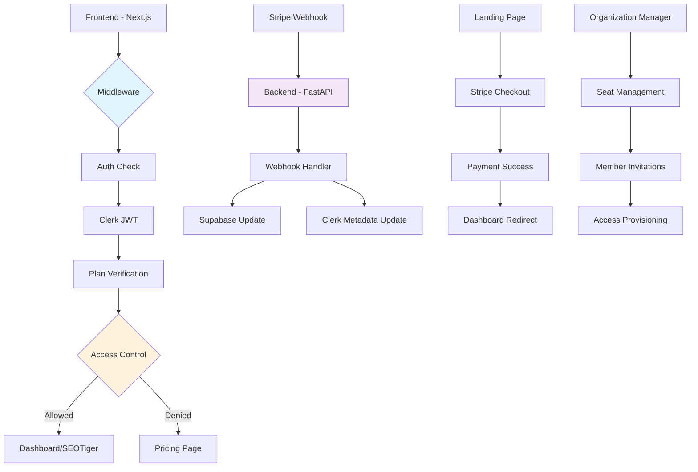
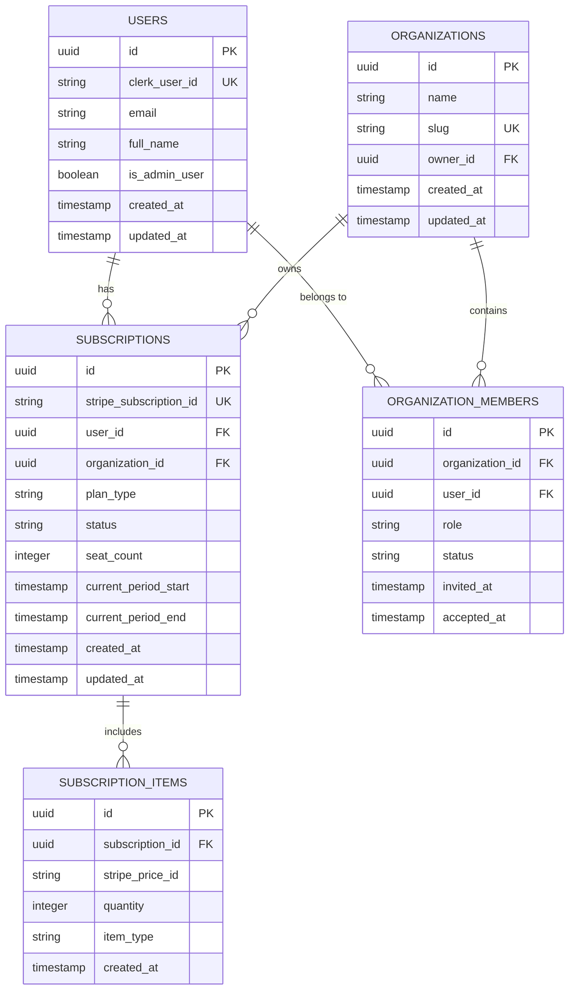
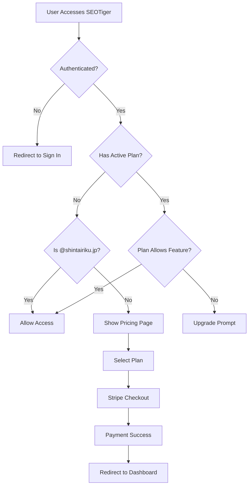

# 設計書: SaaSプラン制限システム実装

## 1. 概要

このドキュメントは、マーケティングオートメーションプラットフォームにおけるSaaSプラン制限システムの技術設計を記述します。要件定義書に基づき、Stripe/Supabase/Clerkの統合によるアクセス制御システム、バックエンドWebhook処理への移行、組織プラン対応を実現します。

## 2. アーキテクチャ設計

### 2.1. システム構成図



### 2.2. 技術スタック

- **フロントエンド:** Next.js 15, TypeScript, Tailwind CSS, shadcn/ui
- **バックエンド:** FastAPI, Pydantic, Python 3.11+
- **データベース:** Supabase (PostgreSQL) with RLS
- **認証:** Clerk with JWT
- **決済:** Stripe with Webhooks
- **ミドルウェア:** Next.js Middleware for route protection

### 2.3. アーキテクチャ上の技術判断

#### 2.3.1. バックエンドWebhook処理移行の理由
- **セキュリティ強化**: サーバーサイドでの署名検証
- **データ整合性保証**: トランザクション処理による一貫性
- **スケーラビリティ向上**: 非同期処理によるパフォーマンス改善
- **監査ログ**: 全決済イベントの完全な追跡

#### 2.3.2. JWT拡張によるアクセス制御
- **Clerkメタデータ拡張**: プラン情報をJWTクレームに含める
- **ミドルウェア処理**: Next.js 15の最新middleware APIを活用
- **リアルタイム更新**: Supabase real-timeでの即座な権限反映

## 3. データベース設計

### 3.1. ER図



### 3.2. テーブル定義: `subscriptions`

| カラム名 | データ型 | 説明 | 制約 |
|---|---|---|---|
| `id` | `UUID` | サブスクリプションID | `PRIMARY KEY` |
| `stripe_subscription_id` | `VARCHAR(255)` | StripeサブスクリプションID | `UNIQUE`, `NOT NULL` |
| `user_id` | `UUID` | 個人ユーザーID | `FOREIGN KEY` |
| `organization_id` | `UUID` | 組織ID | `FOREIGN KEY` |
| `plan_type` | `VARCHAR(50)` | プラン種別 | `NOT NULL` |
| `status` | `VARCHAR(50)` | サブスクリプション状態 | `NOT NULL` |
| `seat_count` | `INTEGER` | 座席数 | `DEFAULT 1` |
| `current_period_start` | `TIMESTAMP` | 課金期間開始 | `NOT NULL` |
| `current_period_end` | `TIMESTAMP` | 課金期間終了 | `NOT NULL` |

### 3.3. RLS (Row Level Security) ポリシー

```sql
-- ユーザーは自身のサブスクリプションのみ参照可能
CREATE POLICY "Users can view own subscriptions" ON subscriptions
    FOR SELECT USING (
        user_id = auth.uid() OR 
        organization_id IN (
            SELECT organization_id FROM organization_members 
            WHERE user_id = auth.uid()
        )
    );

-- 管理者ユーザー (@shintairiku.jp) は全データ参照可能  
CREATE POLICY "Admin users full access" ON subscriptions
    FOR ALL USING (
        EXISTS (
            SELECT 1 FROM users 
            WHERE id = auth.uid() 
            AND email LIKE '%@shintairiku.jp'
        )
    );
```

## 4. APIエンドポイント設計

### 4.1. Webhook エンドポイント

#### `POST /api/webhooks/stripe`
- **説明:** Stripe Webhookイベントを処理します
- **認証:** Stripe署名検証
- **リクエストヘッダー:**
  ```
  Content-Type: application/json
  Stripe-Signature: [signature]
  ```
- **処理イベント:**
  - `customer.subscription.created`
  - `customer.subscription.updated`
  - `customer.subscription.deleted`
  - `invoice.payment_succeeded`
  - `invoice.payment_failed`

### 4.2. プラン確認エンドポイント

#### `GET /api/subscription/status`
- **説明:** 現在のユーザーのサブスクリプション状態を取得
- **認証:** Clerk JWT必須
- **レスポンス (200 OK):**
  ```json
  {
    "hasActiveSubscription": true,
    "planType": "pro",
    "isOrganization": false,
    "seatCount": 1,
    "currentPeriodEnd": "2024-12-31T23:59:59Z",
    "canAccessSeoTiger": true
  }
  ```

### 4.3. 組織管理エンドポイント

#### `POST /api/organizations/{org_id}/members`
- **説明:** 組織メンバーを招待
- **認証:** 組織オーナー権限
- **リクエストボディ:**
  ```json
  {
    "email": "member@example.com",
    "role": "member"
  }
  ```

## 5. UI/UX設計

### 5.1. アクセス制御フロー



### 5.2. 主要画面設計

#### 5.2.1. プライシングページ (`/pricing`)
- **個人プラン**: ¥2,980/月
- **チームプラン**: ¥5,980/月 (2座席〜)
- **エンタープライズ**: カスタム価格

#### 5.2.2. 組織管理画面 (`/organization`)
- 座席使用状況表示
- メンバー招待フォーム
- 座席追加購入ボタン
- 権限管理テーブル

#### 5.2.3. アクセス拒否画面
- 現在のプラン表示
- 必要なプランの説明
- アップグレードCTA
- サポート連絡先

## 6. セキュリティ設計

### 6.1. Webhook セキュリティ
- Stripe署名検証の実装
- IPホワイトリスト (Stripe IPアドレス)
- タイムスタンプ検証 (リプレイ攻撃防止)
- 冪等処理 (重複処理防止)

### 6.2. JWT拡張クレーム
```typescript
interface ExtendedJWTClaims {
  sub: string;                    // Clerk User ID
  email: string;
  planType?: 'free' | 'pro' | 'team';
  hasActiveSubscription: boolean;
  organizationId?: string;
  organizationRole?: 'owner' | 'member';
  seatCount?: number;
  isAdminUser: boolean;           // @shintairiku.jp domain
}
```

## 7. パフォーマンス最適化

### 7.1. キャッシュ戦略
- **プラン情報**: Redis 5分間キャッシュ
- **組織メンバー情報**: Redis 1分間キャッシュ
- **JWT検証**: Clerk公開鍵キャッシュ

### 7.2. データベース最適化
```sql
-- インデックス作成
CREATE INDEX idx_subscriptions_user_status ON subscriptions(user_id, status);
CREATE INDEX idx_subscriptions_stripe_id ON subscriptions(stripe_subscription_id);
CREATE INDEX idx_org_members_user_org ON organization_members(user_id, organization_id);
```

## 8. 監視・ログ設計

### 8.1. 重要なメトリクス
- プラン確認処理時間
- Webhook処理成功率
- 組織招待成功率
- SEOTigerアクセス拒否率

### 8.2. アラート設定
- Webhook処理エラー (即座)
- プラン確認処理遅延 (>500ms)
- サブスクリプション状態不整合
- 大量のアクセス拒否 (不正アクセス検知)