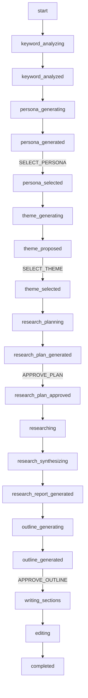

# SEO記事生成における状態管理定数の仕様

## 概要

このドキュメントでは、SEO記事生成プロセス全体で利用される状態管理の定数について詳細に解説します。記事生成システムは複雑な多段階プロセスを管理するため、プロセス状態（`current_step`）とユーザーとの対話を制御する（`UserInputType`）の明確な定義が不可欠です。これらの定数値とその役割を一覧化し、システムの状態遷移を明確にします。

## 技術概要

### 状態管理の仕組み
- **データ構造**: `ArticleContext` クラス内で管理
- **永続化**: Supabase `generated_articles_state` テーブル
- **リアルタイム通信**: `process_events` テーブル経由でフロントエンドに配信
- **型安全性**: Python Literal型とPydantic Enumによる厳密な型定義

### アーキテクチャ原則
1. **状態の明確性**: 各ステップの責務と遷移条件が明確
2. **復旧可能性**: プロセス中断時の状態復元が可能
3. **ユーザビリティ**: ユーザーが現在の処理状況を理解しやすい命名
4. **拡張性**: 新しいステップや入力タイプの追加が容易

## プロセス状態定数（current_step）

### データ型定義

```python
from typing import Literal

ProcessStep = Literal[
    "start",
    "keyword_analyzing", 
    "keyword_analyzed",  
    "persona_generating", 
    "persona_generated",  
    "persona_selected",   
    "theme_generating",   
    "theme_proposed",     
    "theme_selected",
    "research_planning",
    "research_plan_generated", 
    "research_plan_approved",  
    "researching",
    "research_synthesizing",
    "research_report_generated", 
    "outline_generating",
    "outline_generated", 
    "writing_sections",
    "editing",
    "completed",
    "error"
]
```

### ステップ分類

#### 1. 初期ステップ (INITIAL_STEPS)

| ステップ名 | 説明 | 処理内容 | 次ステップ |
|-----------|------|---------|----------|
| `start` | プロセス開始 | - プロセス初期化<br>- ArticleContext生成<br>- データベース保存 | `keyword_analyzing` |

#### 2. 自律実行ステップ (AUTONOMOUS_STEPS)

これらのステップは、ユーザーの介入なしにAIエージェントによって自動実行されます。

| ステップ名 | 説明 | 実行エージェント | 処理内容 | 次ステップ |
|-----------|------|----------------|---------|----------|
| `keyword_analyzing` | キーワード分析実行中 | `serp_keyword_analysis_agent` | - SerpAPIによる競合分析<br>- SEO戦略立案<br>- キーワード難易度評価 | `keyword_analyzed` |
| `keyword_analyzed` | キーワード分析完了 | - | - 分析結果の処理<br>- SerpAPI結果の保存 | `persona_generating` |
| `persona_generating` | ペルソナ生成中 | `persona_generator_agent` | - 複数ペルソナの自動生成<br>- ターゲット属性の詳細化<br>- ペルソナの具体的な描写 | `persona_generated` |
| `theme_generating` | テーマ生成中 | `theme_agent` | - SEO最適化されたテーマ案生成<br>- 競合分析結果の活用<br>- ペルソナに基づく訴求点の決定 | `theme_proposed` |
| `research_planning` | リサーチ計画立案中 | `research_planner_agent` | - テーマ関連の調査項目決定<br>- 検索クエリの戦略的選定<br>- 情報収集の優先順位設定 | `research_plan_generated` |
| `researching` | リサーチ実行中 | `researcher_agent` | - Web検索の並列実行<br>- 情報の信頼性検証<br>- データの構造化 | `research_synthesizing` |
| `research_synthesizing` | リサーチ結果統合中 | `research_synthesizer_agent` | - 収集情報の統合・分析<br>- 重複情報の除去<br>- 論拠の整理 | `research_report_generated` |
| `research_report_generated` | リサーチレポート完了 | - | - 統合レポートの生成<br>- キーポイントの抽出<br>- 情報源の整理 | `outline_generating` |
| `outline_generating` | アウトライン生成中 | `outline_agent` | - SEO構造最適化<br>- 記事構成の論理的整理<br>- 文字数配分の計算 | `outline_generated` |
| `writing_sections` | セクション執筆中 | `section_writer_agent` or `section_writer_with_images_agent` | - 各セクションの並列執筆<br>- HTML形式での出力<br>- リアルタイムストリーミング | `editing` |
| `editing` | 最終編集・校正中 | `editor_agent` | - 文体統一と校正<br>- SEO最適化の最終調整<br>- 品質チェック | `completed` |

#### 3. ユーザー入力待機ステップ (USER_INPUT_STEPS)

これらのステップでは、ユーザーの選択や承認を待機します。

| ステップ名 | 説明 | 待機する入力タイプ | 提供される選択肢 | 次ステップ |
|-----------|------|----------------|-----------------|----------|
| `persona_generated` | ペルソナ選択待ち | `SELECT_PERSONA` | - 生成された複数ペルソナ<br>- 再生成オプション<br>- カスタム編集オプション | `persona_selected` |
| `theme_proposed` | テーマ選択待ち | `SELECT_THEME` | - 生成されたテーマ案<br>- 再生成オプション<br>- テーマ編集オプション | `theme_selected` |
| `research_plan_generated` | リサーチ計画承認待ち | `APPROVE_PLAN` | - 計画の承認/拒否<br>- 計画の編集<br>- 再生成要求 | `research_plan_approved` |
| `outline_generated` | アウトライン承認待ち | `APPROVE_OUTLINE` | - アウトラインの承認/拒否<br>- 構造の編集<br>- 再生成要求 | `writing_sections` |

#### 4. 状態遷移ステップ (TRANSITION_STEPS)

ユーザー入力完了後の遷移処理を行います。

| ステップ名 | 説明 | 処理内容 | 次ステップ |
|-----------|------|---------|----------|
| `persona_selected` | ペルソナ選択完了 | - 選択ペルソナの保存<br>- コンテキスト更新 | `theme_generating` |
| `theme_selected` | テーマ選択完了 | - 選択テーマの保存<br>- 次段階の準備 | `research_planning` |
| `research_plan_approved` | リサーチ計画承認完了 | - 承認済み計画の保存<br>- リサーチ実行準備 | `researching` |

#### 5. 終了ステップ (TERMINAL_STEPS)

プロセスの最終状態を表します。

| ステップ名 | 説明 | 処理内容 | 備考 |
|-----------|------|---------|------|
| `completed` | プロセス正常完了 | - 最終記事のデータベース保存<br>- 完了通知の送信<br>- リソースのクリーンアップ | 成功終了 |
| `error` | エラー終了 | - エラー情報の記録<br>- 復旧情報の保存<br>- エラー通知の送信 | 異常終了 |

### ステップ分類定数

```python
# GenerationFlowManager内で定義される分類
AUTONOMOUS_STEPS = {
    'keyword_analyzing', 'keyword_analyzed', 'persona_generating', 'theme_generating',
    'research_planning', 'researching', 'research_synthesizing', 'research_report_generated',
    'outline_generating', 'writing_sections', 'editing'
}

USER_INPUT_STEPS = {
    'persona_generated', 'theme_proposed', 
    'research_plan_generated', 'outline_generated'
}

TRANSITION_STEPS = {
    'persona_selected', 'theme_selected', 'research_plan_approved'
}

TERMINAL_STEPS = {
    'completed', 'error'
}

INITIAL_STEPS = {
    'start'
}

DISCONNECTION_RESILIENT_STEPS = {
    'research_planning', 'researching', 'research_synthesizing', 'research_report_generated',
    'outline_generating', 'writing_sections', 'editing'
}

# 全ステップの統合リスト（検証用）
ALL_VALID_STEPS = (
    AUTONOMOUS_STEPS | USER_INPUT_STEPS | TRANSITION_STEPS | 
    TERMINAL_STEPS | INITIAL_STEPS
)
```

## ユーザー入力タイプ定数（UserInputType）

### データ型定義

```python
from enum import Enum

class UserInputType(str, Enum):
    """ユーザー入力タイプの定義"""
    
    # 選択系操作
    SELECT_PERSONA = "SELECT_PERSONA"
    SELECT_THEME = "SELECT_THEME"
    
    # 承認系操作
    APPROVE_PLAN = "APPROVE_PLAN"
    APPROVE_OUTLINE = "APPROVE_OUTLINE"
    
    # 編集系操作
    EDIT_AND_PROCEED = "EDIT_AND_PROCEED"
    EDIT_PERSONA = "EDIT_PERSONA"
    EDIT_THEME = "EDIT_THEME"
    EDIT_PLAN = "EDIT_PLAN"
    EDIT_OUTLINE = "EDIT_OUTLINE"
    
    # 制御系操作
    REGENERATE = "REGENERATE"
    SKIP = "SKIP"
    CANCEL = "CANCEL"
```

### ユーザー入力タイプ詳細

#### 1. 選択系操作

| 入力タイプ | 説明 | 期待するペイロード | 使用場面 |
|-----------|------|----------------|---------|
| `SELECT_PERSONA` | ペルソナ選択 | `{"selected_id": number}` | `persona_generated` ステップ |
| `SELECT_THEME` | テーマ選択 | `{"selected_index": number}` | `theme_proposed` ステップ |

**SelectPersonaPayload の構造**
```python
class SelectPersonaPayload(BasePayload):
    selected_id: int = Field(description="選択されたペルソナのID (0ベース)", ge=0)
```

**SelectThemePayload の構造**
```python
class SelectThemePayload(BasePayload):
    selected_index: int = Field(description="選択されたテーマのインデックス (0ベース)", ge=0)
```

#### 2. 承認系操作

| 入力タイプ | 説明 | 期待するペイロード | 使用場面 |
|-----------|------|----------------|---------|
| `APPROVE_PLAN` | リサーチ計画承認 | `{"approved": boolean}` | `research_plan_generated` ステップ |
| `APPROVE_OUTLINE` | アウトライン承認 | `{"approved": boolean}` | `outline_generated` ステップ |

**ApprovePayload の構造**
```python
class ApprovePayload(BasePayload):
    approved: bool = Field(description="承認したかどうか")
```

#### 3. 編集系操作

| 入力タイプ | 説明 | 期待するペイロード | 使用場面 |
|-----------|------|----------------|---------|
| `EDIT_AND_PROCEED` | 汎用編集・進行 | `{"edited_content": object}` | 複数ステップ |
| `EDIT_PERSONA` | ペルソナ編集 | `{"edited_persona": object}` | `persona_generated` ステップ |
| `EDIT_THEME` | テーマ編集 | `{"edited_theme": object}` | `theme_proposed` ステップ |
| `EDIT_PLAN` | 計画編集 | `{"edited_plan": object}` | `research_plan_generated` ステップ |
| `EDIT_OUTLINE` | アウトライン編集 | `{"edited_outline": object}` | `outline_generated` ステップ |

**EditAndProceedPayload の構造**
```python
class EditAndProceedPayload(BasePayload):
    edited_content: Dict[str, Any] = Field(description="ユーザーによって編集された内容")
```

#### 4. 制御系操作

| 入力タイプ | 説明 | 期待するペイロード | 使用場面 |
|-----------|------|----------------|---------|
| `REGENERATE` | 再生成要求 | `{}` (空のペイロード) | 各生成ステップ |
| `SKIP` | ステップスキップ | `{}` (空のペイロード) | 任意ステップ（実装依存） |
| `CANCEL` | プロセス中止 | `{}` (空のペイロード) | 全ステップ |

**RegeneratePayload の構造**
```python
class RegeneratePayload(BasePayload):
    pass  # シンプルにするため、フィールドなし
```

## 状態遷移マトリックス

### 標準的な状態遷移パス



### 例外的な状態遷移

| 現在ステップ | 入力タイプ | 次ステップ | 説明 |
|-------------|-----------|-----------|------|
| `persona_generated` | `REGENERATE` | `persona_generating` | ペルソナ再生成 |
| `theme_proposed` | `REGENERATE` | `theme_generating` | テーマ再生成 |
| `research_plan_generated` | `EDIT_PLAN` | `research_plan_approved` | 計画編集後承認 |
| `outline_generated` | `EDIT_OUTLINE` | `writing_sections` | アウトライン編集後執筆開始 |
| 任意のステップ | `CANCEL` | `error` | プロセス中止 |

## エラーハンドリングと復旧

### 復旧可能ステップの判定

```python
def is_recoverable_step(step: str) -> bool:
    """ステップが復旧可能かどうかを判定"""
    recoverable_steps = DISCONNECTION_RESILIENT_STEPS | USER_INPUT_STEPS
    return step in recoverable_steps

def get_recovery_options(step: str) -> List[str]:
    """ステップに応じた復旧オプションを取得"""
    if step in USER_INPUT_STEPS:
        return ["resume", "regenerate", "skip"]
    elif step in AUTONOMOUS_STEPS:
        return ["retry", "skip"]
    else:
        return ["restart"]
```

### 状態の一貫性チェック

```python
def validate_step_transition(current_step: str, next_step: str, input_type: Optional[str] = None) -> bool:
    """状態遷移の妥当性をチェック"""
    
    # 基本的な遷移ルール
    valid_transitions = {
        "start": ["keyword_analyzing"],
        "keyword_analyzing": ["keyword_analyzed", "error"],
        "keyword_analyzed": ["persona_generating"],
        "persona_generating": ["persona_generated", "error"],
        "persona_generated": ["persona_selected"] if input_type == "SELECT_PERSONA" else ["persona_generating"],
        # ... 他の遷移定義
    }
    
    return next_step in valid_transitions.get(current_step, [])
```

## フロントエンド状態同期

### Supabase Realtime イベント形式

```json
{
  "event_type": "step_update",
  "event_data": {
    "process_id": "123e4567-e89b-12d3-a456-426614174000",
    "current_step": "theme_generating",
    "previous_step": "persona_selected",
    "timestamp": "2025-01-31T12:00:00Z",
    "user_input_required": false,
    "expected_input_type": null,
    "step_progress": {
      "completed_steps": 4,
      "total_steps": 8,
      "estimated_completion": "2025-01-31T12:05:00Z"
    }
  }
}
```

### ユーザー入力要求イベント

```json
{
  "event_type": "user_input_required",
  "event_data": {
    "process_id": "123e4567-e89b-12d3-a456-426614174000",
    "current_step": "persona_generated",
    "input_type": "SELECT_PERSONA",
    "options": [
      {
        "id": 0,
        "description": "田中美穂（32歳）：札幌市在住、パート勤務の主婦..."
      },
      {
        "id": 1,
        "description": "佐藤健二（35歳）：札幌市近郊在住、IT企業勤務..."
      }
    ],
    "timeout": "2025-01-31T12:30:00Z"
  }
}
```

## パフォーマンス考慮事項

### 状態更新頻度の最適化

```python
# 状態更新の間引き（デバウンス）
class StateUpdateManager:
    def __init__(self, min_interval: float = 0.5):
        self.min_interval = min_interval
        self.last_update = 0
        
    async def update_if_needed(self, context: ArticleContext, force: bool = False):
        now = time.time()
        if force or (now - self.last_update) >= self.min_interval:
            await self.persist_state(context)
            self.last_update = now
```

### メモリ効率化

```python
# 大きなデータの遅延読み込み
@dataclass
class OptimizedArticleContext:
    # 基本状態（常時メモリに保持）
    current_step: ProcessStep
    process_id: str
    user_id: str
    
    # 大きなデータ（必要時に読み込み）
    _research_results: Optional[List[ResearchQueryResult]] = None
    _generated_content: Optional[str] = None
    
    async def get_research_results(self) -> List[ResearchQueryResult]:
        if self._research_results is None:
            self._research_results = await self.load_research_results()
        return self._research_results
```

## 開発・デバッグ支援

### 状態トレース機能

```python
class StateTracer:
    """開発・デバッグ用の状態遷移トレース"""
    
    def __init__(self):
        self.transitions: List[Dict[str, Any]] = []
    
    def log_transition(self, from_step: str, to_step: str, trigger: Optional[str] = None):
        self.transitions.append({
            "timestamp": datetime.now(timezone.utc),
            "from_step": from_step,
            "to_step": to_step,
            "trigger": trigger,
            "duration": self.calculate_step_duration(from_step)
        })
    
    def get_transition_summary(self) -> Dict[str, Any]:
        return {
            "total_transitions": len(self.transitions),
            "average_step_duration": self.calculate_average_duration(),
            "problematic_transitions": self.find_long_transitions(),
            "transition_path": [t["to_step"] for t in self.transitions]
        }
```

### テスト用のモック状態

```python
# テスト用の状態生成ヘルパー
def create_mock_context(step: ProcessStep, **kwargs) -> ArticleContext:
    """テスト用のArticleContextを生成"""
    defaults = {
        "initial_keywords": ["test", "keyword"],
        "current_step": step,
        "user_id": "test_user",
        "process_id": "test_process"
    }
    defaults.update(kwargs)
    return ArticleContext(**defaults)

# テスト用の状態遷移検証
def assert_valid_transition(from_step: str, to_step: str, input_type: str = None):
    """状態遷移の妥当性をテスト"""
    assert validate_step_transition(from_step, to_step, input_type), \
        f"Invalid transition: {from_step} -> {to_step} (input: {input_type})"
```

この状態管理定数の仕様により、SEO記事生成プロセス全体の複雑な状態遷移を確実に制御し、ユーザーとシステム両方にとって予測可能で信頼性の高い処理フローを実現しています。各定数は明確な役割を持ち、システムの拡張や保守を容易にする設計となっています。