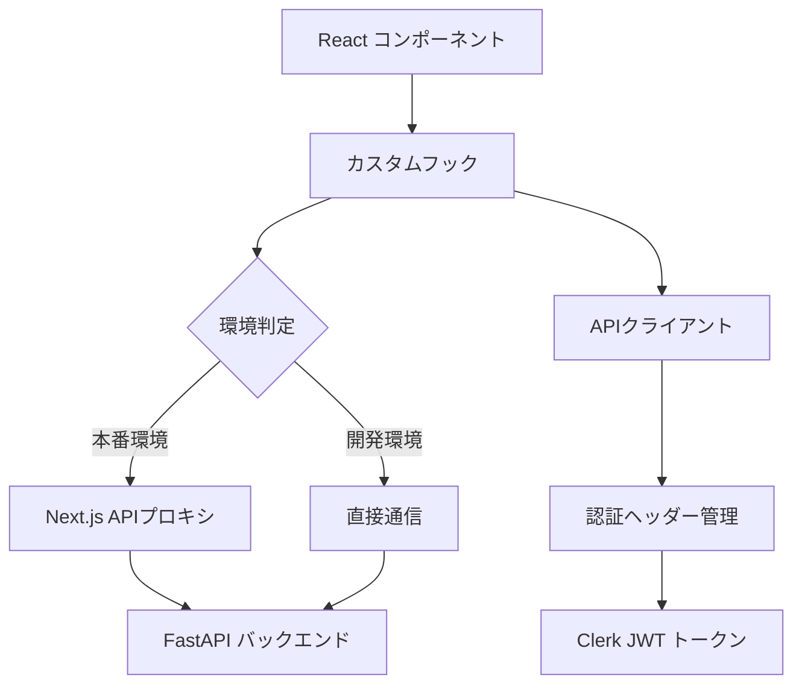

# フロントエンドにおけるAPI利用規約

## 概要

このドキュメントでは、Marketing AutomationプラットフォームのフロントエンドにおけるバックエンドAPI利用の規約について詳細に解説します。Next.jsのAPIルート（`/api/proxy`）を介したプロキシ通信、認証トークンの管理、APIクライアントの実装方法、および各種カスタムフックによる型安全なAPI呼び出しの実装について包括的に説明します。

## アーキテクチャ概要

### 1. API通信アーキテクチャ



### 2. 責務分離

1. **コンポーネント層**: UI状態とユーザーインタラクション
2. **フック層**: ビジネスロジックとデータ管理
3. **APIクライアント層**: 低レベルHTTP通信
4. **プロキシ層**: 本番環境でのセキュアな通信
5. **認証層**: Clerkトークン管理

---

## 1. 環境別通信設定

### 1.1 環境設定の基本方針

```typescript
// /frontend/src/lib/api.ts
const API_BASE_URL = process.env.NEXT_PUBLIC_API_BASE_URL || 'http://localhost:8000';
const USE_PROXY = process.env.NODE_ENV === 'production';

export class ApiClient {
  private baseURL: string;

  constructor() {
    this.baseURL = USE_PROXY ? '/api/proxy' : API_BASE_URL;
  }
}
```

**環境別設定**:
- **開発環境**: `http://localhost:8000` への直接通信
- **本番環境**: `/api/proxy` を介したプロキシ通信

### 1.2 設定の合理性

#### 開発環境での直接通信
```typescript
// 開発環境: 直接バックエンドと通信
const url = 'http://localhost:8000/articles/';
```

**メリット**:
- **デバッグ容易性**: ネットワークタブで直接APIレスポンスを確認
- **開発効率**: プロキシ層のオーバーヘッドなし
- **HOTリロード**: フロントエンド・バックエンドの独立した開発

#### 本番環境でのプロキシ通信
```typescript
// 本番環境: Next.js APIプロキシ経由
const url = '/api/proxy/articles/';
```

**メリット**:
- **CORS回避**: 同一オリジンからの通信
- **セキュリティ**: 内部APIエンドポイントの隠蔽
- **認証一元化**: サーバーサイドでの認証ヘッダー管理

---

## 2. APIクライアント設計

### 2.1 ApiClientクラス

**ファイル**: `/frontend/src/lib/api.ts`

```typescript
export interface ApiResponse<T> {
  data?: T;
  error?: string;
  status: number;
}

export class ApiClient {
  private baseURL: string;

  constructor() {
    this.baseURL = USE_PROXY ? '/api/proxy' : API_BASE_URL;
  }

  private async request<T>(
    endpoint: string,
    options: RequestInit = {}
  ): Promise<ApiResponse<T>> {
    const url = `${this.baseURL}${endpoint}`;
    
    const config: RequestInit = {
      headers: {
        'Content-Type': 'application/json',
        ...options.headers,
      },
      ...options,
    };

    try {
      const response = await fetch(url, config);
      
      if (!response.ok) {
        return {
          error: `HTTP error! status: ${response.status}`,
          status: response.status,
        };
      }
      
      const data = await response.json();
      return {
        data,
        status: response.status,
      };
    } catch (error) {
      console.error('API request failed:', error);
      return {
        error: error instanceof Error ? error.message : 'Unknown error occurred',
        status: 0,
      };
    }
  }
}

export const apiClient = new ApiClient();
```

### 2.2 型安全なレスポンス管理

#### ApiResponse型の設計思想

```typescript
export interface ApiResponse<T> {
  data?: T;        // 成功時のデータ
  error?: string;  // エラーメッセージ
  status: number;  // HTTPステータスコード
}
```

**設計の特徴**:
- **判別可能**: `data` と `error` の存在でレスポンス判定
- **型安全**: ジェネリクスによる型情報の保持
- **包括的**: HTTPステータスコードの保存

#### エラーハンドリング戦略

```typescript
try {
  const response = await fetch(url, config);
  
  if (!response.ok) {
    return {
      error: `HTTP error! status: ${response.status}`,
      status: response.status,
    };
  }
  
  const data = await response.json();
  return { data, status: response.status };
} catch (error) {
  console.error('API request failed:', error);
  return {
    error: error instanceof Error ? error.message : 'Unknown error occurred',
    status: 0,
  };
}
```

**エラー処理の階層**:
1. **HTTPエラー**: `!response.ok` による判定
2. **ネットワークエラー**: `try-catch` による例外キャッチ
3. **パースエラー**: `response.json()` の失敗処理

### 2.3 APIメソッド実装例

#### ヘルスチェック
```typescript
async healthCheck() {
  return this.request<{ status: string; message: string; version: string }>('/health');
}
```

#### 記事一覧取得
```typescript
async getArticles(limit: number = 20, offset: number = 0, token?: string) {
  const headers = token ? { 'Authorization': `Bearer ${token}` } : undefined;
  return this.request<any[]>(`/articles/?limit=${limit}&offset=${offset}`, { headers });
}
```

#### 復帰可能プロセス取得
```typescript
async getRecoverableProcesses(limit: number = 10, token?: string) {
  const headers = token ? { 'Authorization': `Bearer ${token}` } : undefined;
  return this.request<any[]>(`/articles/recoverable-processes?limit=${limit}`, { headers });
}
```

---

## 3. Next.js APIプロキシ実装

### 3.1 プロキシルートの設計

**ファイル**: `/frontend/src/app/api/proxy/[...path]/route.ts`

```typescript
const API_BASE_URL = process.env.NEXT_PUBLIC_API_BASE_URL || 'http://localhost:8000';

export async function GET(
  request: NextRequest,
  { params }: { params: Promise<{ path: string[] }> }
) {
  const { path: pathArray } = await params;
  const pathString = pathArray.join('/');
  const searchParams = request.nextUrl.searchParams.toString();
  const url = `${API_BASE_URL}/${pathString}${searchParams ? `?${searchParams}` : ''}`;

  // 認証ヘッダーの転送
  const headers: Record<string, string> = {
    'Content-Type': 'application/json',
  };
  
  const authHeader = request.headers.get('Authorization');
  if (authHeader) {
    headers.Authorization = authHeader;
  }

  try {
    const response = await fetch(url, {
      method: 'GET',
      headers,
    });

    const data = await response.json();

    return NextResponse.json(data, { 
      status: response.status,
      headers: {
        'Access-Control-Allow-Origin': '*',
        'Access-Control-Allow-Methods': 'GET, POST, PUT, DELETE, OPTIONS',
        'Access-Control-Allow-Headers': 'Content-Type, Authorization',
      },
    });
  } catch (error) {
    console.error('Proxy API error:', error);
    return NextResponse.json(
      { error: 'Failed to fetch from backend API' },
      { status: 500 }
    );
  }
}
```

### 3.2 動的ルート対応

#### パス解析
```typescript
const { path: pathArray } = await params;
const pathString = pathArray.join('/');
```

**変換例**:
- クライアント: `/api/proxy/articles/123`
- バックエンド: `http://localhost:8000/articles/123`

#### クエリパラメータ転送
```typescript
const searchParams = request.nextUrl.searchParams.toString();
const url = `${API_BASE_URL}/${pathString}${searchParams ? `?${searchParams}` : ''}`;
```

**変換例**:
- クライアント: `/api/proxy/articles?limit=20&offset=0`
- バックエンド: `http://localhost:8000/articles?limit=20&offset=0`

### 3.3 HTTPメソッド対応

#### GET, POST, PUT, DELETE の統一実装

```typescript
async function handleRequest(
  request: NextRequest,
  method: string,
  pathArray: string[]
) {
  const pathString = pathArray.join('/');
  const searchParams = request.nextUrl.searchParams.toString();
  const url = `${API_BASE_URL}/${pathString}${searchParams ? `?${searchParams}` : ''}`;

  const config: RequestInit = {
    method,
    headers: {
      'Content-Type': 'application/json',
    },
  };

  // 認証ヘッダーの転送
  const authHeader = request.headers.get('Authorization');
  if (authHeader) {
    config.headers = {
      ...config.headers,
      Authorization: authHeader,
    };
  }

  // リクエストボディの転送（POST, PUT）
  if (method === 'POST' || method === 'PUT') {
    config.body = await request.text();
  }

  const response = await fetch(url, config);
  const data = await response.json();

  return NextResponse.json(data, { status: response.status });
}

export async function POST(request: NextRequest, { params }: { params: Promise<{ path: string[] }> }) {
  const { path: pathArray } = await params;
  return handleRequest(request, 'POST', pathArray);
}
```

---

## 4. 認証システム統合

### 4.1 Clerkトークン管理

#### 基本的な認証パターン
```typescript
import { useAuth } from '@clerk/nextjs';

export function useAuthenticatedApiCall() {
  const { getToken } = useAuth();

  const makeAuthenticatedRequest = async (endpoint: string, options: RequestInit = {}) => {
    // Clerkトークンの取得
    const token = await getToken();
    
    const headers: Record<string, string> = {
      'Content-Type': 'application/json',
      ...((options.headers as Record<string, string>) || {}),
    };
    
    // 認証ヘッダーの付与
    if (token) {
      headers['Authorization'] = `Bearer ${token}`;
    }

    return fetch(endpoint, {
      ...options,
      headers,
    });
  };

  return { makeAuthenticatedRequest };
}
```

### 4.2 トークン管理戦略

#### 自動トークン付与
```typescript
// useArticles.ts での実装例
const fetchArticles = useCallback(async (page: number) => {
  try {
    // Clerkトークンの取得
    const token = await getToken();
    const headers: Record<string, string> = {
      "Content-Type": "application/json",
    };
    
    // トークンが利用可能な場合のみ付与
    if (token) {
      headers["Authorization"] = `Bearer ${token}`;
    }

    const response = await fetch(`${API_BASE_URL}/articles/?${params}`, {
      method: "GET",
      headers,
    });

    // レスポンス処理...
  } catch (err) {
    // エラーハンドリング...
  }
}, [getToken]);
```

#### 条件的認証
```typescript
// 認証が必要なエンドポイントと不要なエンドポイントの区別
const isAuthRequired = (endpoint: string): boolean => {
  const publicEndpoints = ['/health', '/'];
  return !publicEndpoints.some(pub => endpoint.startsWith(pub));
};

const makeRequest = async (endpoint: string) => {
  const headers: Record<string, string> = {
    'Content-Type': 'application/json',
  };

  if (isAuthRequired(endpoint)) {
    const token = await getToken();
    if (token) {
      headers['Authorization'] = `Bearer ${token}`;
    }
  }

  return fetch(endpoint, { headers });
};
```

### 4.3 認証エラー処理

#### 401エラーの処理
```typescript
const handleAuthError = (response: Response) => {
  if (response.status === 401) {
    // 認証エラー時の処理
    console.warn('Authentication failed - redirecting to login');
    // リダイレクトまたは再認証フローの開始
    window.location.href = '/sign-in';
    return;
  }

  if (response.status === 403) {
    // 認可エラー時の処理
    console.warn('Access forbidden - insufficient permissions');
    // ユーザーへの適切なフィードバック
    throw new Error('このリソースにアクセスする権限がありません');
  }
};
```

---

## 5. カスタムフック設計パターン

### 5.1 useArticles: 記事管理フック

**ファイル**: `/frontend/src/hooks/useArticles.ts`

```typescript
export interface Article {
  id: string;
  title: string;
  shortdescription: string;
  postdate: string;
  status: string;
  keywords: string[];
  target_audience: string;
  updated_at: string;
}

interface UseArticlesResult {
  articles: Article[];
  loading: boolean;
  error: string | null;
  total: number;
  currentPage: number;
  totalPages: number;
  setPage: (page: number) => void;
  refetch: () => Promise<void>;
}

export function useArticles(pageSize: number = 20, statusFilter?: string): UseArticlesResult {
  const [articles, setArticles] = useState<Article[]>([]);
  const [loading, setLoading] = useState(true);
  const [error, setError] = useState<string | null>(null);
  const [currentPage, setCurrentPage] = useState(1);
  const [total, setTotal] = useState(0);
  const { getToken } = useAuth();

  const fetchArticles = useCallback(async (page: number) => {
    try {
      setLoading(true);
      setError(null);

      const offset = (page - 1) * pageSize;
      const params = new URLSearchParams({
        limit: pageSize.toString(),
        offset: offset.toString(),
      });

      if (statusFilter) {
        params.append("status_filter", statusFilter);
      }

      const token = await getToken();
      const headers: Record<string, string> = {
        "Content-Type": "application/json",
      };
      
      if (token) {
        headers["Authorization"] = `Bearer ${token}`;
      }

      const response = await fetch(`${API_BASE_URL}/articles/?${params}`, {
        method: "GET",
        headers,
      });

      if (!response.ok) {
        throw new Error(`HTTP error! status: ${response.status}`);
      }

      const data = await response.json();
      setArticles(data);
      setTotal(data.length === pageSize ? page * pageSize + 1 : (page - 1) * pageSize + data.length);
    } catch (err) {
      setError(err instanceof Error ? err.message : "記事の取得に失敗しました");
      setArticles([]);
    } finally {
      setLoading(false);
    }
  }, [pageSize, statusFilter, getToken]);

  useEffect(() => {
    fetchArticles(currentPage);
  }, [currentPage, fetchArticles]);

  return {
    articles,
    loading,
    error,
    total,
    currentPage,
    totalPages: Math.ceil(total / pageSize),
    setPage: setCurrentPage,
    refetch: () => fetchArticles(currentPage),
  };
}
```

**設計特徴**:
- **ページネーション**: サーバーサイドページングのサポート
- **フィルタリング**: ステータス別フィルタリング機能
- **エラーハンドリング**: 詳細なエラーメッセージ
- **再取得**: `refetch` による手動更新機能

### 5.2 useRecoverableProcesses: 復帰可能プロセス管理

```typescript
export interface RecoverableProcess {
  id: string;
  title?: string;
  description?: string;
  status: string;
  current_step_name: string;
  progress_percentage: number;
  updated_at: string;
  created_at: string;
  error_message?: string;
  resume_step: string;
  auto_resume_possible: boolean;
  time_since_last_activity: number;
  recovery_notes: string;
  requires_user_input: boolean;
  initial_keywords?: string[];
  target_age_group?: string;
  target_length?: number;
}

export const useRecoverableProcesses = (): UseRecoverableProcessesResult => {
  const [recoverableProcesses, setRecoverableProcesses] = useState<RecoverableProcess[]>([]);
  const [isLoading, setIsLoading] = useState(false);
  const [error, setError] = useState<string | null>(null);
  const { getToken } = useAuth();

  const refreshProcesses = useCallback(async () => {
    try {
      setIsLoading(true);
      setError(null);

      const token = await getToken();
      if (!token) {
        throw new Error('認証トークンが取得できませんでした');
      }

      const response = await apiClient.getRecoverableProcesses(10, token);
      
      if (response.error) {
        throw new Error(response.error);
      }

      setRecoverableProcesses(response.data || []);
    } catch (err) {
      const errorMessage = err instanceof Error ? err.message : '復帰可能プロセスの取得に失敗しました';
      setError(errorMessage);
    } finally {
      setIsLoading(false);
    }
  }, [getToken]);

  // ユーティリティメソッド
  const getMostRecentProcess = useCallback((): RecoverableProcess | null => {
    return recoverableProcesses.length > 0 ? recoverableProcesses[0] : null;
  }, [recoverableProcesses]);

  const getAutoResumableProcesses = useCallback((): RecoverableProcess[] => {
    return recoverableProcesses.filter(process => process.auto_resume_possible);
  }, [recoverableProcesses]);

  const getUserInputRequiredProcesses = useCallback((): RecoverableProcess[] => {
    return recoverableProcesses.filter(process => process.requires_user_input);
  }, [recoverableProcesses]);

  return {
    recoverableProcesses,
    isLoading,
    error,
    refreshProcesses,
    hasRecoverableProcesses: recoverableProcesses.length > 0,
    getMostRecentProcess,
    getAutoResumableProcesses,
    getUserInputRequiredProcesses,
  };
};
```

**ビジネスロジック**:
- **自動復帰判定**: `auto_resume_possible` による分類
- **ユーザー入力要求**: `requires_user_input` による分類
- **時系列管理**: `updated_at` による最新プロセス取得

### 5.3 useDefaultCompany: デフォルト会社情報管理

```typescript
export interface CompanyInfo {
  id: string;
  name: string;
  website_url: string;
  description: string;
  usp: string;
  target_persona: string;
  is_default: boolean;
  brand_slogan?: string;
  target_keywords?: string;
  industry_terms?: string;
  avoid_terms?: string;
  popular_articles?: string;
  target_area?: string;
  created_at: string;
  updated_at: string;
}

export function useDefaultCompany() {
  const [company, setCompany] = useState<CompanyInfo | null>(null);
  const [loading, setLoading] = useState(true);
  const [error, setError] = useState<string | null>(null);

  const fetchDefaultCompany = async () => {
    try {
      setLoading(true);
      setError(null);
      
      const response = await fetch('/api/companies/default');
      
      if (response.status === 404) {
        // 初回ユーザーの場合、デフォルト会社未設定は正常
        setCompany(null);
        return;
      }
      
      if (!response.ok) {
        throw new Error('デフォルト会社情報の取得に失敗しました');
      }
      
      const data = await response.json();
      setCompany(data);
    } catch (error) {
      console.error('Error fetching default company:', error);
      setError(error instanceof Error ? error.message : 'Unknown error');
    } finally {
      setLoading(false);
    }
  };

  useEffect(() => {
    fetchDefaultCompany();
  }, []);

  return {
    company,
    loading,
    error,
    refreshCompany: fetchDefaultCompany,
    hasCompany: !!company,
  };
}
```

**初期設定対応**:
- **404処理**: 初回ユーザーでも正常動作
- **自動判定**: `hasCompany` による会社情報存在判定
- **再取得機能**: `refreshCompany` による手動更新

### 5.4 useApiTest: API接続テスト

```typescript
interface ApiStatus {
  isConnected: boolean;
  isLoading: boolean;
  error: string | null;
  apiInfo: {
    message?: string;
    version?: string;
    status?: string;
  } | null;
}

export function useApiTest() {
  const [status, setStatus] = useState<ApiStatus>({
    isConnected: false,
    isLoading: true,
    error: null,
    apiInfo: null,
  });

  const testConnection = async () => {
    setStatus(prev => ({ ...prev, isLoading: true, error: null }));

    try {
      // ヘルスチェック優先
      const healthResponse = await apiClient.healthCheck();
      
      if (healthResponse.data) {
        setStatus({
          isConnected: true,
          isLoading: false,
          error: null,
          apiInfo: {
            message: healthResponse.data.message,
            version: healthResponse.data.version,
            status: healthResponse.data.status,
          },
        });
        return;
      }

      // フォールバック: ルートエンドポイント
      const rootResponse = await apiClient.getRoot();
      
      if (rootResponse.data) {
        setStatus({
          isConnected: true,
          isLoading: false,
          error: null,
          apiInfo: {
            message: rootResponse.data.message,
          },
        });
        return;
      }

      // 両方失敗
      setStatus({
        isConnected: false,
        isLoading: false,
        error: healthResponse.error || rootResponse.error || 'API接続に失敗しました',
        apiInfo: null,
      });

    } catch (error) {
      setStatus({
        isConnected: false,
        isLoading: false,
        error: error instanceof Error ? error.message : 'Unknown error occurred',
        apiInfo: null,
      });
    }
  };

  useEffect(() => {
    testConnection();
  }, []);

  return {
    ...status,
    testConnection,
  };
}
```

**診断機能**:
- **フォールバック**: プライマリ失敗時のセカンダリテスト
- **詳細情報**: APIバージョン・ステータス情報の取得
- **再テスト**: 手動での接続再テスト機能

---

## 6. エラーハンドリング戦略

### 6.1 階層的エラー処理

#### APIクライアント レベル
```typescript
private async request<T>(endpoint: string, options: RequestInit = {}): Promise<ApiResponse<T>> {
  try {
    const response = await fetch(url, config);
    
    if (!response.ok) {
      return {
        error: `HTTP error! status: ${response.status}`,
        status: response.status,
      };
    }
    
    const data = await response.json();
    return { data, status: response.status };
  } catch (error) {
    console.error('API request failed:', error);
    return {
      error: error instanceof Error ? error.message : 'Unknown error occurred',
      status: 0,
    };
  }
}
```

#### カスタムフック レベル
```typescript
const fetchArticles = useCallback(async (page: number) => {
  try {
    setLoading(true);
    setError(null);

    // API呼び出し
    const response = await fetch(url, config);
    
    if (!response.ok) {
      throw new Error(`HTTP error! status: ${response.status}`);
    }

    const data = await response.json();
    setArticles(data);
  } catch (err) {
    setError(err instanceof Error ? err.message : "記事の取得に失敗しました");
    setArticles([]);
  } finally {
    setLoading(false);
  }
}, []);
```

#### コンポーネント レベル
```typescript
const ArticleList = () => {
  const { articles, loading, error, refetch } = useArticles();

  if (loading) return <LoadingSpinner />;
  
  if (error) {
    return (
      <div className="error-container">
        <p>エラーが発生しました: {error}</p>
        <Button onClick={refetch}>再試行</Button>
      </div>
    );
  }

  return (
    <div>
      {articles.map(article => (
        <ArticleCard key={article.id} article={article} />
      ))}
    </div>
  );
};
```

### 6.2 ユーザーフレンドリーなエラーメッセージ

#### エラー種別による分類
```typescript
const getErrorMessage = (error: unknown): string => {
  if (error instanceof Error) {
    // ネットワークエラー
    if (error.message.includes('fetch')) {
      return 'インターネット接続を確認してください。';
    }
    
    // 認証エラー
    if (error.message.includes('401')) {
      return 'ログインが必要です。再度ログインしてください。';
    }
    
    // 認可エラー
    if (error.message.includes('403')) {
      return 'このリソースにアクセスする権限がありません。';
    }
    
    // サーバーエラー
    if (error.message.includes('500')) {
      return 'サーバーでエラーが発生しました。しばらくしてから再試行してください。';
    }
    
    return error.message;
  }
  
  return '不明なエラーが発生しました。';
};
```

### 6.3 再試行メカニズム

#### 指数バックオフ
```typescript
const retryWithBackoff = async <T>(
  fn: () => Promise<T>,
  maxRetries: number = 3,
  baseDelay: number = 1000
): Promise<T> => {
  let lastError: Error;

  for (let attempt = 0; attempt <= maxRetries; attempt++) {
    try {
      return await fn();
    } catch (error) {
      lastError = error instanceof Error ? error : new Error('Unknown error');
      
      if (attempt === maxRetries) {
        throw lastError;
      }
      
      const delay = baseDelay * Math.pow(2, attempt);
      await new Promise(resolve => setTimeout(resolve, delay));
    }
  }
  
  throw lastError!;
};

// 使用例
const fetchWithRetry = async () => {
  return retryWithBackoff(
    () => fetch('/api/articles'),
    3,  // 最大3回リトライ
    1000 // 1秒からスタート
  );
};
```

---

## 7. パフォーマンス最適化

### 7.1 リクエストのデバウンシング

```typescript
import { useCallback, useRef } from 'react';

export function useDebounce<T extends any[]>(
  callback: (...args: T) => void,
  delay: number
) {
  const timeoutRef = useRef<NodeJS.Timeout>();

  return useCallback((...args: T) => {
    if (timeoutRef.current) {
      clearTimeout(timeoutRef.current);
    }
    
    timeoutRef.current = setTimeout(() => {
      callback(...args);
    }, delay);
  }, [callback, delay]);
}

// 使用例: 検索API呼び出しのデバウンシング
const SearchComponent = () => {
  const [query, setQuery] = useState('');
  const [results, setResults] = useState([]);

  const searchApi = useCallback(async (searchQuery: string) => {
    if (searchQuery.length < 2) return;
    
    const response = await fetch(`/api/search?q=${encodeURIComponent(searchQuery)}`);
    const data = await response.json();
    setResults(data);
  }, []);

  const debouncedSearch = useDebounce(searchApi, 300);

  useEffect(() => {
    debouncedSearch(query);
  }, [query, debouncedSearch]);

  return (
    <input
      value={query}
      onChange={(e) => setQuery(e.target.value)}
      placeholder="記事を検索..."
    />
  );
};
```

### 7.2 キャッシュ戦略

#### SWR パターンの実装
```typescript
import { useEffect, useRef, useState } from 'react';

interface CacheEntry<T> {
  data: T;
  timestamp: number;
  expires: number;
}

class ApiCache {
  private cache = new Map<string, CacheEntry<any>>();
  private defaultTTL = 5 * 60 * 1000; // 5分

  set<T>(key: string, data: T, ttl: number = this.defaultTTL): void {
    this.cache.set(key, {
      data,
      timestamp: Date.now(),
      expires: Date.now() + ttl,
    });
  }

  get<T>(key: string): T | null {
    const entry = this.cache.get(key);
    
    if (!entry) return null;
    
    if (Date.now() > entry.expires) {
      this.cache.delete(key);
      return null;
    }
    
    return entry.data;
  }

  has(key: string): boolean {
    const entry = this.cache.get(key);
    return entry !== undefined && Date.now() <= entry.expires;
  }

  clear(): void {
    this.cache.clear();
  }
}

const apiCache = new ApiCache();

export function useCachedApi<T>(
  key: string,
  fetcher: () => Promise<T>,
  options: { ttl?: number; revalidateOnFocus?: boolean } = {}
) {
  const [data, setData] = useState<T | null>(null);
  const [loading, setLoading] = useState(false);
  const [error, setError] = useState<string | null>(null);
  const fetcherRef = useRef(fetcher);

  fetcherRef.current = fetcher;

  const fetchData = useCallback(async (force = false) => {
    // キャッシュチェック
    if (!force && apiCache.has(key)) {
      const cachedData = apiCache.get<T>(key);
      if (cachedData) {
        setData(cachedData);
        return;
      }
    }

    try {
      setLoading(true);
      setError(null);
      
      const result = await fetcherRef.current();
      
      // キャッシュに保存
      apiCache.set(key, result, options.ttl);
      setData(result);
    } catch (err) {
      setError(err instanceof Error ? err.message : 'Failed to fetch data');
    } finally {
      setLoading(false);
    }
  }, [key, options.ttl]);

  // 初回ロード
  useEffect(() => {
    fetchData();
  }, [fetchData]);

  // フォーカス時の再検証
  useEffect(() => {
    if (!options.revalidateOnFocus) return;

    const handleFocus = () => {
      if (!apiCache.has(key)) {
        fetchData();
      }
    };

    window.addEventListener('focus', handleFocus);
    return () => window.removeEventListener('focus', handleFocus);
  }, [fetchData, key, options.revalidateOnFocus]);

  return {
    data,
    loading,
    error,
    mutate: (newData?: T) => {
      if (newData !== undefined) {
        apiCache.set(key, newData, options.ttl);
        setData(newData);
      } else {
        fetchData(true);
      }
    },
  };
}
```

### 7.3 並列リクエストの最適化

#### Promise.allSettled を使った並列処理
```typescript
const useDashboardData = () => {
  const [data, setData] = useState({
    articles: [],
    processes: [],
    company: null,
    loading: true,
    errors: [] as string[],
  });

  const loadDashboardData = useCallback(async () => {
    try {
      setData(prev => ({ ...prev, loading: true, errors: [] }));

      // 並列でデータを取得
      const results = await Promise.allSettled([
        fetch('/api/proxy/articles?limit=5').then(r => r.json()),
        fetch('/api/proxy/articles/recoverable-processes?limit=3').then(r => r.json()),
        fetch('/api/companies/default').then(r => r.status === 404 ? null : r.json()),
      ]);

      const errors: string[] = [];
      const [articlesResult, processesResult, companyResult] = results;

      // 各結果の処理
      const articles = articlesResult.status === 'fulfilled' ? articlesResult.value : [];
      if (articlesResult.status === 'rejected') {
        errors.push('記事の取得に失敗しました');
      }

      const processes = processesResult.status === 'fulfilled' ? processesResult.value : [];
      if (processesResult.status === 'rejected') {
        errors.push('プロセスの取得に失敗しました');
      }

      const company = companyResult.status === 'fulfilled' ? companyResult.value : null;
      if (companyResult.status === 'rejected') {
        errors.push('会社情報の取得に失敗しました');
      }

      setData({
        articles,
        processes,
        company,
        loading: false,
        errors,
      });
    } catch (error) {
      setData(prev => ({
        ...prev,
        loading: false,
        errors: ['ダッシュボードデータの取得に失敗しました'],
      }));
    }
  }, []);

  useEffect(() => {
    loadDashboardData();
  }, [loadDashboardData]);

  return {
    ...data,
    refresh: loadDashboardData,
  };
};
```

---

## 8. 型安全性の確保

### 8.1 APIレスポンス型定義

#### 厳密な型定義
```typescript
// types/api.ts
export interface ApiArticle {
  id: string;
  title: string;
  shortdescription: string;
  postdate: string; // ISO8601 format
  status: 'draft' | 'published' | 'archived';
  keywords: string[];
  target_audience: string;
  updated_at: string; // ISO8601 format
}

export interface ApiProcess {
  id: string;
  process_id?: string;
  title: string;
  shortdescription: string;
  postdate: string;
  status: 'in_progress' | 'completed' | 'error' | 'cancelled';
  process_type: 'article' | 'generation';
  keywords: string[];
  target_audience: string;
  updated_at: string;
  current_step?: string;
  progress_percentage?: number;
  can_resume?: boolean;
  is_recoverable?: boolean;
  error_message?: string;
}

export interface ApiCompanyInfo {
  id: string;
  name: string;
  website_url: string;
  description: string;
  usp: string; // Unique Selling Proposition
  target_persona: string;
  is_default: boolean;
  brand_slogan?: string;
  target_keywords?: string;
  industry_terms?: string;
  avoid_terms?: string;
  popular_articles?: string;
  target_area?: string;
  created_at: string;
  updated_at: string;
}
```

#### ランタイム型検証
```typescript
import { z } from 'zod';

// Zodスキーマ定義
const ArticleSchema = z.object({
  id: z.string(),
  title: z.string(),
  shortdescription: z.string(),
  postdate: z.string(),
  status: z.enum(['draft', 'published', 'archived']),
  keywords: z.array(z.string()),
  target_audience: z.string(),
  updated_at: z.string(),
});

const ProcessSchema = z.object({
  id: z.string(),
  process_id: z.string().optional(),
  title: z.string(),
  shortdescription: z.string(),
  postdate: z.string(),
  status: z.enum(['in_progress', 'completed', 'error', 'cancelled']),
  process_type: z.enum(['article', 'generation']),
  keywords: z.array(z.string()),
  target_audience: z.string(),
  updated_at: z.string(),
  current_step: z.string().optional(),
  progress_percentage: z.number().min(0).max(100).optional(),
  can_resume: z.boolean().optional(),
  is_recoverable: z.boolean().optional(),
  error_message: z.string().optional(),
});

// 型安全なAPIクライアント
export class TypedApiClient {
  async getArticles(): Promise<z.infer<typeof ArticleSchema>[]> {
    const response = await fetch('/api/proxy/articles');
    const data = await response.json();
    
    // ランタイム検証
    return z.array(ArticleSchema).parse(data);
  }

  async getProcesses(): Promise<z.infer<typeof ProcessSchema>[]> {
    const response = await fetch('/api/proxy/articles/all-processes');
    const data = await response.json();
    
    return z.array(ProcessSchema).parse(data);
  }
}
```

### 8.2 APIエラーの型安全性

```typescript
// エラー型の定義
export interface ApiError {
  message: string;
  code?: string;
  details?: Record<string, any>;
}

export interface ValidationError extends ApiError {
  field_errors?: Record<string, string[]>;
}

// 型安全なエラーハンドリング
const handleApiError = (error: unknown): ApiError => {
  if (error instanceof Response) {
    return {
      message: `HTTP Error: ${error.status} ${error.statusText}`,
      code: error.status.toString(),
    };
  }
  
  if (error instanceof Error) {
    return {
      message: error.message,
    };
  }
  
  return {
    message: 'Unknown error occurred',
  };
};

// カスタムフックでの型安全な使用
export function useTypedArticles() {
  const [articles, setArticles] = useState<z.infer<typeof ArticleSchema>[]>([]);
  const [error, setError] = useState<ApiError | null>(null);
  
  const fetchArticles = useCallback(async () => {
    try {
      const typedClient = new TypedApiClient();
      const data = await typedClient.getArticles();
      setArticles(data);
      setError(null);
    } catch (err) {
      setError(handleApiError(err));
    }
  }, []);
  
  return { articles, error, fetchArticles };
}
```

---

## 9. セキュリティ考慮事項

### 9.1 XSS対策

#### HTMLサニタイゼーション
```typescript
import DOMPurify from 'dompurify';

const sanitizeContent = (htmlContent: string): string => {
  return DOMPurify.sanitize(htmlContent, {
    ALLOWED_TAGS: ['p', 'br', 'strong', 'em', 'ul', 'ol', 'li', 'h1', 'h2', 'h3'],
    ALLOWED_ATTR: ['class'],
  });
};

// 記事コンテンツの安全な表示
const ArticleContent = ({ content }: { content: string }) => {
  const sanitizedContent = useMemo(() => sanitizeContent(content), [content]);
  
  return (
    <div 
      dangerouslySetInnerHTML={{ __html: sanitizedContent }}
      className="article-content"
    />
  );
};
```

### 9.2 CSRF対策

#### CSRFトークンの管理
```typescript
// CSRFトークンの取得
const getCsrfToken = async (): Promise<string> => {
  const response = await fetch('/api/csrf-token');
  const { token } = await response.json();
  return token;
};

// 状態変更APIでのCSRFトークン使用
const createArticle = async (articleData: Partial<Article>) => {
  const csrfToken = await getCsrfToken();
  
  const response = await fetch('/api/proxy/articles', {
    method: 'POST',
    headers: {
      'Content-Type': 'application/json',
      'X-CSRF-Token': csrfToken,
      'Authorization': `Bearer ${await getToken()}`,
    },
    body: JSON.stringify(articleData),
  });
  
  return response.json();
};
```

### 9.3 機密情報の保護

#### 環境変数の適切な管理
```typescript
// 公開しても安全な設定のみをクライアントサイドで使用
const PUBLIC_CONFIG = {
  API_BASE_URL: process.env.NEXT_PUBLIC_API_BASE_URL,
  APP_VERSION: process.env.NEXT_PUBLIC_APP_VERSION,
  ENVIRONMENT: process.env.NODE_ENV,
} as const;

// 機密情報はサーバーサイドのみで使用
// process.env.SUPABASE_SERVICE_ROLE_KEY (× クライアントサイドでは使用禁止)
// process.env.NEXT_PUBLIC_SUPABASE_ANON_KEY (○ 公開可能)
```

---

## 10. テスト戦略

### 10.1 APIクライアントのテスト

```typescript
// __tests__/lib/api.test.ts
import { ApiClient } from '@/lib/api';

// Fetchのモック
global.fetch = jest.fn();

describe('ApiClient', () => {
  let apiClient: ApiClient;
  
  beforeEach(() => {
    apiClient = new ApiClient();
    jest.clearAllMocks();
  });

  describe('healthCheck', () => {
    it('正常にヘルスチェックを実行する', async () => {
      const mockResponse = {
        status: 'healthy',
        message: 'API is running',
        version: '1.0.0',
      };

      (fetch as jest.Mock).mockResolvedValueOnce({
        ok: true,
        status: 200,
        json: () => Promise.resolve(mockResponse),
      });

      const result = await apiClient.healthCheck();

      expect(result.data).toEqual(mockResponse);
      expect(result.status).toBe(200);
      expect(result.error).toBeUndefined();
    });

    it('APIエラー時に適切なエラーレスポンスを返す', async () => {
      (fetch as jest.Mock).mockResolvedValueOnce({
        ok: false,
        status: 500,
        statusText: 'Internal Server Error',
      });

      const result = await apiClient.healthCheck();

      expect(result.data).toBeUndefined();
      expect(result.status).toBe(500);
      expect(result.error).toBe('HTTP error! status: 500');
    });

    it('ネットワークエラー時に適切なエラーレスポンスを返す', async () => {
      (fetch as jest.Mock).mockRejectedValueOnce(new Error('Network error'));

      const result = await apiClient.healthCheck();

      expect(result.data).toBeUndefined();
      expect(result.status).toBe(0);
      expect(result.error).toBe('Network error');
    });
  });
});
```

### 10.2 カスタムフックのテスト

```typescript
// __tests__/hooks/useArticles.test.tsx
import { renderHook, waitFor } from '@testing-library/react';
import { useAuth } from '@clerk/nextjs';
import { useArticles } from '@/hooks/useArticles';

// Clerkのモック
jest.mock('@clerk/nextjs');

describe('useArticles', () => {
  const mockGetToken = jest.fn();

  beforeEach(() => {
    (useAuth as jest.Mock).mockReturnValue({
      getToken: mockGetToken,
    });
    mockGetToken.mockResolvedValue('mock-token');
    global.fetch = jest.fn();
  });

  afterEach(() => {
    jest.clearAllMocks();
  });

  it('記事一覧を正常に取得する', async () => {
    const mockArticles = [
      {
        id: '1',
        title: 'Test Article',
        shortdescription: 'Test description',
        postdate: '2023-01-01',
        status: 'published',
        keywords: ['test'],
        target_audience: 'developers',
        updated_at: '2023-01-01T00:00:00Z',
      },
    ];

    (fetch as jest.Mock).mockResolvedValueOnce({
      ok: true,
      json: () => Promise.resolve(mockArticles),
    });

    const { result } = renderHook(() => useArticles(20));

    await waitFor(() => {
      expect(result.current.loading).toBe(false);
    });

    expect(result.current.articles).toEqual(mockArticles);
    expect(result.current.error).toBeNull();
    expect(fetch).toHaveBeenCalledWith(
      expect.stringContaining('/articles/'),
      expect.objectContaining({
        headers: expect.objectContaining({
          'Authorization': 'Bearer mock-token',
        }),
      })
    );
  });

  it('APIエラー時に適切なエラー状態になる', async () => {
    (fetch as jest.Mock).mockResolvedValueOnce({
      ok: false,
      status: 500,
    });

    const { result } = renderHook(() => useArticles());

    await waitFor(() => {
      expect(result.current.loading).toBe(false);
    });

    expect(result.current.articles).toEqual([]);
    expect(result.current.error).toBe('HTTP error! status: 500');
  });
});
```

---

## 11. 監視とデバッグ

### 11.1 APIリクエストのログ出力

```typescript
// ログ機能付きAPIクライアント
class LoggingApiClient extends ApiClient {
  private async request<T>(
    endpoint: string,
    options: RequestInit = {}
  ): Promise<ApiResponse<T>> {
    const startTime = Date.now();
    const requestId = Math.random().toString(36).substr(2, 9);
    
    console.log(`[API Request ${requestId}] ${options.method || 'GET'} ${endpoint}`, {
      headers: options.headers,
      body: options.body,
    });

    try {
      const result = await super.request<T>(endpoint, options);
      const duration = Date.now() - startTime;
      
      console.log(`[API Response ${requestId}] ${result.status} (${duration}ms)`, {
        success: !result.error,
        error: result.error,
        dataSize: result.data ? JSON.stringify(result.data).length : 0,
      });
      
      return result;
    } catch (error) {
      const duration = Date.now() - startTime;
      console.error(`[API Error ${requestId}] (${duration}ms)`, error);
      throw error;
    }
  }
}
```

### 11.2 パフォーマンス監視

```typescript
// パフォーマンスメトリクス収集
export class ApiMetrics {
  private static metrics: Array<{
    endpoint: string;
    method: string;
    duration: number;
    status: number;
    timestamp: number;
  }> = [];

  static record(
    endpoint: string,
    method: string,
    duration: number,
    status: number
  ) {
    this.metrics.push({
      endpoint,
      method,
      duration,
      status,
      timestamp: Date.now(),
    });

    // 最新100件のみ保持
    if (this.metrics.length > 100) {
      this.metrics = this.metrics.slice(-100);
    }
  }

  static getStats() {
    const now = Date.now();
    const last5Minutes = this.metrics.filter(
      m => now - m.timestamp < 5 * 60 * 1000
    );

    return {
      totalRequests: last5Minutes.length,
      averageResponseTime: last5Minutes.reduce((sum, m) => sum + m.duration, 0) / last5Minutes.length || 0,
      errorRate: last5Minutes.filter(m => m.status >= 400).length / last5Minutes.length || 0,
      slowestEndpoints: this.getSlowEndpoints(last5Minutes),
    };
  }

  private static getSlowEndpoints(metrics: any[]) {
    const byEndpoint = metrics.reduce((acc, m) => {
      const key = `${m.method} ${m.endpoint}`;
      if (!acc[key]) {
        acc[key] = { total: 0, count: 0 };
      }
      acc[key].total += m.duration;
      acc[key].count += 1;
      return acc;
    }, {} as Record<string, { total: number; count: number }>);

    return Object.entries(byEndpoint)
      .map(([endpoint, stats]) => ({
        endpoint,
        averageTime: stats.total / stats.count,
        requestCount: stats.count,
      }))
      .sort((a, b) => b.averageTime - a.averageTime)
      .slice(0, 5);
  }
}

// 使用例
const metricsApiClient = new class extends ApiClient {
  protected async request<T>(endpoint: string, options: RequestInit = {}) {
    const startTime = Date.now();
    const method = options.method || 'GET';
    
    try {
      const result = await super.request<T>(endpoint, options);
      ApiMetrics.record(endpoint, method, Date.now() - startTime, result.status);
      return result;
    } catch (error) {
      ApiMetrics.record(endpoint, method, Date.now() - startTime, 0);
      throw error;
    }
  }
}();
```

---

## 12. 開発・運用ガイドライン

### 12.1 新しいAPIエンドポイントの追加手順

1. **型定義の作成**
```typescript
// types/api.ts に追加
export interface NewResource {
  id: string;
  name: string;
  created_at: string;
  // ... その他のフィールド
}
```

2. **APIクライアントメソッドの追加**
```typescript
// lib/api.ts に追加
async getNewResources(limit: number = 20, token?: string) {
  const headers = token ? { 'Authorization': `Bearer ${token}` } : undefined;
  return this.request<NewResource[]>(`/new-resources?limit=${limit}`, { headers });
}
```

3. **カスタムフックの作成**
```typescript
// hooks/useNewResources.ts
export function useNewResources() {
  // useArticles を参考に実装
}
```

4. **テストの作成**
```typescript
// __tests__/hooks/useNewResources.test.tsx
// __tests__/lib/api.test.ts に追加
```

### 12.2 エラーハンドリングのベストプラクティス

#### Do's
- ユーザーフレンドリーなエラーメッセージを提供
- 詳細なエラー情報をコンソールに出力
- 適切な再試行メカニズムを実装
- ローディング状態を適切に管理

#### Don'ts
- 生のAPIエラーをそのままユーザーに表示しない
- エラー状態を放置しない
- 無限ループを引き起こすような再試行を実装しない

### 12.3 パフォーマンス改善の指針

1. **不要なリクエストの削減**
   - デバウンシング・スロットリングの活用
   - 適切なキャッシュ戦略
   - 条件付きリクエスト

2. **並列処理の活用**
   - 独立したデータの並列取得
   - Promise.allSettled の活用

3. **メモリ効率の向上**
   - 不要なデータの早期解放
   - 適切なクリーンアップ処理

---

## まとめ

Marketing AutomationプラットフォームのフロントエンドAPI利用規約は、以下の特徴を持つ堅牢で拡張性の高いシステムを構築しています：

### 技術的優位性

1. **環境適応型アーキテクチャ**: 開発・本番環境での最適な通信方式
2. **型安全な設計**: TypeScriptによる包括的な型定義
3. **堅牢なエラーハンドリング**: 階層的エラー処理と回復メカニズム
4. **パフォーマンス最適化**: キャッシュ・並列処理・デバウンシング

### セキュリティ強化

1. **認証統合**: Clerk JWTとの seamless な連携
2. **XSS/CSRF対策**: 包括的なセキュリティ措置
3. **機密情報保護**: 適切な環境変数管理

### 開発体験向上

1. **カスタムフック**: 再利用可能なAPI呼び出しロジック
2. **デバッグ支援**: 詳細なログとメトリクス
3. **テスト容易性**: モックとテストの充実

### 運用効率性

1. **監視機能**: リアルタイムパフォーマンス追跡
2. **自動回復**: ネットワーク障害からの自動復旧
3. **拡張性**: 新機能追加の標準プロセス

この設計により、エンタープライズレベルの信頼性と開発効率性を兼ね備えたAPI利用環境を実現し、継続的な機能拡張と安定した運用を支えています。フロントエンドチームは統一されたパターンでAPIを活用し、ユーザーに優れた体験を提供できます。