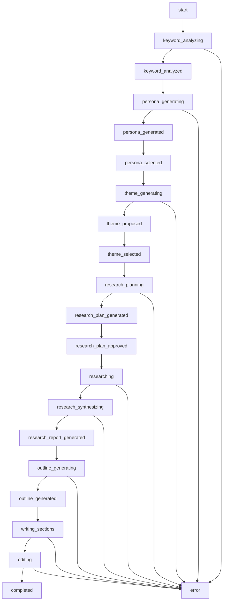

# SEO記事生成プロセスの詳細フロー

## 概要

このドキュメントでは、マーケティングオートメーションAPIの中核機能であるSEO記事生成プロセスについて、ユーザーの入力から記事完成までの具体的な処理フローを詳細に解説します。システムは多段階のAIエージェントを組み合わせ、Supabase Realtimeを活用した非同期処理により、高品質なSEO記事を自動生成します。

## 技術スタック

- **AI SDK**: OpenAI Agents SDK
- **メッセージング**: Supabase Realtime (旧WebSocket から移行)
- **エージェント**: 多段階AI処理 (gpt-4o-mini)
- **外部API**: SerpAPI (競合分析)、Vertex AI Imagen 4.0 (画像生成)
- **データベース**: Supabase PostgreSQL
- **バックグラウンド処理**: FastAPI BackgroundTasks

## 全体フロー概要

### プロセス状態遷移図



### ステップ分類

**自律実行ステップ (AUTONOMOUS_STEPS)**
- `keyword_analyzing` - SerpAPI によるキーワード分析
- `keyword_analyzed` - 分析結果の処理
- `persona_generating` - AIによるペルソナ生成
- `theme_generating` - テーマ案の自動生成
- `research_planning` - リサーチ計画の立案
- `researching` - Web検索によるリサーチ実行
- `research_synthesizing` - リサーチ結果の統合
- `research_report_generated` - レポート生成完了
- `outline_generating` - アウトライン自動生成
- `writing_sections` - セクション執筆
- `editing` - 最終編集・校正

**ユーザー入力待機ステップ (USER_INPUT_STEPS)**
- `persona_generated` - ペルソナ選択待ち
- `theme_proposed` - テーマ選択待ち
- `research_plan_generated` - 計画承認待ち
- `outline_generated` - アウトライン承認待ち

**状態遷移ステップ (TRANSITION_STEPS)**
- `persona_selected` - ペルソナ選択完了
- `theme_selected` - テーマ選択完了
- `research_plan_approved` - 計画承認完了

**終了ステップ (TERMINAL_STEPS)**
- `completed` - 処理完了
- `error` - エラー終了

## 詳細プロセスフロー

### 1. プロセス開始 (`start`)

#### リクエスト受信
```http
POST /articles/generation/start
Content-Type: application/json
Authorization: Bearer <clerk_jwt_token>

{
  "initial_keywords": ["札幌", "注文住宅", "自然素材", "子育て"],
  "target_age_group": "30代",
  "persona_type": "主婦",
  "custom_persona": "札幌近郊で自然素材を使った家づくりに関心がある、小さな子供を持つ30代夫婦",
  "target_length": 3000,
  "num_theme_proposals": 3,
  "num_research_queries": 3,
  "num_persona_examples": 3,
  "company_name": "株式会社ナチュラルホームズ札幌",
  "image_mode": false,
  "style_template_id": null
}
```

#### プロセス初期化
1. **ArticleContext 生成**
   ```python
   context = ArticleContext(
       initial_keywords=request.initial_keywords,
       target_age_group=request.target_age_group,
       persona_type=request.persona_type,
       custom_persona=request.custom_persona,
       target_length=request.target_length,
       image_mode=request.image_mode,
       user_id=user_id,
       current_step="start"
   )
   ```

2. **データベース保存**
   - `generated_articles_state` テーブルに初期状態を記録
   - プロセスIDを生成（UUID）
   - Realtimeチャンネル設定 (`process_{process_id}`)

3. **バックグラウンドタスク開始**
   ```python
   background_tasks.add_task(
       article_service.run_generation_background_task,
       process_id=process_id,
       user_id=user_id,
       organization_id=organization_id,
       request_data=request
   )
   ```

4. **レスポンス返却**
   ```json
   {
     "process_id": "123e4567-e89b-12d3-a456-426614174000",
     "realtime_channel": "process_123e4567-e89b-12d3-a456-426614174000",
     "status": "started",
     "subscription_info": {
       "table": "process_events",
       "filter": "process_id=eq.123e4567-e89b-12d3-a456-426614174000"
     }
   }
   ```

### 2. キーワード分析 (`keyword_analyzing` → `keyword_analyzed`)

#### SerpAPI 分析実行
```python
async def handle_keyword_analyzing_step(self, context: ArticleContext, run_config: RunConfig, process_id: str, user_id: str):
    """SerpAPIを使用したキーワード分析"""
    
    if context.has_serp_api_key:
        current_agent = serp_keyword_analysis_agent
        search_query = " ".join(context.initial_keywords)
        agent_input = f"キーワード「{search_query}」について、SerpAPIを使用してSEO競合分析を実行してください。"
        
        agent_output = await self.run_agent(current_agent, agent_input, context, run_config)
        
        if isinstance(agent_output, SerpKeywordAnalysisReport):
            context.serp_analysis_report = agent_output
            context.current_step = "keyword_analyzed"
    else:
        # SerpAPIが利用できない場合はスキップ
        context.current_step = "keyword_analyzed"
```

#### SerpAPI 分析レポート例
```json
{
  "search_query": "札幌 注文住宅 自然素材 子育て",
  "total_results": 125000,
  "analyzed_articles": [
    {
      "url": "https://example.com/article1",
      "title": "札幌で自然素材の注文住宅を建てる際のポイント",
      "headings": ["自然素材のメリット", "札幌の気候に適した設計", "子育て世代向けの間取り"],
      "char_count": 3500,
      "position": 1
    }
  ],
  "average_article_length": 3200,
  "recommended_target_length": 3500,
  "main_themes": ["自然素材のメリット", "札幌の気候対策", "子育て環境"],
  "content_gaps": ["コスト比較", "メンテナンス方法", "施工期間"],
  "competitive_advantages": ["地域密着性", "実例紹介", "専門家監修"],
  "user_intent_analysis": "情報収集段階のユーザーが多く、比較検討のための具体的な情報を求めている"
}
```

### 3. ペルソナ生成 (`persona_generating` → `persona_generated`)

#### PersonaGeneratorAgent 実行
```python
async def handle_persona_generating_step(self, context: ArticleContext, run_config: RunConfig, process_id: str, user_id: str):
    """具体的なペルソナ生成"""
    
    current_agent = persona_generator_agent
    base_persona_info = context.custom_persona or f"{context.target_age_group}の{context.persona_type}"
    
    agent_input = f"""
    基本ペルソナ情報: {base_persona_info}
    キーワード: {', '.join(context.initial_keywords)}
    
    {context.num_persona_examples}つの具体的で詳細なペルソナを生成してください。
    各ペルソナには名前、年齢、職業、家族構成、悩み、興味関心を含めてください。
    """
    
    agent_output = await self.run_agent(current_agent, agent_input, context, run_config)
```

#### 生成されるペルソナ例
```json
{
  "personas": [
    {
      "id": 0,
      "description": "田中美穂（32歳）：札幌市在住、パート勤務の主婦。4歳と2歳の子供を持つ。夫は会社員。現在賃貸アパート住まいで、子供たちが成長する前にマイホームを建てたいと考えている。自然素材を使った健康的な家づくりに興味があり、化学物質の少ない住環境を重視。札幌の厳しい冬でも快適に過ごせる断熱性能を求めている。"
    },
    {
      "id": 1, 
      "description": "佐藤健二（35歳）：札幌市近郊在住、IT企業勤務。妻と5歳の娘の3人家族。在宅勤務が増えたため、仕事専用スペースのある家を希望。自然素材の温かみのある内装にこだわりたい。環境に配慮した住宅に関心が高く、長期的な住み心地を重視している。"
    },
    {
      "id": 2,
      "description": "山田裕子（29歳）：札幌市在住、看護師として病院勤務。来年結婚予定で、将来の子育てを見据えた家づくりを検討中。自然素材の持つ調湿効果や抗菌作用に医療従事者として興味を持っている。安全で健康的な住環境を第一に考えている。"
    }
  ]
}
```

#### ユーザー選択待ち
```python
# Supabase Realtime イベント送信
await self.service.utils.request_user_input(
    context,
    UserInputType.SELECT_PERSONA,
    GeneratedPersonasPayload(personas=personas_data).model_dump()
)

# プロセス状態更新
context.current_step = "persona_generated"
context.expected_user_input = UserInputType.SELECT_PERSONA
```

### 4. ペルソナ選択 (`persona_selected`)

#### ユーザー入力受信
```http
POST /articles/generation/{process_id}/user-input
Content-Type: application/json

{
  "response_type": "SELECT_PERSONA",
  "payload": {
    "selected_id": 0
  }
}
```

#### 選択処理
```python
async def handle_persona_selection(self, context: ArticleContext, payload: SelectPersonaPayload):
    """ペルソナ選択の処理"""
    selected_id = payload.selected_id
    if 0 <= selected_id < len(context.generated_detailed_personas):
        context.selected_detailed_persona = context.generated_detailed_personas[selected_id]
        context.current_step = "persona_selected"
        
        # データベース更新
        await self.service.persistence_service.save_context_to_db(context, process_id=process_id, user_id=user_id)
```

### 5. テーマ生成 (`theme_generating` → `theme_proposed`)

#### ThemeAgent 実行
```python
def create_theme_agent_input(self, context: ArticleContext) -> str:
    """テーマエージェント用の入力を作成"""
    agent_input_base = f"キーワード「{', '.join(context.initial_keywords)}」と、以下のペルソナに基づいて、{context.num_theme_proposals}個のテーマ案を生成してください。\n\nペルソナ詳細:\n{context.selected_detailed_persona}"
    
    # SerpAPI分析結果がある場合は、競合情報とSEO戦略を追加
    if context.serp_analysis_report:
        seo_context = f"""
        
\n\n=== SEO分析結果（競合記事分析） ===
検索クエリ: {context.serp_analysis_report.search_query}
推奨文字数: {context.serp_analysis_report.recommended_target_length}文字
主要テーマ（競合で頻出）: {', '.join(context.serp_analysis_report.main_themes)}
コンテンツギャップ（差別化チャンス）: {', '.join(context.serp_analysis_report.content_gaps)}
競合優位性のポイント: {', '.join(context.serp_analysis_report.competitive_advantages)}

上記の競合分析結果を活用し、検索上位を狙えるかつ差別化されたテーマを提案してください。"""
        return agent_input_base + seo_context
    return agent_input_base
```

#### 生成されるテーマ例
```json
{
  "themes": [
    {
      "title": "札幌で子育て世代が選ぶべき自然素材注文住宅の完全ガイド",
      "description": "札幌の厳しい冬でも快適に過ごせる自然素材住宅の特徴、選び方、地域に適した設計のポイントを、子育て世代の視点から徹底解説。",
      "keywords": ["札幌", "注文住宅", "自然素材", "子育て", "断熱性能", "健康住宅"]
    },
    {
      "title": "自然素材で建てる札幌の注文住宅：子供の健康を守る家づくりのすべて",
      "description": "化学物質を避け、子供の健康を最優先にした自然素材住宅の建築事例と、札幌エリアでの実践的な家づくりノウハウを紹介。",
      "keywords": ["自然素材", "健康住宅", "子供", "札幌", "注文住宅", "無添加"]
    },
    {
      "title": "札幌の冬を快適に過ごす自然素材注文住宅：子育て家族のための設計術",
      "description": "札幌の気候に特化した自然素材住宅の設計方法と、子育て世代に最適な間取りや機能性について、専門家の視点から詳しく解説。",
      "keywords": ["札幌", "冬", "自然素材", "注文住宅", "子育て", "設計", "間取り"]
    }
  ]
}
```

### 6. リサーチ計画立案 (`research_planning` → `research_plan_generated`)

#### ResearchPlannerAgent 実行
```python
async def handle_research_planning_step(self, context: ArticleContext, run_config: RunConfig, process_id: str, user_id: str):
    """リサーチ計画ステップの処理"""
    
    current_agent = research_planner_agent
    agent_input = f"選択されたテーマ「{context.selected_theme.title}」についてのリサーチ計画を作成してください。"
    
    agent_output = await self.run_agent(current_agent, agent_input, context, run_config)
    
    if isinstance(agent_output, ResearchPlan):
        context.research_plan = agent_output
        context.current_step = "research_plan_generated"
```

#### 生成されるリサーチ計画例
```json
{
  "topic": "札幌で子育て世代が選ぶべき自然素材注文住宅の完全ガイド",
  "queries": [
    {
      "query": "札幌 自然素材 住宅 断熱性能 冬",
      "focus": "札幌の気候に適した自然素材住宅の断熱性能と冬の快適性"
    },
    {
      "query": "自然素材 注文住宅 子育て 健康 化学物質",
      "focus": "子育て世代における自然素材住宅の健康メリットと安全性"
    },
    {
      "query": "札幌 注文住宅 施工会社 自然素材 実例",
      "focus": "札幌エリアでの自然素材注文住宅の実際の施工事例と業者情報"
    }
  ]
}
```

### 7. リサーチ実行 (`researching`)

#### 並列Web検索実行
```python
async def handle_researching_step(self, context: ArticleContext, run_config: RunConfig, process_id: str, user_id: str):
    """リサーチ実行ステップ"""
    
    context.research_query_results = []
    total_queries = len(context.research_plan.queries)
    
    for index, query_data in enumerate(context.research_plan.queries):
        # 進捗通知
        progress_payload = ResearchProgressPayload(
            query_index=index,
            total_queries=total_queries,
            query=query_data.query
        )
        await self.service.utils.send_server_event(context, progress_payload)
        
        # Web検索実行
        current_agent = researcher_agent
        agent_input = f"クエリ「{query_data.query}」でWeb検索を実行し、「{query_data.focus}」に関する情報を収集してください。"
        
        agent_output = await self.run_agent(current_agent, agent_input, context, run_config)
        
        if isinstance(agent_output, ResearchQueryResult):
            context.research_query_results.append(agent_output)
    
    context.current_step = "research_synthesizing"
```

#### 検索結果例
```json
{
  "query": "札幌 自然素材 住宅 断熱性能 冬",
  "results": [
    {
      "title": "札幌の自然素材住宅における断熱性能の重要性",
      "url": "https://example.com/thermal-performance",
      "snippet": "札幌の厳しい冬では、自然素材住宅でも高い断熱性能が必要です。セルロースファイバーや羊毛断熱材を使用することで、化学物質を避けながら優れた断熱効果を実現できます。"
    }
  ],
  "summary": "札幌の気候条件下では、自然素材を使用しながらも高断熱性能を確保する技術が重要"
}
```

### 8. リサーチ統合 (`research_synthesizing` → `research_report_generated`)

#### ResearchSynthesizerAgent 実行
```python
async def handle_research_synthesizing_step(self, context: ArticleContext, run_config: RunConfig, process_id: str, user_id: str):
    """リサーチ結果統合ステップ"""
    
    current_agent = research_synthesizer_agent
    research_summary = self.create_research_summary(context)
    agent_input = f"以下のリサーチ結果を統合し、包括的なレポートを作成してください：\n\n{research_summary}"
    
    agent_output = await self.run_agent(current_agent, agent_input, context, run_config)
    
    if isinstance(agent_output, ResearchReport):
        context.research_report = agent_output
        context.current_step = "research_report_generated"
```

#### 統合レポート例
```json
{
  "topic": "札幌で子育て世代が選ぶべき自然素材注文住宅",
  "overall_summary": "札幌の自然素材注文住宅市場では、厳しい冬の気候に対応した高断熱性能と、子育て世代の健康志向に応える自然素材の使用が重要なポイントとなっている。",
  "key_points": [
    {
      "point": "札幌の気候に適した断熱材の選択",
      "supporting_sources": ["断熱材メーカーA社の技術資料", "札幌市建築指導課のガイドライン"]
    },
    {
      "point": "自然素材の健康効果と安全性",
      "supporting_sources": ["健康住宅研究所の調査結果", "小児科医の見解"]
    }
  ],
  "interesting_angles": [
    "札幌特有の積雪対応設計",
    "光熱費削減効果の具体的データ",
    "子供のアレルギー症状改善事例"
  ],
  "all_sources": ["https://example1.com", "https://example2.com"]
}
```

### 9. アウトライン生成 (`outline_generating` → `outline_generated`)

#### OutlineAgent 実行
```python
async def handle_outline_generating_step(self, context: ArticleContext, run_config: RunConfig, process_id: str, user_id: str):
    """アウトライン生成ステップ"""
    
    current_agent = outline_agent
    
    # 会社情報とスタイルガイドを含めた詳細な指示
    company_context = build_enhanced_company_context(context)
    style_context = build_style_context(context)
    
    agent_input = f"""
    テーマ: {context.selected_theme.title}
    ペルソナ: {context.selected_detailed_persona}
    
    {company_context}
    {style_context}
    
    リサーチレポート: {context.research_report.overall_summary}
    
    上記の情報を基に、SEOに最適化された詳細なアウトラインを作成してください。
    """
    
    agent_output = await self.run_agent(current_agent, agent_input, context, run_config)
```

#### 生成されるアウトライン例
```json
{
  "title": "札幌で子育て世代が選ぶべき自然素材注文住宅の完全ガイド",
  "suggested_tone": "親しみやすく信頼できる専門家のトーン。専門用語は分かりやすく解説し、実体験に基づく具体例を交える。",
  "sections": [
    {
      "heading": "札幌の自然素材注文住宅が子育て世代に選ばれる理由",
      "estimated_chars": 400,
      "subsections": [
        "化学物質を避けた健康的な住環境",
        "札幌の気候に適した自然素材の特性",
        "子供の成長を考えた長期的な住まい"
      ]
    },
    {
      "heading": "札幌で使われる主な自然素材とその特徴",
      "estimated_chars": 600,
      "subsections": [
        "無垢材フローリングの種類と特性",
        "漆喰・珪藻土の調湿効果",
        "断熱材としての自然素材オプション"
      ]
    },
    {
      "heading": "札幌の冬を快適に過ごす自然素材住宅の設計ポイント",
      "estimated_chars": 700,
      "subsections": null
    }
  ]
}
```

### 10. セクション執筆 (`writing_sections`)

#### SectionWriterAgent による並列執筆
```python
async def handle_writing_sections_step(self, context: ArticleContext, run_config: RunConfig, process_id: str, user_id: str):
    """セクション執筆ステップ"""
    
    context.generated_sections = []
    context.generated_sections_html = []
    
    total_sections = len(context.generated_outline.sections)
    
    for section_index, section_data in enumerate(context.generated_outline.sections):
        # 進捗通知
        progress_payload = SectionChunkPayload(
            section_index=section_index,
            heading=section_data.heading,
            html_content_chunk="",
            is_complete=False,
            is_image_mode=context.image_mode
        )
        await self.service.utils.send_server_event(context, progress_payload)
        
        # セクション執筆エージェント選択
        if context.image_mode:
            current_agent = section_writer_with_images_agent
        else:
            current_agent = section_writer_agent
        
        # エージェント入力生成
        agent_input = self.create_section_writer_input(context, section_data, section_index)
        
        # ストリーミング実行
        agent_output = await self.run_agent_streaming(current_agent, agent_input, context, run_config, section_index)
        
        if isinstance(agent_output, (ArticleSection, ArticleSectionWithImages)):
            context.generated_sections.append(agent_output)
            context.generated_sections_html.append(agent_output.content)
    
    context.current_step = "editing"
```

#### ストリーミング出力処理
```python
async def run_agent_streaming(self, agent: Agent, agent_input: str, context: ArticleContext, run_config: RunConfig, section_index: int):
    """エージェントのストリーミング実行"""
    
    async with Runner(agent=agent, run_config=run_config) as runner:
        async for chunk in runner.run_stream(user_message=agent_input):
            if chunk.content:
                # リアルタイムでHTMLチャンクを送信
                chunk_payload = SectionChunkPayload(
                    section_index=section_index,
                    heading=context.generated_outline.sections[section_index].heading,
                    html_content_chunk=chunk.content,
                    is_complete=False,
                    is_image_mode=context.image_mode
                )
                await self.service.utils.send_server_event(context, chunk_payload)
        
        # セクション完了通知
        final_payload = SectionChunkPayload(
            section_index=section_index,
            heading=context.generated_outline.sections[section_index].heading,
            html_content_chunk="",
            is_complete=True,
            section_complete_content=runner.result.content,
            is_image_mode=context.image_mode
        )
        await self.service.utils.send_server_event(context, final_payload)
```

### 11. 最終編集 (`editing` → `completed`)

#### EditorAgent による最終校正
```python
async def handle_editing_step(self, context: ArticleContext, run_config: RunConfig, process_id: str, user_id: str):
    """編集・校正ステップ"""
    
    # 編集開始通知
    await self.service.utils.send_server_event(context, EditingStartPayload())
    
    current_agent = editor_agent
    full_draft = context.get_full_draft()
    
    agent_input = f"""
    以下のドラフト記事を最終編集してください：
    
    タイトル: {context.selected_theme.title}
    
    {full_draft}
    
    編集方針:
    - 文体の統一と自然な文章への校正
    - SEO最適化（キーワードの適切な配置）
    - 読みやすさの向上
    - 情報の正確性確認
    """
    
    agent_output = await self.run_agent(current_agent, agent_input, context, run_config)
    
    if isinstance(agent_output, RevisedArticle):
        context.final_article = agent_output
        context.final_article_html = agent_output.content
        
        # データベースに最終記事を保存
        article_id = await self.save_final_article_to_db(context, process_id, user_id)
        context.final_article_id = article_id
        
        # 完了通知
        final_payload = FinalResultPayload(
            title=agent_output.title,
            final_html_content=agent_output.content,
            article_id=article_id
        )
        await self.service.utils.send_server_event(context, final_payload)
        
        context.current_step = "completed"
```

## Supabase Realtime 連携仕様

### リアルタイム通信フロー

#### 1. プロセスイベント配信
```sql
-- process_events テーブルへのINSERT時にRealtime配信
INSERT INTO process_events (
    process_id,
    event_type,
    event_data,
    event_sequence
) VALUES (
    '123e4567-e89b-12d3-a456-426614174000',
    'step_update',
    '{"step": "keyword_analyzing", "message": "キーワード分析を開始します"}',
    1
);
```

#### 2. プロセス状態更新
```sql
-- generated_articles_state テーブルのUPDATE時にRealtime配信
UPDATE generated_articles_state 
SET 
    article_context = $1,
    status = 'in_progress',
    current_step = 'theme_generating',
    updated_at = NOW()
WHERE id = $2;
```

#### 3. フロントエンド購読
```typescript
// フロントエンドでのSupabase Realtime購読
const subscription = supabase
  .channel(`process_events:process_id=eq.${processId}`)
  .on('postgres_changes', 
    { 
      event: 'INSERT', 
      schema: 'public', 
      table: 'process_events',
      filter: `process_id=eq.${processId}`
    }, 
    (payload) => {
      handleProcessEvent(payload.new);
    }
  )
  .subscribe();
```

### イベント種類一覧

| イベント種類 | 説明 | ペイロード例 |
|-------------|------|-------------|
| `process_created` | プロセス開始 | `{"process_id": "...", "initial_keywords": [...]}` |
| `step_update` | ステップ更新 | `{"step": "keyword_analyzing", "message": "..."}` |
| `persona_generated` | ペルソナ生成完了 | `{"personas": [...]}` |
| `theme_proposed` | テーマ提案 | `{"themes": [...]}` |
| `user_input_required` | ユーザー入力待ち | `{"input_type": "SELECT_THEME", "options": [...]}` |
| `research_progress` | リサーチ進捗 | `{"query_index": 1, "total_queries": 3}` |
| `section_chunk` | セクション執筆進捗 | `{"section_index": 0, "html_chunk": "..."}` |
| `process_completed` | プロセス完了 | `{"article_id": "...", "final_content": "..."}` |
| `process_error` | エラー発生 | `{"error_message": "...", "step": "..."}` |

## バックグラウンド処理とエラーハンドリング

### 復旧可能エラー処理
```python
class GenerationFlowManager:
    async def handle_generation_error(self, context: ArticleContext, error: Exception, process_id: str):
        """生成エラーのハンドリング"""
        
        error_message = str(error)
        logger.error(f"Generation error in step {context.current_step}: {error_message}")
        
        # 復旧可能なエラーかチェック
        if self.is_recoverable_error(error, context.current_step):
            # 復旧情報をデータベースに保存
            await self.save_recovery_state(context, process_id, error_message)
            
            # フロントエンドに復旧可能エラーを通知
            error_payload = {
                "error_type": "recoverable",
                "step": context.current_step,
                "message": error_message,
                "recovery_options": ["retry", "skip", "manual_input"]
            }
        else:
            # 致命的エラー
            context.current_step = "error"
            error_payload = {
                "error_type": "fatal",
                "step": context.current_step,
                "message": error_message
            }
        
        await self.service.utils.send_error_event(context, error_payload)
```

### プロセス復旧
```python
async def resume_generation_process(self, process_id: str, user_id: str):
    """中断されたプロセスの復旧"""
    
    # データベースから状態復元
    context = await self.persistence_service.load_context_from_db(process_id, user_id)
    
    if context and context.current_step in DISCONNECTION_RESILIENT_STEPS:
        # バックグラウンドタスクで処理再開
        await self.run_generation_from_current_step(context, process_id, user_id)
        return True
    
    return False
```

## パフォーマンス最適化

### 並列処理
- **リサーチクエリ**: 複数検索クエリの並列実行
- **セクション執筆**: 独立セクションの並列生成
- **画像生成**: テキスト生成と画像生成の並列処理

### キャッシュ戦略
- **エージェント結果**: 同一入力のキャッシュ
- **Web検索結果**: 24時間キャッシュ
- **会社情報**: セッション間キャッシュ

### リソース管理
- **トークン使用量制限**: ユーザーごとの上限管理
- **同時プロセス数制限**: システム負荷制御
- **タイムアウト設定**: 長時間処理の自動停止

このSEO記事生成プロセスにより、ユーザーの簡単な入力から高品質なSEO記事まで、完全自動化された記事作成ワークフローを実現しています。Supabase Realtimeによるリアルタイム進捗共有により、ユーザーは生成プロセスをリアルタイムで確認でき、必要に応じて介入・調整することが可能です。