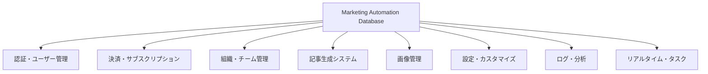

# データベーステーブル仕様一覧

## 概要

このドキュメントでは、Marketing Automationプラットフォームのデータベースに存在するすべてのテーブルの詳細仕様を網羅的に解説します。各テーブルのカラム定義、データ型、制約、役割、および他テーブルとのリレーションシップを体系的に整理し、プラットフォーム全体のデータ構造を明確化します。

## テーブル分類とアーキテクチャ

### 1. システム分類



### 2. テーブル総数と役割分担

- **認証・ユーザー管理**: 2テーブル (users, customers)
- **決済システム**: 4テーブル (products, prices, subscriptions, organization_subscriptions)
- **組織管理**: 3テーブル (organizations, organization_members, invitations)
- **記事生成**: 5テーブル (prompt_templates, article_generation_flows, flow_steps, generated_articles_state, articles)
- **画像管理**: 2テーブル (images, image_placeholders)
- **設定管理**: 2テーブル (company_info, style_guide_templates)
- **ログ・分析**: 5テーブル (agent_log_sessions, agent_execution_logs, llm_call_logs, tool_call_logs, workflow_step_logs)
- **リアルタイム**: 3テーブル (process_events, background_tasks, task_dependencies)

**総計**: 26テーブル

---

## 1. 認証・ユーザー管理テーブル

### 1.1 users テーブル

**目的**: Supabase Authと連携したユーザー基本情報管理

```sql
create table users (
  id uuid references auth.users not null primary key,
  full_name text,
  avatar_url text,
  billing_address jsonb,
  payment_method jsonb
);
```

**カラム仕様**:
| カラム名 | データ型 | 制約 | 説明 |
|---------|---------|-----|-----|
| id | UUID | PK, FK(auth.users) | Supabase Auth UUID |
| full_name | TEXT | nullable | ユーザーのフルネーム |
| avatar_url | TEXT | nullable | プロフィール画像URL |
| billing_address | JSONB | nullable | 請求先住所（JSON形式） |
| payment_method | JSONB | nullable | 支払い方法情報（JSON形式） |

**RLSポリシー**:
- 「自分自身のデータのみ閲覧・更新可能」
- `auth.uid() = id` による厳格なアクセス制御

**リレーションシップ**:
- `auth.users` への外部キー参照
- `subscriptions`, `organization_members` からの被参照

### 1.2 customers テーブル

**目的**: ユーザーとStripe顧客IDのマッピング管理

```sql
create table customers (
  id uuid references auth.users not null primary key,
  stripe_customer_id text
);
```

**カラム仕様**:
| カラム名 | データ型 | 制約 | 説明 |
|---------|---------|-----|-----|
| id | UUID | PK, FK(auth.users) | ユーザーUUID |
| stripe_customer_id | TEXT | nullable | Stripe顧客ID |

**セキュリティ**:
- **プライベートテーブル**: ユーザーからは直接アクセス不可
- Stripe WebhookとバックエンドAPIのみがアクセス

---

## 2. 決済・サブスクリプション管理テーブル

### 2.1 products テーブル

**目的**: Stripe商品情報の同期管理

```sql
create table products (
  id text primary key,
  active boolean,
  name text,
  description text,
  image text,
  metadata jsonb
);
```

**カラム仕様**:
| カラム名 | データ型 | 制約 | 説明 |
|---------|---------|-----|-----|
| id | TEXT | PK | Stripe商品ID (prod_xxxx) |
| active | BOOLEAN | nullable | 販売可否フラグ |
| name | TEXT | nullable | 商品表示名 |
| description | TEXT | nullable | 商品説明文 |
| image | TEXT | nullable | 商品画像URL |
| metadata | JSONB | nullable | 追加メタデータ |

**アクセス権**:
- **パブリック読み取り専用**: すべてのユーザーが閲覧可能
- Stripe Webhookによる更新のみ

### 2.2 prices テーブル

**目的**: Stripe価格情報の同期管理

```sql
create type pricing_type as enum ('one_time', 'recurring');
create type pricing_plan_interval as enum ('day', 'week', 'month', 'year');

create table prices (
  id text primary key,
  product_id text references products,
  active boolean,
  description text,
  unit_amount bigint,
  currency text check (char_length(currency) = 3),
  type pricing_type,
  interval pricing_plan_interval,
  interval_count integer,
  trial_period_days integer,
  metadata jsonb
);
```

**カラム仕様**:
| カラム名 | データ型 | 制約 | 説明 |
|---------|---------|-----|-----|
| id | TEXT | PK | Stripe価格ID (price_xxxx) |
| product_id | TEXT | FK(products) | 関連商品ID |
| active | BOOLEAN | nullable | 有効フラグ |
| description | TEXT | nullable | 価格説明 |
| unit_amount | BIGINT | nullable | 最小通貨単位での金額 |
| currency | TEXT | CHECK(3文字) | ISO通貨コード |
| type | pricing_type | nullable | 'one_time' or 'recurring' |
| interval | pricing_plan_interval | nullable | 請求間隔 |
| interval_count | INTEGER | nullable | 間隔係数 |
| trial_period_days | INTEGER | nullable | 試用期間日数 |
| metadata | JSONB | nullable | 追加メタデータ |

### 2.3 subscriptions テーブル

**目的**: 個人ユーザーのサブスクリプション管理

```sql
create type subscription_status as enum (
  'trialing', 'active', 'canceled', 'incomplete', 
  'incomplete_expired', 'past_due', 'unpaid', 'paused'
);

create table subscriptions (
  id text primary key,
  user_id uuid references auth.users not null,
  status subscription_status,
  metadata jsonb,
  price_id text references prices,
  quantity integer,
  cancel_at_period_end boolean,
  created timestamp with time zone default timezone('utc'::text, now()) not null,
  current_period_start timestamp with time zone default timezone('utc'::text, now()) not null,
  current_period_end timestamp with time zone default timezone('utc'::text, now()) not null,
  ended_at timestamp with time zone,
  cancel_at timestamp with time zone,
  canceled_at timestamp with time zone,
  trial_start timestamp with time zone,
  trial_end timestamp with time zone
);
```

**主要カラム説明**:
- **status**: サブスクリプション状態（試用中、有効、キャンセル済み等）
- **cancel_at_period_end**: 期間終了時の自動キャンセルフラグ
- **current_period_start/end**: 現在請求期間の開始・終了日時

### 2.4 organization_subscriptions テーブル

**目的**: 組織レベルのサブスクリプション管理

```sql
create table organization_subscriptions (
  id text primary key,
  organization_id uuid references organizations(id) on delete cascade not null,
  status subscription_status not null,
  metadata jsonb,
  price_id text references prices,
  quantity integer not null default 1,
  -- 個人サブスクリプションと同様の時刻フィールド群
);
```

**個人サブスクリプションとの違い**:
- `user_id` の代わりに `organization_id` を使用
- `quantity` によるマルチシート管理
- 組織削除時のカスケード削除

---

## 3. 組織・チーム管理テーブル

### 3.1 organizations テーブル

**目的**: チーム・組織の基本情報管理

```sql
create table organizations (
  id uuid default gen_random_uuid() primary key,
  name text not null,
  owner_user_id uuid references auth.users not null,
  clerk_organization_id text unique,
  stripe_customer_id text,
  created_at timestamp with time zone default timezone('utc'::text, now()) not null,
  updated_at timestamp with time zone default timezone('utc'::text, now()) not null
);
```

**カラム仕様**:
| カラム名 | データ型 | 制約 | 説明 |
|---------|---------|-----|-----|
| id | UUID | PK | 組織内部ID |
| name | TEXT | NOT NULL | 組織表示名 |
| owner_user_id | UUID | FK(auth.users) | 組織オーナーID |
| clerk_organization_id | TEXT | UNIQUE | Clerk組織ID（認証連携） |
| stripe_customer_id | TEXT | nullable | Stripe顧客ID（課金用） |

**自動化機能**:
- 組織作成時の自動オーナーメンバー追加（トリガー）
- `updated_at` の自動更新

### 3.2 organization_members テーブル

**目的**: 組織メンバーシップと権限管理

```sql
create type organization_role as enum ('owner', 'admin', 'member');

create table organization_members (
  organization_id uuid references organizations(id) on delete cascade,
  user_id uuid references auth.users on delete cascade,
  primary key (organization_id, user_id),
  role organization_role not null default 'member',
  clerk_membership_id text,
  joined_at timestamp with time zone default timezone('utc'::text, now()) not null
);
```

**権限階層**:
1. **owner**: 組織の完全な管理権限
2. **admin**: メンバー管理、組織設定の管理権限
3. **member**: 基本的な閲覧・利用権限

**複合主キー**: `(organization_id, user_id)` による一意性確保

### 3.3 invitations テーブル

**目的**: 組織招待システムの管理

```sql
create type invitation_status as enum ('pending', 'accepted', 'declined', 'expired');

create table invitations (
  id uuid default gen_random_uuid() primary key,
  organization_id uuid references organizations(id) on delete cascade not null,
  email text not null,
  role organization_role not null default 'member',
  status invitation_status not null default 'pending',
  invited_by_user_id uuid references auth.users not null,
  token text unique not null default replace(gen_random_uuid()::text || gen_random_uuid()::text, '-', ''),
  expires_at timestamp with time zone default (timezone('utc'::text, now()) + interval '7 days') not null,
  created_at timestamp with time zone default timezone('utc'::text, now()) not null
);
```

**セキュリティ機能**:
- **一意トークン**: UUID v4 を2つ連結した 64 文字のランダム値
- **自動有効期限**: デフォルト7日間
- **ステータス管理**: pending → accepted/declined/expired

---

## 4. 記事生成システムテーブル

### 4.1 prompt_templates テーブル

**目的**: 再利用可能なプロンプトテンプレートの管理

```sql
create table prompt_templates (
  id uuid default gen_random_uuid() primary key,
  name text not null,
  content text not null,
  description text,
  created_at timestamp with time zone default timezone('utc'::text, now()) not null,
  updated_at timestamp with time zone default timezone('utc'::text, now') not null
);
```

**アクセス制御**:
- **認証ユーザー読み取り専用**: 全テンプレートの閲覧可能
- **管理者のみ作成・編集**: 将来的に組織レベルカスタマイズ予定

### 4.2 article_generation_flows テーブル

**目的**: カスタマイズ可能な記事生成ワークフローの定義

```sql
create table article_generation_flows (
  id uuid default gen_random_uuid() primary key,
  organization_id uuid references organizations(id) on delete cascade,
  user_id uuid references auth.users on delete cascade,
  name text not null,
  description text,
  is_template boolean default false,
  created_at timestamp with time zone default timezone('utc'::text, now()) not null,
  updated_at timestamp with time zone default timezone('utc'::text, now()) not null,
  
  constraint flow_ownership_check check (
    (organization_id is not null and user_id is null) or
    (organization_id is null and user_id is not null) or
    (organization_id is null and user_id is null and is_template = true)
  )
);
```

**所有権パターン**:
1. **組織フロー**: `organization_id` 設定、全メンバーで共有
2. **個人フロー**: `user_id` 設定、個人専用
3. **システムテンプレート**: 両方NULL、`is_template=true`

### 4.3 flow_steps テーブル

**目的**: フロー内の個別ステップ定義

```sql
create type step_type as enum (
  'keyword_analysis', 'persona_generation', 'theme_proposal',
  'research_planning', 'research_execution', 'research_synthesis',
  'outline_generation', 'section_writing', 'editing', 'custom'
);

create table flow_steps (
  id uuid default gen_random_uuid() primary key,
  flow_id uuid references article_generation_flows(id) on delete cascade not null,
  step_order integer not null,
  step_type step_type not null,
  agent_name text,
  prompt_template_id uuid references prompt_templates(id),
  tool_config jsonb,
  output_schema jsonb,
  is_interactive boolean default false,
  skippable boolean default false,
  config jsonb,
  
  unique(flow_id, step_order)
);
```

**ステップ設定**:
- **step_order**: フロー内での実行順序（ユニーク制約）
- **is_interactive**: ユーザー入力が必要なステップ
- **tool_config**: 外部ツール（Web検索等）の設定
- **output_schema**: 期待される出力形式の定義

### 4.4 generated_articles_state テーブル

**目的**: 記事生成プロセスの状態永続化

```sql
create type generation_status as enum (
  'in_progress', 'user_input_required', 'paused', 
  'completed', 'error', 'cancelled', 'resuming', 'auto_progressing'
);

create table generated_articles_state (
  id uuid default gen_random_uuid() primary key,
  flow_id uuid references article_generation_flows(id) not null,
  user_id text not null,  -- Clerk対応のため文字列型
  organization_id uuid references organizations(id),
  current_step_id uuid references flow_steps(id),
  status generation_status not null default 'in_progress',
  
  -- コンテキストとデータ
  article_context jsonb not null,
  generated_content jsonb,
  article_id uuid references articles(id),
  
  -- プロセス制御
  current_step_name text,
  progress_percentage integer default 0,
  is_waiting_for_input boolean default false,
  input_type text,
  
  -- リアルタイム対応
  realtime_channel text,
  last_realtime_event jsonb,
  realtime_subscriptions jsonb default '[]'::jsonb,
  
  -- バックグラウンドタスク管理
  executing_step text,
  step_execution_start timestamp with time zone,
  step_execution_metadata jsonb default '{}'::jsonb,
  background_task_id text,
  task_priority integer default 5,
  retry_count integer default 0,
  max_retries integer default 3,
  
  -- ユーザー入力管理
  user_input_timeout timestamp with time zone,
  input_reminder_sent boolean default false,
  interaction_history jsonb default '[]'::jsonb,
  
  -- プロセス強化
  auto_resume_eligible boolean default false,
  resume_from_step text,
  step_history jsonb default '[]'::jsonb,
  process_metadata jsonb default '{}'::jsonb,
  process_type text default 'article_generation',
  parent_process_id uuid references generated_articles_state(id),
  process_tags text[] default '{}',
  
  -- パフォーマンス追跡
  step_durations jsonb default '{}'::jsonb,
  total_processing_time interval,
  estimated_completion_time timestamp with time zone,
  last_activity_at timestamp with time zone default timezone('utc'::text, now()),
  
  -- 画像生成モード
  image_mode boolean default false,
  image_settings jsonb default '{}'::jsonb,
  style_template_id uuid references style_guide_templates(id),
  
  created_at timestamp with time zone default timezone('utc'::text, now()) not null,
  updated_at timestamp with time zone default timezone('utc'::text, now()) not null,
  error_message text
);
```

**主要機能**:
1. **状態管理**: 包括的なプロセス状態追跡
2. **リアルタイム**: Supabase Realtimeとの連携
3. **中断・再開**: プロセスの柔軟な制御
4. **ユーザー対話**: 入力待ち状態の管理
5. **エラー回復**: 自動・手動でのエラー対応

### 4.5 articles テーブル

**目的**: 完成した記事の保存・管理

```sql
create table articles (
  id uuid default gen_random_uuid() primary key,
  user_id text not null,  -- Clerk対応
  organization_id uuid references organizations(id),
  generation_process_id uuid references generated_articles_state(id),
  title text not null,
  content text not null,
  keywords text[],
  target_audience text,
  status text default 'draft',
  created_at timestamp with time zone default timezone('utc'::text, now()) not null,
  updated_at timestamp with time zone default timezone('utc'::text, now()) not null
);
```

**記事管理機能**:
- **生成トレーサビリティ**: `generation_process_id` による生成過程の追跡
- **SEOメタデータ**: キーワード配列、ターゲットオーディエンス
- **マルチテナント**: 個人・組織レベルでの管理

---

## 5. 画像管理テーブル

### 5.1 images テーブル

**目的**: アップロード・生成画像の統合管理

```sql
create table images (
  id uuid default gen_random_uuid() primary key,
  user_id text not null,  -- Clerk対応
  organization_id uuid references organizations(id),
  article_id uuid references articles(id),
  generation_process_id uuid references generated_articles_state(id),
  
  -- ファイル情報
  original_filename text,
  file_path text not null,
  image_type text check (image_type in ('uploaded', 'generated')) not null,
  
  -- 表示・SEO情報
  alt_text text,
  caption text,
  
  -- AI生成関連
  generation_prompt text,
  generation_params jsonb,
  
  -- メタデータ
  metadata jsonb default '{}'::jsonb,
  created_at timestamp with time zone default timezone('utc'::text, now()) not null,
  updated_at timestamp with time zone default timezone('utc'::text, now()) not null
);
```

**画像種別**:
- **uploaded**: ユーザーがアップロードした画像
- **generated**: Vertex AI Imagen 4.0で生成した画像

**統合管理**:
- 記事、生成プロセス、組織との多層リレーション
- プロンプト・パラメータによる生成過程の記録

### 5.2 image_placeholders テーブル

**目的**: 記事内画像プレースホルダーの管理

```sql
create table image_placeholders (
  id uuid default gen_random_uuid() primary key,
  article_id uuid references articles(id),  
  generation_process_id uuid references generated_articles_state(id),
  placeholder_id text not null,
  description_jp text not null,
  prompt_en text not null,
  position_index integer not null,
  replaced_with_image_id uuid references images(id),
  status text check (status in ('pending', 'replaced', 'generating')) default 'pending',
  metadata jsonb default '{}'::jsonb,
  created_at timestamp with time zone default timezone('utc'::text, now()) not null,
  updated_at timestamp with time zone default timezone('utc'::text, now()) not null,
  
  unique(article_id, placeholder_id)
);
```

**プレースホルダーフロー**:
1. **記事生成時**: `<!-- IMAGE_PLACEHOLDER: ID|説明|プロンプト -->` 形式で挿入
2. **抽出処理**: `extract_image_placeholders()` 関数で自動抽出
3. **画像生成**: ステータス `pending` → `generating` → `replaced`
4. **記事更新**: `replace_placeholder_with_image()` で実際の画像に置換

---

## 6. 設定・カスタマイズテーブル

### 6.1 company_info テーブル

**目的**: 企業情報を活用した記事生成のカスタマイズ

```sql
create table company_info (
  id text primary key default (gen_random_uuid()::text),
  user_id text not null,  -- Clerk対応
  
  -- 必須企業情報
  name varchar(200) not null,
  website_url varchar(500) not null,
  description text not null,
  usp text not null,  -- Unique Selling Proposition
  target_persona varchar(50) not null,
  
  -- デフォルト設定
  is_default boolean default false not null,
  
  -- 詳細カスタマイズ
  brand_slogan varchar(200),
  target_keywords varchar(500),
  industry_terms varchar(500),
  avoid_terms varchar(500),
  popular_articles text,
  target_area varchar(200),
  
  created_at timestamp with time zone default timezone('utc'::text, now()) not null,
  updated_at timestamp with time zone default timezone('utc'::text, now') not null
);
```

**記事生成への活用**:
- **ArticleContext組み込み**: 生成プロセス中に企業情報を注入
- **プロンプト強化**: エージェントのシステムプロンプトに企業特性を反映
- **SEO最適化**: 企業固有のキーワード・用語の活用

### 6.2 style_guide_templates テーブル

**目的**: 再利用可能なスタイルガイドテンプレート管理

```sql
create type style_template_type as enum (
  'writing_tone', 'vocabulary', 'structure', 
  'branding', 'seo_focus', 'custom'
);

create table style_guide_templates (
  id uuid default gen_random_uuid() primary key,
  user_id text not null,  -- Clerk対応（UUID→TEXT変更あり）
  organization_id uuid references organizations(id) on delete cascade,
  name text not null,
  description text,
  template_type style_template_type default 'custom',
  settings jsonb not null default '{}'::jsonb,
  is_active boolean default true,
  is_default boolean default false,
  created_at timestamp with time zone default timezone('utc'::text, now()) not null,
  updated_at timestamp with time zone default timezone('utc'::text, now()) not null
);
```

**テンプレート種別**:
- **writing_tone**: 文体・トーン設定
- **vocabulary**: 語彙・専門用語設定
- **structure**: 記事構造・形式設定
- **branding**: ブランディング要素
- **seo_focus**: SEO重点設定
- **custom**: カスタム設定

**一意性保証**:
- `ensure_single_default_style_template()` 関数により、ユーザー/組織あたり1つのデフォルトテンプレートのみ許可

---

## 7. ログ・分析テーブル群

### 7.1 agent_log_sessions テーブル

**目的**: マルチエージェント記事生成セッション全体の追跡

```sql
create table agent_log_sessions (
  id uuid primary key default gen_random_uuid(),
  article_uuid uuid not null references articles(id) on delete cascade,
  user_id text not null,  -- Clerk対応
  organization_id uuid references organizations(id) on delete cascade,
  
  -- 初期入力データ
  initial_input jsonb not null default '{}',
  seo_keywords text[],
  image_mode_enabled boolean default false,
  article_style_info jsonb default '{}',
  generation_theme_count integer default 1,
  target_age_group text,
  persona_settings jsonb default '{}',
  company_info jsonb default '{}',
  
  -- セッション状態
  status text not null default 'started' check (status in ('started', 'in_progress', 'completed', 'failed', 'cancelled')),
  total_steps integer default 0,
  completed_steps integer default 0,
  
  created_at timestamptz not null default now(),
  updated_at timestamptz not null default now(),
  completed_at timestamptz,
  session_metadata jsonb default '{}',
  
  constraint valid_step_counts check (completed_steps <= total_steps)
);
```

**包括的記録**:
- **初期入力の完全保存**: 生成セッションの再現可能性
- **進捗追跡**: ステップ単位での完了率管理
- **メタデータ拡張**: 分析用の追加情報保存

### 7.2 agent_execution_logs テーブル

**目的**: 個別エージェント実行の詳細ログ

```sql
create table agent_execution_logs (
  id uuid primary key default gen_random_uuid(),
  session_id uuid not null references agent_log_sessions(id) on delete cascade,
  
  -- エージェント識別
  agent_name text not null,
  agent_type text not null,
  step_number integer not null,
  sub_step_number integer default 1,
  
  -- 実行状態
  status text not null default 'started' check (status in ('started', 'running', 'completed', 'failed', 'timeout')),
  
  -- 入出力データ
  input_data jsonb default '{}',
  output_data jsonb default '{}',
  
  -- LLMメトリクス
  llm_model text,
  llm_provider text default 'openai',
  input_tokens integer default 0,
  output_tokens integer default 0,
  cache_tokens integer default 0,
  reasoning_tokens integer default 0,  -- o3, o4-mini対応
  
  -- タイミング
  started_at timestamptz not null default now(),
  completed_at timestamptz,
  duration_ms integer,
  
  -- エラー処理
  error_message text,
  error_details jsonb default '{}',
  execution_metadata jsonb default '{}',
  
  constraint valid_duration check (duration_ms >= 0),
  constraint valid_tokens check (
    input_tokens >= 0 and output_tokens >= 0 and 
    cache_tokens >= 0 and reasoning_tokens >= 0
  )
);
```

### 7.3 llm_call_logs テーブル

**目的**: LLM API呼び出しの詳細記録

```sql
create table llm_call_logs (
  id uuid primary key default gen_random_uuid(),
  execution_id uuid not null references agent_execution_logs(id) on delete cascade,
  
  -- 呼び出し情報
  call_sequence integer not null default 1,
  api_type text not null default 'chat_completions',
  model_name text not null,
  provider text not null default 'openai',
  
  -- プロンプト・レスポンス
  system_prompt text,
  user_prompt text,
  full_prompt_data jsonb default '{}',
  response_content text,
  response_data jsonb default '{}',
  
  -- 使用量・コスト
  prompt_tokens integer default 0,
  completion_tokens integer default 0,
  total_tokens integer default 0,
  cached_tokens integer default 0,
  reasoning_tokens integer default 0,
  response_time_ms integer,
  estimated_cost_usd decimal(10, 6),
  
  -- API応答
  http_status_code integer,
  api_response_id text,
  called_at timestamptz not null default now(),
  
  -- エラー処理
  error_type text,
  error_message text,
  retry_count integer default 0,
  
  constraint valid_tokens_llm check (
    prompt_tokens >= 0 and completion_tokens >= 0 and 
    total_tokens >= 0 and cached_tokens >= 0 and reasoning_tokens >= 0
  ),
  constraint valid_cost check (estimated_cost_usd >= 0)
);
```

**コスト分析機能**:
- **トークン別集計**: プロンプト・完了・キャッシュ・推論トークンの詳細追跡
- **コスト推定**: USD単位での費用算出
- **パフォーマンス分析**: レスポンス時間の測定

### 7.4 tool_call_logs テーブル

**目的**: 外部ツール（WebSearch、SerpAPI等）呼び出しログ

```sql
create table tool_call_logs (
  id uuid primary key default gen_random_uuid(),
  execution_id uuid not null references agent_execution_logs(id) on delete cascade,
  
  -- ツール情報
  tool_name text not null,  -- 'web_search', 'serp_api', 'file_search'
  tool_function text not null,
  call_sequence integer not null default 1,
  
  -- 呼び出しデータ
  input_parameters jsonb default '{}',
  output_data jsonb default '{}',
  status text not null default 'started' check (status in ('started', 'completed', 'failed', 'timeout')),
  
  -- メトリクス
  execution_time_ms integer,
  data_size_bytes integer,
  api_calls_count integer default 1,
  
  -- エラー処理
  error_type text,
  error_message text,
  retry_count integer default 0,
  
  called_at timestamptz not null default now(),
  completed_at timestamptz,
  tool_metadata jsonb default '{}',
  
  constraint valid_execution_time check (execution_time_ms >= 0),
  constraint valid_data_size check (data_size_bytes >= 0)
);
```

### 7.5 workflow_step_logs テーブル

**目的**: ワークフロー各ステップの実行状況記録

```sql
create table workflow_step_logs (
  id uuid primary key default gen_random_uuid(),
  session_id uuid not null references agent_log_sessions(id) on delete cascade,
  
  -- ステップ情報
  step_name text not null,
  step_type text not null,
  step_order integer not null,
  status text not null default 'pending' check (status in ('pending', 'running', 'completed', 'failed', 'skipped')),
  
  -- データ
  step_input jsonb default '{}',
  step_output jsonb default '{}',
  intermediate_results jsonb default '{}',
  
  -- 関連実行
  primary_execution_id uuid references agent_execution_logs(id),
  
  -- タイミング
  started_at timestamptz,
  completed_at timestamptz,
  duration_ms integer,
  step_metadata jsonb default '{}',
  
  constraint valid_step_duration check (duration_ms >= 0)
);
```

---

## 8. リアルタイム・タスク管理テーブル

### 8.1 process_events テーブル

**目的**: Supabase Realtimeイベントストリーミング

```sql
create table process_events (
  id uuid primary key default gen_random_uuid(),
  process_id uuid not null references generated_articles_state(id) on delete cascade,
  
  -- イベント詳細
  event_type text not null,
  event_data jsonb not null default '{}'::jsonb,
  event_sequence integer not null,
  
  -- イベントメタデータ
  created_at timestamp with time zone default now(),
  published_at timestamp with time zone,
  acknowledged_by text[] default '{}',  -- 確認済みユーザーID配列
  delivery_attempts integer default 0,
  
  -- イベント分類
  event_category text default 'system',
  event_priority integer default 5,
  event_source text default 'backend',
  
  -- 保持・クリーンアップ
  expires_at timestamp with time zone,
  archived boolean default false,
  
  constraint unique_process_sequence unique(process_id, event_sequence)
);
```

**イベント配信保証**:
- **順序保証**: `event_sequence` による厳密な順序管理
- **配信確認**: `acknowledged_by` 配列によるマルチクライアント対応
- **再配信制御**: `delivery_attempts` による上限管理

**主要イベント種別**:
- `process_created`: プロセス開始
- `status_changed`: ステータス変更
- `step_changed`: ステップ移行
- `progress_updated`: 進捗更新
- `input_required`: ユーザー入力要求
- `input_resolved`: 入力完了
- `generation_completed`: 生成完了
- `generation_error`: エラー発生

### 8.2 background_tasks テーブル

**目的**: バックグラウンドタスクキューの管理

```sql
create table background_tasks (
  id uuid primary key default gen_random_uuid(),
  process_id uuid not null references generated_articles_state(id) on delete cascade,
  
  -- タスク定義
  task_type text not null,
  task_data jsonb not null default '{}'::jsonb,
  
  -- 状態・優先度
  status text default 'pending' check (status in ('pending', 'running', 'completed', 'failed', 'cancelled', 'paused')),
  priority integer default 5,
  scheduled_for timestamp with time zone default now(),
  
  -- 実行管理
  started_at timestamp with time zone,
  completed_at timestamp with time zone,
  worker_id text,
  worker_hostname text,
  heartbeat_at timestamp with time zone,
  
  -- エラー・再試行
  error_message text,
  error_details jsonb,
  retry_count integer default 0,
  max_retries integer default 3,
  retry_delay_seconds integer default 60,
  
  -- 依存関係
  depends_on uuid[] default '{}',
  blocks_tasks uuid[] default '{}',
  
  -- パフォーマンス
  execution_time interval,
  estimated_duration interval,
  resource_usage jsonb default '{}'::jsonb,
  
  created_at timestamp with time zone default now(),
  updated_at timestamp with time zone default now(),
  created_by text,
  tags text[] default '{}'
);
```

**タスクキュー機能**:
- **優先度管理**: `priority` による実行順序制御
- **依存関係**: `depends_on` 配列による前提タスク管理
- **ワーカー管理**: 分散処理での競合回避
- **ハートビート**: 長時間実行タスクの生存確認

### 8.3 task_dependencies テーブル

**目的**: 複雑なタスク依存関係の明示的管理

```sql
create table task_dependencies (
  id uuid primary key default gen_random_uuid(),
  parent_task_id uuid not null references background_tasks(id) on delete cascade,
  dependent_task_id uuid not null references background_tasks(id) on delete cascade,
  dependency_type text default 'sequential' check (dependency_type in ('sequential', 'parallel', 'conditional')),
  condition_expression text,
  created_at timestamp with time zone default now(),
  
  constraint unique_task_dependency unique(parent_task_id, dependent_task_id)
);
```

**依存種別**:
- **sequential**: 順次実行（親完了後に子実行）
- **parallel**: 並列実行可能
- **conditional**: 条件付き実行

---

## 9. ビューとメトリクス

### 9.1 agent_performance_metrics ビュー

**目的**: エージェント実行パフォーマンスの集計分析

```sql
create view agent_performance_metrics as
select 
  als.id as session_id,
  als.article_uuid,
  als.status as session_status,
  count(distinct ael.id) as total_executions,
  count(distinct lcl.id) as total_llm_calls,
  count(distinct tcl.id) as total_tool_calls,
  sum(ael.input_tokens + ael.output_tokens + ael.cache_tokens + ael.reasoning_tokens) as total_tokens,
  sum(lcl.estimated_cost_usd) as estimated_total_cost,
  avg(ael.duration_ms) as avg_execution_duration_ms,
  sum(ael.duration_ms) as total_duration_ms,
  als.created_at,
  als.completed_at
from agent_log_sessions als
left join agent_execution_logs ael on als.id = ael.session_id
left join llm_call_logs lcl on ael.id = lcl.execution_id
left join tool_call_logs tcl on ael.id = tcl.execution_id
group by als.id, als.article_uuid, als.status, als.created_at, als.completed_at;
```

### 9.2 error_analysis ビュー

**目的**: エラーパターンの分析と改善指標

```sql
create view error_analysis as
select 
  date_trunc('day', ael.started_at) as error_date,
  ael.agent_type,
  ael.error_message,
  count(*) as error_count,
  avg(ael.duration_ms) as avg_duration_before_error
from agent_execution_logs ael
where ael.status = 'failed'
group by date_trunc('day', ael.started_at), ael.agent_type, ael.error_message
order by error_date desc, error_count desc;
```

---

## 10. データベース機能とトリガー

### 10.1 自動化トリガー

**updated_at 自動更新**:
```sql
create or replace function update_updated_at_column()
returns trigger as $$
begin
  new.updated_at = timezone('utc'::text, now());
  return new;
end;
$$ language plpgsql;
```

**プロセスイベント自動発行**:
```sql
create or replace function publish_process_event()
returns trigger as $$
-- 詳細は省略: generated_articles_state変更時にprocess_eventsへイベント挿入
```

**組織作成時のオーナー自動追加**:
```sql
create or replace function handle_new_organization()
returns trigger as $$
begin
  insert into organization_members (organization_id, user_id, role)
  values (new.id, new.owner_user_id, 'owner');
  return new;
end;
$$ language plpgsql security definer;
```

### 10.2 ユーティリティ関数

**次の利用可能タスク取得**:
```sql
create or replace function get_next_background_task(
  worker_id_param text,
  task_types text[] default null
)
returns uuid as $$
-- 詳細省略: 優先度・依存関係を考慮したタスク取得
```

**プロセスイベント作成**:
```sql
create or replace function create_process_event(
  p_process_id uuid,
  p_event_type text,
  p_event_data jsonb default '{}'::jsonb
)
returns uuid as $$
-- 詳細省略: 手動イベント作成
```

**画像プレースホルダー抽出**:
```sql
create or replace function extract_image_placeholders(
  article_content text,
  process_id uuid default null,
  article_id_param uuid default null
)
returns void as $$
-- 詳細省略: 記事コンテンツからプレースホルダー情報を抽出・保存
```

---

## 11. Row Level Security (RLS) ポリシー

### 11.1 ユーザーデータ保護の基本パターン

**個人データアクセス制御**:
```sql
-- Clerk JWT の sub クレームとの比較
create policy "Users can manage their own data" on table_name
  for all using (user_id = current_setting('request.jwt.claims', true)::json->>'sub');
```

**組織メンバーアクセス制御**:
```sql
create policy "Organization members can access data" on table_name
  for select using (
    exists (
      select 1 from organization_members 
      where organization_members.organization_id = table_name.organization_id 
      and organization_members.user_id::text = current_setting('request.jwt.claims', true)::json->>'sub'
    )
  );
```

### 11.2 階層権限制御

**組織管理者のみアクセス**:
```sql
create policy "Organization admins can manage data" on table_name
  for all using (
    exists (
      select 1 from organization_members 
      where organization_members.organization_id = table_name.organization_id 
      and organization_members.user_id::text = current_setting('request.jwt.claims', true)::json->>'sub'
      and organization_members.role in ('owner', 'admin')
    )
  );
```

### 11.3 システム・バックエンドアクセス

**サービスロール専用操作**:
```sql
create policy "System can manage background tasks" on background_tasks
  for all with check (true); -- バックエンドAPIのみアクセス
```

---

## 12. インデックス戦略

### 12.1 パフォーマンス最適化インデックス

**ユーザー・組織レベル検索**:
```sql
create index idx_table_user_org on table_name(user_id, organization_id);
create index idx_table_user_status on table_name(user_id, status);
```

**時系列データ検索**:
```sql
create index idx_table_created_at on table_name(created_at desc);
create index idx_table_updated_at on table_name(updated_at desc);
```

**プロセス・ワークフロー検索**:
```sql
create index idx_generated_articles_state_realtime_channel on generated_articles_state(realtime_channel);
create index idx_process_events_process_id on process_events(process_id);
```

### 12.2 部分インデックス

**アクティブレコードのみ**:
```sql
create index idx_active_processes on generated_articles_state(id, status, updated_at)
  where status in ('in_progress', 'user_input_required', 'paused');

create index idx_pending_tasks on background_tasks(priority desc, scheduled_for asc)
  where status = 'pending';
```

**JSONB検索対応**:
```sql
create index idx_table_json_field on table_name using gin ((settings->'field_name'));
```

---

## 13. Supabase Realtime 対応

### 13.1 パブリケーション設定

```sql
create publication supabase_realtime for table 
  products, prices, organizations, organization_members, invitations,
  article_generation_flows, flow_steps, generated_articles_state, articles,
  process_events, background_tasks, task_dependencies,
  image_placeholders, company_info, style_guide_templates;
```

### 13.2 レプリカ識別設定

```sql
alter table process_events replica identity full;
alter table background_tasks replica identity full;
alter table generated_articles_state replica identity full;
```

**REPLICA IDENTITY FULL**: 全カラムの変更を追跡し、RLSと組み合わせた安全なリアルタイム更新を実現

---

## 14. データ保持とクリーンアップ

### 14.1 自動クリーンアップ機能

**古いイベントの削除**:
```sql
create or replace function cleanup_old_events(days_old integer default 7)
returns integer as $$
begin
  -- 重要でないイベントは削除
  delete from process_events
  where created_at < (now() - interval '1 day' * days_old)
    and event_type not in ('process_created', 'generation_completed', 'generation_error')
    and archived = false;
  
  -- 重要なイベントはアーカイブ
  update process_events 
  set archived = true
  where created_at < (now() - interval '1 day' * days_old * 2)
    and event_type in ('process_created', 'generation_completed', 'generation_error')
    and archived = false;
end;
$$ language plpgsql;
```

**完了プロセスのクリーンアップ**:
```sql
create or replace function cleanup_old_processes(days_old integer default 30)
returns integer as $$
begin
  delete from generated_articles_state
  where status in ('completed', 'cancelled')
  and updated_at < (now() - interval '1 day' * days_old);
end;
$$ language plpgsql;
```

---

## 15. まとめ：アーキテクチャの特徴

### 15.1 スケーラビリティ設計

1. **マルチテナント対応**: 個人・組織レベルでの柔軟なデータ分離
2. **水平スケーリング**: 適切なインデックス・パーティション戦略
3. **非同期処理**: バックグラウンドタスクによる長時間処理の分散

### 15.2 リアルタイム・レスポンシブ設計

1. **Supabase Realtime統合**: WebSocketレスの高効率リアルタイム更新
2. **イベント駆動**: プロセス状態変更の即座な通知
3. **プログレッシブ・ロード**: 段階的な情報表示による UX向上

### 15.3 データ整合性・信頼性

1. **厳格なRLS**: JWT クレームベースの多層セキュリティ
2. **トランザクション整合性**: 適切な外部キー制約・チェック制約
3. **監査・トレーサビリティ**: 包括的なログ記録システム

### 15.4 運用・保守性

1. **自動化**: トリガーによる定型操作の自動実行
2. **メトリクス・分析**: パフォーマンス・エラー分析のためのビュー
3. **クリーンアップ**: データ保持ポリシーに基づく自動削除

### 15.5 拡張性・カスタマイゼーション

1. **JSONB活用**: スキーマ変更なしでの機能拡張
2. **プラグイン設計**: フロー・ステップのカスタマイズ
3. **テンプレート化**: 企業・用途別のテンプレート活用

このデータベース設計により、Marketing Automationプラットフォームは堅牢性、拡張性、運用効率性を兼ね備えたエンタープライズレベルのサービスを実現しています。各テーブルが相互に連携し、SEO記事生成から組織管理、リアルタイム通知まで、包括的なマーケティング自動化機能を支える強固なデータ基盤を構築しています。
