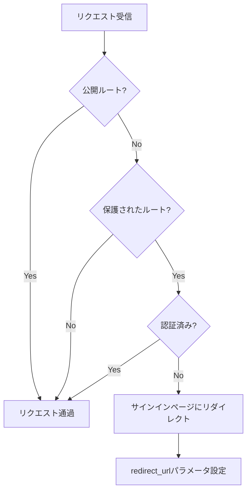

# Middlewareと認証フローの定義

## 概要

このドキュメントでは、Next.jsのMiddleware機能とClerk認証システムを連携させた包括的な認証フローについて詳細に解説します。保護されたルートの定義、公開ルートの管理、および認証状態に基づくアクセス制御の仕組みを説明します。

## Middlewareの基本構造

### 1. メインMiddleware実装

**ファイル**: `/frontend/src/middleware.ts`

```typescript
import { NextResponse } from 'next/server';
import { clerkMiddleware, createRouteMatcher } from '@clerk/nextjs/server';

// Define routes that should be protected
const isProtectedRoute = createRouteMatcher([
  '/dashboard(.*)', // Protects all routes under /dashboard
  '/account(.*)',   // Protects /account
  '/generate(.*)',  // Protects /generate and its sub-routes
  '/edit(.*)',      // Protects /edit and its sub-routes
  '/tools(.*)',     // Protects /tools and its sub-routes
  '/seo(.*)',       // Protects /seo and its sub-routes
  '/instagram(.*)', // Protects /instagram and its sub-routes
  '/line(.*)',      // Protects /line and its sub-routes
  // 他に保護したいルートがあればここに追加
]);

// Define routes that should be public (accessible without authentication)
const isPublicRoute = createRouteMatcher([
  '/', // Landing page
  '/pricing',
  '/sign-in(.*)', // Clerk sign-in routes
  '/sign-up(.*)', // Clerk sign-up routes
  '/api/webhooks(.*)', // Stripe webhook (usually public, but ensure security)
  // 他に公開したいルートがあればここに追加
]);

export default clerkMiddleware(async (authObject, req) => {
  if (!isPublicRoute(req) && isProtectedRoute(req)) {
    const { userId } = await authObject();
    if (!userId) {
      const signInUrl = new URL('/sign-in', req.url)
      signInUrl.searchParams.set('redirect_url', req.url)
      return NextResponse.redirect(signInUrl)
    }
  }
  return NextResponse.next();
});

export const config = {
  matcher: [
    // Skip Next.js internals and all static files, unless found in search params
    '/((?!_next|[^?]*\.(?:html?|css|js(?!on)|jpe?g|webp|png|gif|svg|ttf|woff2?|ico|csv|docx?|xlsx?|zip|webmanifest)).*)',
    // Always run for API routes
    '/(api|trpc)(.*)',
  ],
};
```

### 2. Middleware設定の詳細解析

#### ルートマッチャーの定義

**保護されたルート（Protected Routes）**:
```typescript
const isProtectedRoute = createRouteMatcher([
  '/dashboard(.*)', // ダッシュボードとすべてのサブパス
  '/account(.*)',   // アカウント設定ページ
  '/generate(.*)',  // 記事生成機能
  '/edit(.*)',      // 記事編集機能
  '/tools(.*)',     // ツール群
  '/seo(.*)',       // SEO関連機能
  '/instagram(.*)', // Instagram連携
  '/line(.*)',      // LINE連携
]);
```

**公開ルート（Public Routes）**:
```typescript
const isPublicRoute = createRouteMatcher([
  '/',              // ランディングページ
  '/pricing',       // 料金プラン
  '/sign-in(.*)',   // サインインページ
  '/sign-up(.*)',   // サインアップページ
  '/api/webhooks(.*)', // Webhook API
]);
```

#### Middleware実行フロー



### 3. 設定オプション

#### Matcherパターン

```typescript
export const config = {
  matcher: [
    // Next.js内部ファイルと静的ファイルを除外
    '/((?!_next|[^?]*\.(?:html?|css|js(?!on)|jpe?g|webp|png|gif|svg|ttf|woff2?|ico|csv|docx?|xlsx?|zip|webmanifest)).*)',
    // APIルートは常に実行
    '/(api|trpc)(.*)',
  ],
};
```

**除外されるファイル**:
- `_next/` - Next.js内部ファイル
- 静的ファイル（画像、CSS、JavaScript等）
- WebAssemblyファイル、フォント

**含まれるパス**:
- すべてのページルート
- APIルート
- トレースルート（tRPC）

## 認証フローの詳細

### 1. 認証状態の確認プロセス

```typescript
export default clerkMiddleware(async (authObject, req) => {
  // 1. ルートの種類を判定
  const isPublic = isPublicRoute(req);
  const isProtected = isProtectedRoute(req);
  
  // 2. 保護されたルートで未認証の場合のみ処理
  if (!isPublic && isProtected) {
    // 3. 認証情報を取得
    const { userId } = await authObject();
    
    // 4. 未認証の場合はリダイレクト
    if (!userId) {
      const signInUrl = new URL('/sign-in', req.url);
      signInUrl.searchParams.set('redirect_url', req.url);
      return NextResponse.redirect(signInUrl);
    }
  }
  
  // 5. 認証済みまたは公開ルートの場合は通過
  return NextResponse.next();
});
```

### 2. リダイレクト処理の仕組み

#### サインインページへのリダイレクト

```typescript
if (!userId) {
  const signInUrl = new URL('/sign-in', req.url);
  signInUrl.searchParams.set('redirect_url', req.url);
  return NextResponse.redirect(signInUrl);
}
```

**リダイレクトURL例**:
```
元のリクエスト: https://example.com/dashboard/articles
リダイレクト先: https://example.com/sign-in?redirect_url=https%3A%2F%2Fexample.com%2Fdashboard%2Farticles
```

#### サインイン後の自動リダイレクト

Clerkは`redirect_url`パラメータを自動的に認識し、認証完了後に元のページに戻します。

### 3. Clerk認証システムとの統合

#### AuthObject の詳細

```typescript
const { userId, user, sessionClaims, session } = await authObject();
```

**利用可能な認証情報**:
- `userId`: ユーザーの一意識別子
- `user`: 完全なユーザーオブジェクト
- `sessionClaims`: セッションに含まれるクレーム
- `session`: セッション情報

#### セッション管理

```typescript
// セッションの有効性確認
if (session) {
  console.log('Session ID:', session.id);
  console.log('Session expires at:', session.expireAt);
}

// カスタムクレームの利用
if (sessionClaims?.organizationId) {
  // 組織固有の処理
}
```

## Supabaseとの連携

### 1. Supabase Middleware Client

**ファイル**: `/frontend/src/libs/supabase/supabase-middleware-client.ts`

Middlewareでは独自のSupabaseクライアントも利用できます：

```typescript
import { updateSession } from '@/libs/supabase/supabase-middleware-client';

export default clerkMiddleware(async (authObject, req) => {
  // Clerk認証処理
  if (!isPublicRoute(req) && isProtectedRoute(req)) {
    const { userId } = await authObject();
    if (!userId) {
      const signInUrl = new URL('/sign-in', req.url);
      signInUrl.searchParams.set('redirect_url', req.url);
      return NextResponse.redirect(signInUrl);
    }
  }
  
  // Supabaseセッション更新（オプション）
  // const supabaseResponse = await updateSession(req);
  // return supabaseResponse;
  
  return NextResponse.next();
});
```

### 2. 複数認証システムの協調

現在の実装では：
- **Clerk**: メイン認証システム
- **Supabase**: データベースアクセスとリアルタイム機能

将来的な拡張では、両システムの認証情報を協調させることも可能です。

## ルーティング戦略

### 1. App Routerとの統合

#### ルートグループ（Route Groups）

```
/frontend/src/app/
├── (account)/
│   └── account/
├── (dashboard)/
│   ├── dashboard/
│   └── layout.tsx
├── (marketing)/
│   ├── page.tsx
│   └── pricing/
├── (tools)/
│   ├── seo/
│   ├── instagram/
│   └── settings/
└── sign-in/
    └── [[...sign-in]]/
```

**ルートグループの利点**:
- レイアウトの共有
- 認証要件の分離
- SEO最適化の管理

#### 動的ルートの保護

```typescript
// 動的セグメントも保護される
'/seo/generate/new-article/[jobId]' // ✅ 保護される
'/tools/instagram/home'             // ✅ 保護される
'/dashboard/articles'               // ✅ 保護される
```

### 2. APIルートの保護

#### API Middleware適用

```typescript
export const config = {
  matcher: [
    '/((?!_next|[^?]*\.(?:html?|css|js(?!on)|jpe?g|webp|png|gif|svg|ttf|woff2?|ico|csv|docx?|xlsx?|zip|webmanifest)).*)',
    '/(api|trpc)(.*)', // APIルートも保護対象
  ],
};
```

#### Webhook例外処理

```typescript
const isPublicRoute = createRouteMatcher([
  '/', 
  '/pricing',
  '/sign-in(.*)', 
  '/sign-up(.*)',
  '/api/webhooks(.*)', // Webhookは公開（別途セキュリティ確保）
]);
```

**Webhook専用セキュリティ**:
```typescript
// /api/webhooks/route.ts
export async function POST(req: Request) {
  const signature = req.headers.get('stripe-signature');
  
  // Stripe署名検証
  if (!signature || !webhookSecret) {
    return Response.json('Unauthorized', { status: 401 });
  }
  
  try {
    const event = stripe.webhooks.constructEvent(body, signature, webhookSecret);
    // Webhook処理
  } catch (error) {
    return Response.json('Invalid signature', { status: 400 });
  }
}
```

## パフォーマンス最適化

### 1. Middleware実行の最適化

#### 早期リターン戦略

```typescript
export default clerkMiddleware(async (authObject, req) => {
  // 1. 公開ルートは即座に通過
  if (isPublicRoute(req)) {
    return NextResponse.next();
  }
  
  // 2. 保護されていないルートも即座に通過
  if (!isProtectedRoute(req)) {
    return NextResponse.next();
  }
  
  // 3. 必要な場合のみ認証チェック
  const { userId } = await authObject();
  // ... 認証ロジック
});
```

#### キャッシュ戦略

```typescript
// 認証状態のキャッシュ（概念例）
const authCache = new Map();

export default clerkMiddleware(async (authObject, req) => {
  const cacheKey = req.headers.get('cookie');
  
  if (authCache.has(cacheKey)) {
    const cachedAuth = authCache.get(cacheKey);
    if (cachedAuth.expires > Date.now()) {
      // キャッシュされた認証情報を使用
    }
  }
  
  // ... 認証処理
});
```

### 2. エラーハンドリング

#### 認証エラーの処理

```typescript
export default clerkMiddleware(async (authObject, req) => {
  try {
    if (!isPublicRoute(req) && isProtectedRoute(req)) {
      const { userId } = await authObject();
      if (!userId) {
        return NextResponse.redirect(new URL('/sign-in', req.url));
      }
    }
    return NextResponse.next();
  } catch (error) {
    console.error('Middleware authentication error:', error);
    
    // エラーページまたはフォールバック処理
    return NextResponse.redirect(new URL('/auth-error', req.url));
  }
});
```

#### ネットワークエラー対応

```typescript
// Clerk APIが利用できない場合の処理
const authObject = await clerkAuth();
if (!authObject) {
  // フォールバック認証方式
  // または一時的なアクセス許可
}
```

## セキュリティ考慮事項

### 1. CSRF保護

Next.jsとClerkは自動的にCSRF保護を提供しますが、追加の保護も可能です：

```typescript
export default clerkMiddleware(async (authObject, req) => {
  // カスタムCSRFチェック
  if (req.method === 'POST' || req.method === 'PUT' || req.method === 'DELETE') {
    const origin = req.headers.get('origin');
    const host = req.headers.get('host');
    
    if (origin !== `https://${host}` && origin !== `http://${host}`) {
      return NextResponse.json({ error: 'Invalid origin' }, { status: 403 });
    }
  }
  
  // ... 認証処理
});
```

### 2. Rate Limiting

```typescript
const rateLimiter = new Map();

export default clerkMiddleware(async (authObject, req) => {
  const ip = req.ip || req.headers.get('x-forwarded-for');
  const key = `${ip}-${req.url}`;
  
  const now = Date.now();
  const windowStart = now - 60000; // 1分間
  
  if (!rateLimiter.has(key)) {
    rateLimiter.set(key, []);
  }
  
  const requests = rateLimiter.get(key);
  const recentRequests = requests.filter(time => time > windowStart);
  
  if (recentRequests.length >= 100) { // 1分間に100リクエスト
    return NextResponse.json({ error: 'Rate limit exceeded' }, { status: 429 });
  }
  
  recentRequests.push(now);
  rateLimiter.set(key, recentRequests);
  
  // ... 認証処理
});
```

## デバッグとモニタリング

### 1. ログ設定

```typescript
export default clerkMiddleware(async (authObject, req) => {
  const startTime = Date.now();
  
  console.log(`[Middleware] ${req.method} ${req.url}`, {
    userAgent: req.headers.get('user-agent'),
    ip: req.ip,
    timestamp: new Date().toISOString(),
  });
  
  try {
    // 認証処理
    const response = await processAuthentication(authObject, req);
    
    console.log(`[Middleware] Response: ${response.status}`, {
      duration: Date.now() - startTime,
      url: req.url,
    });
    
    return response;
  } catch (error) {
    console.error(`[Middleware] Error:`, {
      error: error.message,
      url: req.url,
      duration: Date.now() - startTime,
    });
    throw error;
  }
});
```

### 2. メトリクス収集

```typescript
// 認証メトリクスの収集
const metrics = {
  totalRequests: 0,
  authenticatedRequests: 0,
  redirects: 0,
  errors: 0,
};

export default clerkMiddleware(async (authObject, req) => {
  metrics.totalRequests++;
  
  if (!isPublicRoute(req) && isProtectedRoute(req)) {
    const { userId } = await authObject();
    
    if (userId) {
      metrics.authenticatedRequests++;
    } else {
      metrics.redirects++;
      return NextResponse.redirect(new URL('/sign-in', req.url));
    }
  }
  
  return NextResponse.next();
});
```

## トラブルシューティング

### よくある問題と解決方法

1. **無限リダイレクトループ**
   ```typescript
   // 問題: サインインページが保護されている
   const isProtectedRoute = createRouteMatcher([
     '/sign-in(.*)', // ❌ これは削除
     '/dashboard(.*)',
   ]);
   
   // 解決: サインインページを公開ルートに追加
   const isPublicRoute = createRouteMatcher([
     '/sign-in(.*)', // ✅ 正しい場所
   ]);
   ```

2. **APIルートの認証問題**
   ```typescript
   // 問題: API認証が適切に処理されない
   // 解決: APIルート専用の認証ハンドラー
   if (req.nextUrl.pathname.startsWith('/api/')) {
     // API専用の認証ロジック
     const authHeader = req.headers.get('authorization');
     // JWTトークン検証など
   }
   ```

3. **静的ファイルの処理問題**
   ```typescript
   // 問題: 画像やCSSファイルが認証チェックされる
   // 解決: matcherパターンの見直し
   export const config = {
     matcher: [
       '/((?!_next|[^?]*\\.(?:html?|css|js(?!on)|jpe?g|webp|png|gif|svg|ttf|woff2?|ico|csv|docx?|xlsx?|zip|webmanifest)).*)',
     ],
   };
   ```

## 結論

このMiddleware認証システムにより、以下の特徴を実現しています：

1. **包括的なアクセス制御**: ルートベースの柔軟な認証
2. **優れたUX**: 適切なリダイレクトとエラーハンドリング
3. **パフォーマンス**: 最適化されたMiddleware実行
4. **セキュリティ**: 多層防御による堅牢な保護
5. **監視可能性**: 充実したログとメトリクス
6. **保守性**: 明確な設定と拡張可能な設計

この認証フローは、Next.js App RouterとClerkの最新機能を活用し、スケーラブルで安全なWebアプリケーションの構築を支援します。