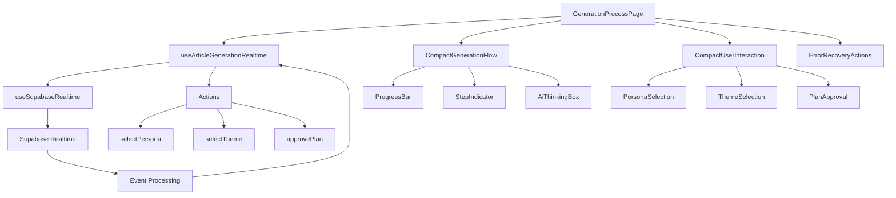

# SEO記事生成ページのコンポーネント設計とデータフロー詳細

## 概要

このドキュメントでは、SEO記事生成ページを構成する主要コンポーネントの設計思想、データフローの詳細、コンポーネント間の連携メカニズムについて包括的に解説します。React+TypeScriptによる型安全なアーキテクチャと、Propsを通じたデータ流動、状態管理の最適化手法を詳述します。

## コンポーネントアーキテクチャ

### 1. コンポーネント階層構造

```
GenerationProcessPage (ルートコンポーネント)
├── Header (ヘッダー)
├── ErrorAlert (エラー表示)
├── CompactGenerationFlow (メイン生成フロー)
│   ├── ConnectionStatus (接続状態)
│   ├── AiThinkingBox (AI思考表示)
│   ├── ProgressBar (進捗バー)
│   ├── StepIndicator (ステップ表示)
│   └── ContentPreview (コンテンツプレビュー)
├── CompactUserInteraction (ユーザーインタラクション)
│   ├── PersonaSelection (ペルソナ選択)
│   ├── ThemeSelection (テーマ選択)
│   ├── PlanApproval (計画承認)
│   └── OutlineApproval (アウトライン承認)
├── ErrorRecoveryActions (エラー回復)
├── ProcessRecoveryDialog (プロセス復旧)
└── CompletedArticleView (完成記事表示)
```

### 2. データフロー概念図



## 主要コンポーネントの詳細設計

### 1. GenerationProcessPage (ルートコンポーネント)

**ファイル**: `/frontend/src/features/tools/seo/generate/new-article/display/GenerationProcessPage.tsx`

#### コンポーネント構造

```typescript
interface GenerationProcessPageProps {
  jobId: string;
}

export default function GenerationProcessPage({ jobId }: GenerationProcessPageProps) {
  const { user, isLoaded } = useUser();
  const router = useRouter();
  
  // ローカル状態
  const [thinkingMessages, setThinkingMessages] = useState<string[]>([]);
  const [isLoading, setIsLoading] = useState(true);
  const [recoveryInfo, setRecoveryInfo] = useState<any>(null);
  const [showRecoveryDialog, setShowRecoveryDialog] = useState(false);
  const [retryCount, setRetryCount] = useState(0);

  // リアルタイム状態管理フック
  const {
    state,
    isConnected,
    isConnecting,
    error,
    connect,
    disconnect,
    startArticleGeneration,
    selectPersona,
    selectTheme,
    approvePlan,
    approveOutline,
    pauseGeneration,
    resumeGeneration,
    cancelGeneration,
  } = useArticleGenerationRealtime({
    processId: jobId,
    userId: isLoaded && user?.id ? user.id : undefined,
  });

  // ... 初期化・エフェクト・ハンドラー
}
```

#### 責任と役割

1. **状態統合**: 複数の状態源の統合管理
2. **ナビゲーション**: ページ遷移の制御
3. **エラーハンドリング**: 全体的なエラー処理
4. **データ取得**: 初期プロセスデータの取得
5. **子コンポーネント調整**: Propsによるデータ流動の管理

#### データフロー

```typescript
// プロセス初期化フロー
useEffect(() => {
  const loadProcess = async () => {
    if (!user?.id || !jobId) return;
    
    setIsLoading(true);
    try {
      // 1. プロセス情報を取得
      const response = await fetch(`/api/proxy/articles/generation/${jobId}`, {
        headers: { 'Content-Type': 'application/json' },
        credentials: 'include',
      });
      
      if (!response.ok) {
        router.push('/seo/generate/new-article');
        return;
      }

      const processData = await response.json();
      
      // 2. 復旧情報の設定
      if (processData.can_resume && 
          ['user_input_required', 'paused', 'error'].includes(processData.status)) {
        setRecoveryInfo({
          can_resume: processData.can_resume,
          resume_step: processData.current_step || processData.status,
          current_data: processData.context,
          waiting_for_input: processData.is_waiting_for_input,
          input_type: processData.input_type,
          last_activity: processData.updated_at,
          status: processData.status,
          error_message: processData.error_message,
        });
        setShowRecoveryDialog(true);
      }
      
    } catch (err) {
      console.error('Error loading process:', err);
      router.push('/seo/generate/new-article');
    } finally {
      setIsLoading(false);
    }
  };

  loadProcess();
}, [user?.id, jobId, router]);
```

### 2. CompactGenerationFlow (メイン生成フロー)

**ファイル**: `/frontend/src/features/tools/seo/generate/new-article/component/CompactGenerationFlow.tsx`

#### Props定義

```typescript
interface CompactGenerationFlowProps {
  steps: GenerationStep[];
  currentStep: string;
  isConnected: boolean;
  isGenerating: boolean;
  progressPercentage: number;
  finalArticle?: {
    title: string;
    content: string;
  };
  currentMessage?: string;
  generatedContent?: string;
  currentSection?: {
    index: number;
    heading: string;
    content: string;
  };
  outline?: any;
  researchProgress?: ResearchProgress;
  sectionsProgress?: SectionsProgress;
  imageMode?: boolean;
  imagePlaceholders?: ImagePlaceholder[];
  completedSections?: CompletedSection[];
}
```

#### コンポーネント設計

```typescript
export default function CompactGenerationFlow({
  steps,
  currentStep,
  isConnected,
  isGenerating,
  progressPercentage,
  finalArticle,
  currentMessage,
  generatedContent,
  outline,
  researchProgress,
  sectionsProgress,
  imageMode,
  imagePlaceholders,
  completedSections
}: CompactGenerationFlowProps) {
  // タブ状態管理
  const [activeTab, setActiveTab] = useState<string>('progress');
  
  // ステップアイコンの決定
  const getStepIcon = (step: GenerationStep) => {
    switch (step.status) {
      case 'completed':
        return <Check className="h-4 w-4 text-green-600" />;
      case 'in_progress':
        return <div className="animate-spin rounded-full h-4 w-4 border-b-2 border-blue-600"></div>;
      case 'error':
        return <AlertCircle className="h-4 w-4 text-red-600" />;
      default:
        return <Clock className="h-4 w-4 text-gray-400" />;
    }
  };

  // コンテンツの表示判定
  const shouldShowContent = () => {
    return generatedContent || outline || completedSections?.length > 0;
  };

  return (
    <Card className="w-full">
      <CardContent className="p-6">
        {/* ヘッダー */}
        <div className="flex items-center justify-between mb-6">
          <h2 className="text-xl font-semibold text-gray-900">記事生成プロセス</h2>
          <ConnectionStatus 
            isConnected={isConnected}
            isConnecting={false}
            error={null}
          />
        </div>

        {/* 進捗バー */}
        <div className="mb-6">
          <div className="flex justify-between text-sm text-gray-600 mb-2">
            <span>進捗状況</span>
            <span>{Math.round(progressPercentage)}%</span>
          </div>
          <Progress value={progressPercentage} className="h-3" />
        </div>

        {/* AI思考表示 */}
        <AiThinkingBox 
          message={currentMessage} 
          isVisible={isGenerating && !!currentMessage} 
        />

        {/* タブナビゲーション */}
        <Tabs value={activeTab} onValueChange={setActiveTab} className="w-full">
          <TabsList className="grid w-full grid-cols-3">
            <TabsTrigger value="progress">進捗</TabsTrigger>
            <TabsTrigger value="content" disabled={!shouldShowContent()}>
              コンテンツ
            </TabsTrigger>
            <TabsTrigger value="debug">デバッグ</TabsTrigger>
          </TabsList>

          {/* 進捗タブ */}
          <TabsContent value="progress" className="space-y-3">
            {steps.map((step, index) => (
              <StepIndicator
                key={step.id}
                step={step}
                isActive={step.id === currentStep}
                icon={getStepIcon(step)}
                index={index}
              />
            ))}
            
            {/* 進捗詳細 */}
            <ProgressDetails
              researchProgress={researchProgress}
              sectionsProgress={sectionsProgress}
            />
          </TabsContent>

          {/* コンテンツタブ */}
          <TabsContent value="content">
            <ContentPreview
              outline={outline}
              generatedContent={generatedContent}
              completedSections={completedSections}
              finalArticle={finalArticle}
            />
          </TabsContent>

          {/* デバッグタブ */}
          <TabsContent value="debug">
            <DebugInfo
              currentStep={currentStep}
              isConnected={isConnected}
              imageMode={imageMode}
              imagePlaceholders={imagePlaceholders}
            />
          </TabsContent>
        </Tabs>
      </CardContent>
    </Card>
  );
}
```

#### 子コンポーネントの設計

##### StepIndicator

```typescript
interface StepIndicatorProps {
  step: GenerationStep;
  isActive: boolean;
  icon: React.ReactNode;
  index: number;
}

const StepIndicator = memo(({ step, isActive, icon, index }: StepIndicatorProps) => (
  <motion.div
    initial={{ opacity: 0, x: -20 }}
    animate={{ opacity: 1, x: 0 }}
    transition={{ delay: index * 0.1 }}
    className={`flex items-center space-x-3 p-3 rounded-lg transition-colors ${
      isActive 
        ? 'bg-blue-50 border border-blue-200' 
        : step.status === 'completed'
        ? 'bg-green-50 border border-green-200'
        : step.status === 'error'
        ? 'bg-red-50 border border-red-200'
        : 'bg-gray-50'
    }`}
  >
    <div className="flex-shrink-0">
      {icon}
    </div>
    <div className="flex-1">
      <p className={`font-medium ${
        step.status === 'completed' ? 'text-green-800' :
        step.status === 'error' ? 'text-red-800' :
        isActive ? 'text-blue-800' : 'text-gray-600'
      }`}>
        {step.name}
      </p>
      {step.message && (
        <p className="text-sm text-gray-500 mt-1">{step.message}</p>
      )}
    </div>
  </motion.div>
));
```

##### ProgressDetails

```typescript
interface ProgressDetailsProps {
  researchProgress?: ResearchProgress;
  sectionsProgress?: SectionsProgress;
}

const ProgressDetails = memo(({ researchProgress, sectionsProgress }: ProgressDetailsProps) => (
  <>
    <AnimatePresence>
      {researchProgress && (
        <motion.div
          initial={{ opacity: 0, height: 0 }}
          animate={{ opacity: 1, height: 'auto' }}
          exit={{ opacity: 0, height: 0 }}
          className="mt-4 p-4 bg-blue-50 rounded-lg border border-blue-200"
        >
          <div className="flex items-center space-x-2 mb-2">
            <Search className="h-4 w-4 text-blue-600" />
            <span className="text-sm font-medium text-blue-800">リサーチ進捗</span>
          </div>
          <div className="text-sm text-blue-700 mb-2">
            進行中: {researchProgress.query}
          </div>
          <Progress 
            value={(researchProgress.currentQuery / researchProgress.totalQueries) * 100} 
            className="h-2 mb-1" 
          />
          <div className="text-xs text-blue-600">
            {researchProgress.currentQuery} / {researchProgress.totalQueries} クエリ完了
          </div>
        </motion.div>
      )}
    </AnimatePresence>

    <AnimatePresence>
      {sectionsProgress && (
        <motion.div
          initial={{ opacity: 0, height: 0 }}
          animate={{ opacity: 1, height: 'auto' }}
          exit={{ opacity: 0, height: 0 }}
          className="mt-4 p-4 bg-purple-50 rounded-lg border border-purple-200"
        >
          <div className="flex items-center space-x-2 mb-2">
            <PenTool className="h-4 w-4 text-purple-600" />
            <span className="text-sm font-medium text-purple-800">執筆進捗</span>
          </div>
          <div className="text-sm text-purple-700 mb-2">
            現在執筆中: {sectionsProgress.sectionHeading}
          </div>
          <Progress 
            value={(sectionsProgress.currentSection / sectionsProgress.totalSections) * 100} 
            className="h-2 mb-1" 
          />
          <div className="text-xs text-purple-600">
            {sectionsProgress.currentSection} / {sectionsProgress.totalSections} セクション完了
          </div>
        </motion.div>
      )}
    </AnimatePresence>
  </>
));
```

### 3. CompactUserInteraction (ユーザーインタラクション)

**ファイル**: `/frontend/src/features/tools/seo/generate/new-article/component/CompactUserInteraction.tsx`

#### Props設計

```typescript
interface CompactUserInteractionProps {
  type: 'select_persona' | 'select_theme' | 'approve_plan' | 'approve_outline';
  personas?: PersonaOption[];
  themes?: ThemeOption[];
  researchPlan?: any;
  outline?: any;
  onSelect?: (id: number) => void;
  onApprove?: (approved: boolean) => void;
  onRegenerate?: () => void;
  onEditAndProceed?: (editedContent: any) => void;
  isWaiting?: boolean;
}
```

#### コンポーネント実装

```typescript
export default function CompactUserInteraction({
  type,
  personas,
  themes,
  researchPlan,
  outline,
  onSelect,
  onApprove,
  onRegenerate,
  onEditAndProceed,
  isWaiting = false
}: CompactUserInteractionProps) {
  // ローカル状態
  const [selectedPersona, setSelectedPersona] = useState<number | null>(null);
  const [selectedTheme, setSelectedTheme] = useState<number | null>(null);
  const [isEditMode, setIsEditMode] = useState(false);
  const [editedContent, setEditedContent] = useState('');

  // イベントハンドラー
  const handlePersonaSelect = useCallback((index: number) => {
    setSelectedPersona(index);
  }, []);

  const handleThemeSelect = useCallback((index: number) => {
    setSelectedTheme(index);
  }, []);

  const handleConfirmSelection = useCallback(() => {
    if (type === 'select_persona' && selectedPersona !== null) {
      onSelect?.(selectedPersona);
    } else if (type === 'select_theme' && selectedTheme !== null) {
      onSelect?.(selectedTheme);
    }
  }, [type, selectedPersona, selectedTheme, onSelect]);

  const handleApprove = useCallback((approved: boolean) => {
    onApprove?.(approved);
  }, [onApprove]);

  const handleEditAndProceed = useCallback(() => {
    if (editedContent.trim()) {
      onEditAndProceed?.(editedContent);
      setIsEditMode(false);
    }
  }, [editedContent, onEditAndProceed]);

  // タイプ別レンダリング
  const renderPersonaSelection = () => {
    if (!personas) return null;

    return (
      <PersonaSelectionUI
        personas={personas}
        selectedPersona={selectedPersona}
        onSelect={handlePersonaSelect}
        onConfirm={handleConfirmSelection}
        isWaiting={isWaiting}
      />
    );
  };

  const renderThemeSelection = () => {
    if (!themes) return null;

    return (
      <ThemeSelectionUI
        themes={themes}
        selectedTheme={selectedTheme}
        onSelect={handleThemeSelect}
        onConfirm={handleConfirmSelection}
        isWaiting={isWaiting}
      />
    );
  };

  const renderPlanApproval = () => {
    if (!researchPlan) return null;

    return (
      <PlanApprovalUI
        plan={researchPlan}
        onApprove={handleApprove}
        onRegenerate={onRegenerate}
        isWaiting={isWaiting}
        isEditMode={isEditMode}
        editedContent={editedContent}
        onEditModeChange={setIsEditMode}
        onEditContentChange={setEditedContent}
        onEditAndProceed={handleEditAndProceed}
      />
    );
  };

  const renderOutlineApproval = () => {
    if (!outline) return null;

    return (
      <OutlineApprovalUI
        outline={outline}
        onApprove={handleApprove}
        onRegenerate={onRegenerate}
        isWaiting={isWaiting}
        isEditMode={isEditMode}
        editedContent={editedContent}
        onEditModeChange={setIsEditMode}
        onEditContentChange={setEditedContent}
        onEditAndProceed={handleEditAndProceed}
      />
    );
  };

  // メインレンダリング
  switch (type) {
    case 'select_persona':
      return renderPersonaSelection();
    case 'select_theme':
      return renderThemeSelection();
    case 'approve_plan':
      return renderPlanApproval();
    case 'approve_outline':
      return renderOutlineApproval();
    default:
      return null;
  }
}
```

#### 子コンポーネント設計

##### PersonaSelectionUI

```typescript
interface PersonaSelectionUIProps {
  personas: PersonaOption[];
  selectedPersona: number | null;
  onSelect: (index: number) => void;
  onConfirm: () => void;
  isWaiting: boolean;
}

const PersonaSelectionUI = memo(({
  personas,
  selectedPersona,
  onSelect,
  onConfirm,
  isWaiting
}: PersonaSelectionUIProps) => (
  <Card className="w-full border-2 border-blue-200 bg-blue-50">
    <CardContent className="p-6">
      <div className="flex items-start space-x-4 mb-6">
        <div className="flex-shrink-0">
          <Users className="h-8 w-8 text-blue-600" />
        </div>
        <div className="flex-1">
          <h3 className="text-xl font-semibold text-gray-900 mb-2">
            ターゲットペルソナを選択してください
          </h3>
          <p className="text-gray-600 mb-4">
            記事のターゲットとなる読者層を以下の中から選択してください。
          </p>
        </div>
      </div>

      <div className="space-y-3">
        {personas.map((persona, index) => (
          <PersonaCard
            key={index}
            persona={persona}
            index={index}
            isSelected={selectedPersona === index}
            onSelect={onSelect}
          />
        ))}
      </div>

      {selectedPersona !== null && (
        <SelectionActions
          onClear={() => onSelect(-1)}
          onConfirm={onConfirm}
          isWaiting={isWaiting}
          confirmText="このペルソナで続行"
          confirmClassName="bg-blue-600 hover:bg-blue-700"
        />
      )}
    </CardContent>
  </Card>
));
```

##### PersonaCard

```typescript
interface PersonaCardProps {
  persona: PersonaOption;
  index: number;
  isSelected: boolean;
  onSelect: (index: number) => void;
}

const PersonaCard = memo(({ persona, index, isSelected, onSelect }: PersonaCardProps) => (
  <motion.div
    whileHover={{ scale: 1.02 }}
    whileTap={{ scale: 0.98 }}
  >
    <Card 
      className={`cursor-pointer transition-all duration-200 hover:border-blue-400 hover:shadow-md ${
        isSelected ? 'border-blue-500 bg-blue-100' : 'border-gray-200'
      }`}
      onClick={() => onSelect(index)}
    >
      <CardContent className="p-4">
        <div className="flex items-center justify-between">
          <div className="flex-1">
            <p className="text-gray-800 leading-relaxed">
              {persona.description}
            </p>
          </div>
          {isSelected && (
            <Check className="h-5 w-5 text-blue-600 ml-3 flex-shrink-0" />
          )}
        </div>
      </CardContent>
    </Card>
  </motion.div>
));
```

## データフロー詳細分析

### 1. Props流動パターン

#### 下向きデータフロー (Top-Down)

```typescript
// GenerationProcessPage -> CompactGenerationFlow
<CompactGenerationFlow
  steps={state.steps}                    // 生成ステップ情報
  currentStep={state.currentStep}        // 現在のステップ
  isConnected={isConnected}              // 接続状態
  isGenerating={isGenerating}            // 生成中フラグ
  progressPercentage={getProgressPercentage()} // 進捗率
  finalArticle={state.finalArticle}      // 最終記事
  currentMessage={thinkingMessages[0]}   // 現在のメッセージ
  generatedContent={state.generatedContent} // 生成コンテンツ
  outline={state.outline}                // アウトライン
  researchProgress={state.researchProgress} // リサーチ進捗
  sectionsProgress={state.sectionsProgress} // セクション進捗
  imageMode={state.imageMode}            // 画像モード
  imagePlaceholders={state.imagePlaceholders} // 画像プレースホルダー
  completedSections={state.completedSections} // 完了セクション
/>
```

#### イベントハンドラーの流動 (Bottom-Up)

```typescript
// GenerationProcessPage -> CompactUserInteraction
<CompactUserInteraction
  type={state.inputType as any}
  personas={state.personas}
  themes={state.themes}
  researchPlan={state.researchPlan}
  outline={state.outline}
  onSelect={(index) => {
    if (state.inputType === 'select_persona') {
      selectPersona(index);  // アクション実行
    } else if (state.inputType === 'select_theme') {
      selectTheme(index);   // アクション実行
    }
  }}
  onApprove={(approved) => {
    if (state.inputType === 'approve_plan') {
      approvePlan(approved); // アクション実行
    } else if (state.inputType === 'approve_outline') {
      approveOutline(approved); // アクション実行
    }
  }}
  onRegenerate={() => {
    // TODO: 再生成機能の実装
    console.log('Regenerate not yet implemented for Supabase Realtime');
  }}
  onEditAndProceed={(editedContent) => {
    // TODO: 編集・続行機能の実装
    console.log('EditAndProceed not yet implemented', { editedContent, inputType: state.inputType });
  }}
  isWaiting={false}
/>
```

### 2. 状態伝播メカニズム

#### useArticleGenerationRealtime からの状態流動

```typescript
// フックからのデータ取得
const {
  state,                    // GenerationState
  isConnected,             // boolean
  isConnecting,            // boolean
  error,                   // string | null
  connect,                 // () => Promise<void>
  disconnect,              // () => void
  startArticleGeneration,  // (data: any) => Promise<any>
  selectPersona,           // (id: number) => Promise<ActionResult>
  selectTheme,             // (index: number) => Promise<ActionResult>
  approvePlan,             // (approved: boolean) => Promise<ActionResult>
  approveOutline,          // (approved: boolean) => Promise<ActionResult>
  pauseGeneration,         // () => Promise<boolean>
  resumeGeneration,        // () => Promise<boolean>
  cancelGeneration,        // () => Promise<boolean>
} = useArticleGenerationRealtime({
  processId: jobId,
  userId: isLoaded && user?.id ? user.id : undefined,
});

// 状態の加工と派生データ
const isGenerating = state.currentStep !== 'completed' && state.currentStep !== 'error';
const getProgressPercentage = () => {
  const stepProgressMap = {
    'keyword_analyzing': 12.5,
    'persona_generating': 25,
    'theme_generating': 37.5,
    'research_planning': 50,
    'researching': 62.5,
    'outline_generating': 75,
    'writing_sections': 87.5,
    'editing': 100,
  };
  return stepProgressMap[state.currentStep as keyof typeof stepProgressMap] || 0;
};
```

#### リアルタイムイベントからの状態更新

```typescript
// useSupabaseRealtime -> useArticleGenerationRealtime -> GenerationProcessPage
handleRealtimeEvent(event: ProcessEvent) {
  // イベント処理による状態更新
  switch (event.event_type) {
    case 'process_state_updated':
      // プロセス状態の包括的更新
      const processData = event.event_data;
      setState((prev: GenerationState) => {
        const newState = { ...prev };
        
        // ステップ更新
        if (processData.current_step_name) {
          newState.currentStep = mapBackendStepToUIStep(processData.current_step_name);
        }
        
        // 入力待ち状態更新
        newState.isWaitingForInput = processData.is_waiting_for_input || false;
        newState.inputType = processData.input_type;
        
        // コンテンツ更新
        if (processData.article_context) {
          const context = processData.article_context;
          if (context.generated_detailed_personas) {
            newState.personas = context.generated_detailed_personas.map((persona: any, index: number) => ({
              id: index,
              description: persona.description || persona.persona_description
            }));
          }
          // ... 他のコンテンツ更新
        }
        
        return newState;
      });
      break;
    // ... 他のイベント処理
  }
}
```

### 3. コンポーネント間通信パターン

#### 親子コンポーネント通信

```typescript
// 親コンポーネント (GenerationProcessPage)
const handleUserSelection = useCallback((index: number) => {
  if (state.inputType === 'select_persona') {
    selectPersona(index);
  } else if (state.inputType === 'select_theme') {
    selectTheme(index);
  }
}, [state.inputType, selectPersona, selectTheme]);

// 子コンポーネント (CompactUserInteraction)
const handleConfirmSelection = useCallback(() => {
  if (type === 'select_persona' && selectedPersona !== null) {
    onSelect?.(selectedPersona);  // 親のハンドラーを呼び出し
  } else if (type === 'select_theme' && selectedTheme !== null) {
    onSelect?.(selectedTheme);    // 親のハンドラーを呼び出し
  }
}, [type, selectedPersona, selectedTheme, onSelect]);
```

#### 兄弟コンポーネント通信

```typescript
// 状態は親で管理し、兄弟コンポーネントに配布
// CompactGenerationFlow <- GenerationProcessPage -> CompactUserInteraction

// 状態共有のパターン
if (state.isWaitingForInput) {
  // CompactUserInteraction を表示
  return <CompactUserInteraction {...interactionProps} />;
} else {
  // CompactGenerationFlow のみ表示
  return <CompactGenerationFlow {...flowProps} />;
}
```

## パフォーマンス最適化

### 1. メモ化戦略

#### React.memo の活用

```typescript
// 重いコンポーネントのメモ化
const CompactGenerationFlow = memo(({
  steps,
  currentStep,
  isConnected,
  isGenerating,
  progressPercentage,
  // ... 他のプロパティ
}: CompactGenerationFlowProps) => {
  // コンポーネントロジック
});

// 比較関数を使用した詳細な制御
const StepIndicator = memo(({ step, isActive, icon, index }: StepIndicatorProps) => {
  // コンポーネントロジック
}, (prevProps, nextProps) => {
  return (
    prevProps.step.status === nextProps.step.status &&
    prevProps.isActive === nextProps.isActive &&
    prevProps.step.message === nextProps.step.message
  );
});
```

#### useCallback によるコールバック最適化

```typescript
// コールバック関数のメモ化
const handlePersonaSelect = useCallback((index: number) => {
  setSelectedPersona(index);
}, []);

const handleThemeSelect = useCallback((index: number) => {
  setSelectedTheme(index);
}, []);

const handleConfirmSelection = useCallback(() => {
  if (type === 'select_persona' && selectedPersona !== null) {
    onSelect?.(selectedPersona);
  } else if (type === 'select_theme' && selectedTheme !== null) {
    onSelect?.(selectedTheme);
  }
}, [type, selectedPersona, selectedTheme, onSelect]);
```

#### useMemo による計算結果のキャッシュ

```typescript
// 重い計算のメモ化
const processedSteps = useMemo(() => {
  return steps.map((step, index) => ({
    ...step,
    icon: getStepIcon(step),
    isActive: step.id === currentStep,
    delay: index * 0.1
  }));
}, [steps, currentStep]);

// 条件付きレンダリングの判定をメモ化
const shouldShowContent = useMemo(() => {
  return !!(generatedContent || outline || completedSections?.length > 0);
}, [generatedContent, outline, completedSections]);
```

### 2. レンダリング最適化

#### 条件付きレンダリングの効率化

```typescript
// 早期リターンによる無駄なレンダリング回避
if (!isLoaded) {
  return <LoadingSpinner />;
}

if (!user) {
  return <AuthenticationError />;
}

if (isLoading) {
  return <ProcessLoadingIndicator />;
}

// メインコンテンツのレンダリング
return (
  <div className="main-content">
    {/* メインコンテンツ */}
  </div>
);
```

#### 仮想化とページネーション

```typescript
// 大量のアイテムを扱う場合の最適化（将来の拡張用）
const VirtualizedStepList = memo(({ steps }: { steps: GenerationStep[] }) => {
  const [visibleRange, setVisibleRange] = useState({ start: 0, end: 10 });
  
  const visibleSteps = useMemo(() => {
    return steps.slice(visibleRange.start, visibleRange.end);
  }, [steps, visibleRange]);

  return (
    <div className="virtualized-list">
      {visibleSteps.map((step, index) => (
        <StepIndicator
          key={step.id}
          step={step}
          isActive={step.id === currentStep}
          icon={getStepIcon(step)}
          index={visibleRange.start + index}
        />
      ))}
    </div>
  );
});
```

### 3. 状態更新の最適化

#### バッチ更新の活用

```typescript
// 複数の状態更新をバッチ化
const updateMultipleStates = useCallback((eventData: any) => {
  // React 18の自動バッチングを活用
  setThinkingMessages([eventData.message]);
  setCurrentStep(eventData.step);
  setProgress(eventData.progress);
  // これらの更新は自動的にバッチ化される
}, []);

// フラッシュ同期が必要な場合
import { flushSync } from 'react-dom';

const criticalUpdate = useCallback((urgentData: any) => {
  flushSync(() => {
    setUrgentState(urgentData);
  });
  // 他の更新
  setNormalState(normalData);
}, []);
```

#### 状態の正規化

```typescript
// 複雑な状態の正規化例
interface NormalizedState {
  steps: {
    byId: Record<string, GenerationStep>;
    allIds: string[];
    currentId: string | null;
  };
  content: {
    personas: PersonaOption[];
    themes: ThemeOption[];
    outline: any;
    generatedContent: string;
  };
  ui: {
    isLoading: boolean;
    isConnected: boolean;
    activeTab: string;
  };
}

// 正規化されたstateの更新
const updateStep = useCallback((stepId: string, updates: Partial<GenerationStep>) => {
  setState(prev => ({
    ...prev,
    steps: {
      ...prev.steps,
      byId: {
        ...prev.steps.byId,
        [stepId]: {
          ...prev.steps.byId[stepId],
          ...updates
        }
      }
    }
  }));
}, []);
```

## エラー境界とエラー処理

### 1. Error Boundary の実装

```typescript
interface ErrorBoundaryState {
  hasError: boolean;
  error: Error | null;
  errorInfo: ErrorInfo | null;
}

class GenerationProcessErrorBoundary extends Component<
  PropsWithChildren<{}>,
  ErrorBoundaryState
> {
  constructor(props: PropsWithChildren<{}>) {
    super(props);
    this.state = { hasError: false, error: null, errorInfo: null };
  }

  static getDerivedStateFromError(error: Error): ErrorBoundaryState {
    return {
      hasError: true,
      error,
      errorInfo: null
    };
  }

  componentDidCatch(error: Error, errorInfo: ErrorInfo) {
    console.error('Generation process error:', error, errorInfo);
    
    // エラーログをサービスに送信
    this.logErrorToService(error, errorInfo);
    
    this.setState({
      error,
      errorInfo
    });
  }

  private logErrorToService = (error: Error, errorInfo: ErrorInfo) => {
    // エラーログの送信ロジック
    // Sentry、LogRocket、DataDog等
  };

  render() {
    if (this.state.hasError) {
      return (
        <div className="error-boundary-fallback">
          <Card className="border-red-200 bg-red-50">
            <CardContent className="p-6">
              <div className="flex items-start space-x-4">
                <AlertCircle className="h-8 w-8 text-red-600 flex-shrink-0" />
                <div className="flex-1">
                  <h2 className="text-lg font-semibold text-red-900 mb-2">
                    アプリケーションエラーが発生しました
                  </h2>
                  <p className="text-red-800 mb-4">
                    予期しないエラーが発生し、記事生成プロセスが中断されました。
                  </p>
                  <details className="mb-4">
                    <summary className="cursor-pointer text-red-700 font-medium">
                      エラー詳細（開発者向け）
                    </summary>
                    <pre className="mt-2 p-3 bg-red-100 rounded text-xs text-red-800 overflow-auto">
                      {this.state.error?.toString()}
                      {this.state.errorInfo?.componentStack}
                    </pre>
                  </details>
                  <div className="flex space-x-3">
                    <Button
                      onClick={() => window.location.reload()}
                      variant="outline"
                      className="border-red-300 text-red-700 hover:bg-red-100"
                    >
                      ページを再読み込み
                    </Button>
                    <Button
                      onClick={() => window.location.href = '/seo/generate/new-article'}
                      className="bg-red-600 hover:bg-red-700"
                    >
                      新規作成に戻る
                    </Button>
                  </div>
                </div>
              </div>
            </CardContent>
          </Card>
        </div>
      );
    }

    return this.props.children;
  }
}
```

### 2. コンポーネントレベルのエラー処理

```typescript
// カスタムフックでのエラー処理
const useErrorHandler = () => {
  const [error, setError] = useState<string | null>(null);

  const handleError = useCallback((error: unknown, context?: string) => {
    const errorMessage = error instanceof Error ? error.message : 'Unknown error occurred';
    const fullMessage = context ? `${context}: ${errorMessage}` : errorMessage;
    
    console.error('Component error:', fullMessage, error);
    setError(fullMessage);
    
    // エラーログの送信
    // logErrorToService(error, context);
  }, []);

  const clearError = useCallback(() => {
    setError(null);
  }, []);

  return { error, handleError, clearError };
};

// 使用例
const CompactGenerationFlow = ({...props}) => {
  const { error, handleError, clearError } = useErrorHandler();

  const handleStepClick = useCallback(async (stepId: string) => {
    try {
      await performStepAction(stepId);
    } catch (err) {
      handleError(err, `Step action failed for ${stepId}`);
    }
  }, [handleError]);

  if (error) {
    return (
      <Alert className="border-red-200 bg-red-50">
        <AlertCircle className="h-4 w-4 text-red-600" />
        <AlertDescription className="text-red-800">
          {error}
          <Button 
            onClick={clearError}
            size="sm"
            variant="outline"
            className="ml-2"
          >
            閉じる
          </Button>
        </AlertDescription>
      </Alert>
    );
  }

  return (
    // 通常のコンポーネントレンダリング
  );
};
```

## テスト戦略

### 1. 単体テスト

```typescript
// コンポーネントのテスト例
import { render, screen, fireEvent, waitFor } from '@testing-library/react';
import { vi } from 'vitest';
import CompactUserInteraction from './CompactUserInteraction';

describe('CompactUserInteraction', () => {
  const mockOnSelect = vi.fn();
  const mockOnApprove = vi.fn();

  beforeEach(() => {
    vi.clearAllMocks();
  });

  describe('ペルソナ選択', () => {
    const mockPersonas = [
      { id: 0, description: 'テストペルソナ1' },
      { id: 1, description: 'テストペルソナ2' }
    ];

    it('ペルソナ選択UIが正しく表示される', () => {
      render(
        <CompactUserInteraction
          type="select_persona"
          personas={mockPersonas}
          onSelect={mockOnSelect}
        />
      );

      expect(screen.getByText('ターゲットペルソナを選択してください')).toBeInTheDocument();
      expect(screen.getByText('テストペルソナ1')).toBeInTheDocument();
      expect(screen.getByText('テストペルソナ2')).toBeInTheDocument();
    });

    it('ペルソナ選択が正しく動作する', async () => {
      render(
        <CompactUserInteraction
          type="select_persona"
          personas={mockPersonas}
          onSelect={mockOnSelect}
        />
      );

      fireEvent.click(screen.getByText('テストペルソナ1'));
      fireEvent.click(screen.getByText('このペルソナで続行'));

      await waitFor(() => {
        expect(mockOnSelect).toHaveBeenCalledWith(0);
      });
    });
  });

  describe('計画承認', () => {
    const mockPlan = { description: 'テストリサーチ計画' };

    it('計画承認UIが正しく表示される', () => {
      render(
        <CompactUserInteraction
          type="approve_plan"
          researchPlan={mockPlan}
          onApprove={mockOnApprove}
        />
      );

      expect(screen.getByText('リサーチ計画を確認してください')).toBeInTheDocument();
      expect(screen.getByText('テストリサーチ計画')).toBeInTheDocument();
    });

    it('計画承認が正しく動作する', async () => {
      render(
        <CompactUserInteraction
          type="approve_plan"
          researchPlan={mockPlan}
          onApprove={mockOnApprove}
        />
      );

      fireEvent.click(screen.getByText('承認して続行'));

      await waitFor(() => {
        expect(mockOnApprove).toHaveBeenCalledWith(true);
      });
    });
  });
});
```

### 2. 統合テスト

```typescript
// フックとコンポーネントの統合テスト
import { renderHook, act } from '@testing-library/react';
import { useArticleGenerationRealtime } from '@/hooks/useArticleGenerationRealtime';

describe('useArticleGenerationRealtime', () => {
  it('初期状態が正しく設定される', () => {
    const { result } = renderHook(() =>
      useArticleGenerationRealtime({
        processId: 'test-process-id',
        userId: 'test-user-id'
      })
    );

    expect(result.current.state.currentStep).toBe('keyword_analyzing');
    expect(result.current.state.steps).toHaveLength(8);
    expect(result.current.state.isWaitingForInput).toBe(false);
  });

  it('ペルソナ選択が正しく動作する', async () => {
    const { result } = renderHook(() =>
      useArticleGenerationRealtime({
        processId: 'test-process-id',
        userId: 'test-user-id'
      })
    );

    await act(async () => {
      const response = await result.current.selectPersona(0);
      expect(response.success).toBe(true);
    });
  });
});
```

## 結論

このSEO記事生成ページのコンポーネント設計とデータフローシステムにより、以下の特徴を実現しています：

1. **明確な責務分離**: 各コンポーネントが単一の責任を持つ設計
2. **効率的なデータフロー**: Props drivenな一方向データフローとイベント駆動の双方向通信
3. **型安全性**: TypeScriptによる包括的な型定義と検証
4. **パフォーマンス最適化**: メモ化と最適化されたレンダリング戦略
5. **エラー耐性**: 多層的なエラー処理とGraceful degradation
6. **テスト可能性**: 単体テストから統合テストまでの包括的なテスト戦略
7. **保守性**: 明確なコンポーネント境界と拡張可能なアーキテクチャ

この設計により、複雑な記事生成プロセスを効率的に管理し、優れたユーザー体験と開発者体験を両立させています。