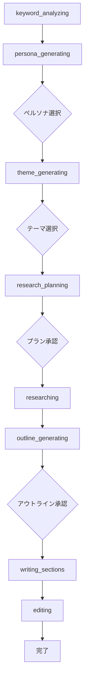

# SEO記事生成ページにおけるステップ処理とユーザー入力の仕様

## 概要

このドキュメントでは、SEO記事生成ページにおけるステップ処理システムとユーザーインタラクション機能について詳細に解説します。8段階の生成プロセス、各ステップでのユーザー入力要求、`CompactUserInteraction`コンポーネントによる対話UI、そしてバックエンドとのリアルタイム連携による応答処理の仕組みを説明します。

## 生成プロセスの8段階ステップ

### 1. ステップ定義とフロー

#### 基本ステップ構造

```typescript
const steps = [
  { id: 'keyword_analyzing', name: 'キーワード分析', status: 'pending' },
  { id: 'persona_generating', name: 'ペルソナ生成', status: 'pending' },
  { id: 'theme_generating', name: 'テーマ提案', status: 'pending' },
  { id: 'research_planning', name: 'リサーチ計画', status: 'pending' },
  { id: 'researching', name: 'リサーチ実行（リサーチ要約）', status: 'pending' },
  { id: 'outline_generating', name: 'アウトライン作成', status: 'pending' },
  { id: 'writing_sections', name: '執筆', status: 'pending' },
  { id: 'editing', name: '編集・校正', status: 'pending' },
];
```

#### ステップ遷移フロー



### 2. 各ステップの詳細仕様

#### 1. キーワード分析 (keyword_analyzing)

**目的**: 入力されたキーワードの分析と競合調査
**ユーザー入力**: なし（自動処理）
**遷移条件**: 分析完了で自動的に次のステップへ

```typescript
case 'keyword_analysis_completed':
  console.log('🎯 Keyword analysis completed - auto-progressing to persona generation');
  newState.steps = newState.steps.map((step: GenerationStep) => {
    if (step.id === 'keyword_analyzing') return { ...step, status: 'completed' as StepStatus };
    if (step.id === 'persona_generating') return { ...step, status: 'in_progress' as StepStatus };
    return step;
  });
  newState.currentStep = 'persona_generating';
  break;
```

#### 2. ペルソナ生成 (persona_generating)

**目的**: ターゲットペルソナの詳細プロファイル生成
**ユーザー入力**: 複数のペルソナから選択
**遷移条件**: ユーザーによるペルソナ選択

```typescript
// ペルソナデータの設定
if (context.generated_detailed_personas) {
  newState.personas = context.generated_detailed_personas.map((persona: any, index: number) => ({
    id: index,
    description: persona.description || persona.persona_description || JSON.stringify(persona)
  }));
}

// 入力待ち状態の設定
newState.isWaitingForInput = true;
newState.inputType = 'select_persona';
```

#### 3. テーマ生成 (theme_generating)

**目的**: SEO効果の高い記事テーマの提案
**ユーザー入力**: 複数のテーマから選択
**遷移条件**: ユーザーによるテーマ選択

```typescript
// テーマデータの設定
if (context.generated_themes) {
  newState.themes = context.generated_themes;
}

// 入力待ち状態の設定
newState.isWaitingForInput = true;
newState.inputType = 'select_theme';
```

#### 4. リサーチ計画 (research_planning)

**目的**: 記事の信頼性を高めるリサーチ計画の策定
**ユーザー入力**: リサーチ計画の承認・却下
**遷移条件**: ユーザーによる計画承認

```typescript
// リサーチプランの設定
if (context.research_plan) {
  newState.researchPlan = context.research_plan;
}

// 入力待ち状態の設定
newState.isWaitingForInput = true;
newState.inputType = 'approve_plan';
```

#### 5. リサーチ実行 (researching)

**目的**: Web上からの最新情報収集・分析
**ユーザー入力**: なし（自動処理）
**遷移条件**: リサーチ完了で自動的に次のステップへ

```typescript
// リサーチ進捗の表示
case 'research_progress':
  newState.researchProgress = {
    currentQuery: event.event_data.current_query,
    totalQueries: event.event_data.total_queries,
    query: event.event_data.query || ''
  };
  break;
```

#### 6. アウトライン生成 (outline_generating)

**目的**: 読者に価値を提供する記事構成の設計
**ユーザー入力**: アウトラインの承認・却下
**遷移条件**: ユーザーによるアウトライン承認

```typescript
// アウトラインの設定
const outlineData = context.outline || context.generated_outline;
if (outlineData) {
  newState.outline = outlineData;
}

// 入力待ち状態の設定
newState.isWaitingForInput = true;
newState.inputType = 'approve_outline';
```

#### 7. 執筆 (writing_sections)

**目的**: セクションごとの記事執筆
**ユーザー入力**: なし（自動処理）
**遷移条件**: 全セクション完了で自動的に次のステップへ

```typescript
// セクション進捗の表示
case 'section_writing_progress':
  newState.sectionsProgress = {
    currentSection: event.event_data.current_section || 1,
    totalSections: event.event_data.total_sections || 1,
    sectionHeading: event.event_data.section_heading || ''
  };
  break;
```

#### 8. 編集・校正 (editing)

**目的**: 記事全体の校正と最終調整
**ユーザー入力**: なし（自動処理）
**遷移条件**: 編集完了で記事完成

```typescript
case 'editing_completed':
  newState.finalArticle = {
    title: event.event_data.title || 'Generated Article',
    content: event.event_data.final_html_content || newState.generatedContent || '',
  };
  newState.articleId = event.event_data.article_id;
  break;
```

## ユーザーインタラクション機能

### 1. CompactUserInteraction コンポーネント

**ファイル**: `/frontend/src/features/tools/seo/generate/new-article/component/CompactUserInteraction.tsx`

#### コンポーネント定義

```typescript
interface CompactUserInteractionProps {
  type: 'select_persona' | 'select_theme' | 'approve_plan' | 'approve_outline';
  personas?: PersonaOption[];
  themes?: ThemeOption[];
  researchPlan?: any;
  outline?: any;
  onSelect?: (id: number) => void;
  onApprove?: (approved: boolean) => void;
  onRegenerate?: () => void;
  onEditAndProceed?: (editedContent: any) => void;
  isWaiting?: boolean;
}

export default function CompactUserInteraction({
  type,
  personas,
  themes,
  researchPlan,
  outline,
  onSelect,
  onApprove,
  onRegenerate,
  onEditAndProceed,
  isWaiting = false
}: CompactUserInteractionProps) {
  // コンポーネントロジック
}
```

#### インタラクションタイプ別UI

##### ペルソナ選択UI

```typescript
// ペルソナ選択の場合
if (type === 'select_persona' && personas) {
  return (
    <Card className="w-full border-2 border-blue-200 bg-blue-50">
      <CardContent className="p-6">
        <div className="flex items-start space-x-4 mb-6">
          <div className="flex-shrink-0">
            <Users className="h-8 w-8 text-blue-600" />
          </div>
          <div className="flex-1">
            <h3 className="text-xl font-semibold text-gray-900 mb-2">
              ターゲットペルソナを選択してください
            </h3>
            <p className="text-gray-600 mb-4">
              記事のターゲットとなる読者層を以下の中から選択してください。
            </p>
          </div>
        </div>

        <div className="space-y-3">
          {personas.map((persona, index) => (
            <motion.div
              key={index}
              whileHover={{ scale: 1.02 }}
              whileTap={{ scale: 0.98 }}
            >
              <Card 
                className={`cursor-pointer transition-all duration-200 hover:border-blue-400 hover:shadow-md ${
                  selectedPersona === index ? 'border-blue-500 bg-blue-100' : 'border-gray-200'
                }`}
                onClick={() => handlePersonaSelect(index)}
              >
                <CardContent className="p-4">
                  <div className="flex items-center justify-between">
                    <div className="flex-1">
                      <p className="text-gray-800 leading-relaxed">
                        {persona.description}
                      </p>
                    </div>
                    {selectedPersona === index && (
                      <Check className="h-5 w-5 text-blue-600 ml-3 flex-shrink-0" />
                    )}
                  </div>
                </CardContent>
              </Card>
            </motion.div>
          ))}
        </div>

        {selectedPersona !== null && (
          <motion.div
            initial={{ opacity: 0, y: 10 }}
            animate={{ opacity: 1, y: 0 }}
            className="flex justify-end space-x-3 mt-6"
          >
            <Button
              variant="outline"
              onClick={() => setSelectedPersona(null)}
              disabled={isWaiting}
            >
              選択をクリア
            </Button>
            <Button
              onClick={handleConfirmSelection}
              disabled={isWaiting}
              className="bg-blue-600 hover:bg-blue-700"
            >
              {isWaiting ? (
                <>
                  <div className="animate-spin rounded-full h-4 w-4 border-b-2 border-white mr-2"></div>
                  処理中...
                </>
              ) : (
                <>
                  <ChevronRight className="h-4 w-4 mr-2" />
                  この ペルソナで続行
                </>
              )}
            </Button>
          </motion.div>
        )}
      </CardContent>
    </Card>
  );
}
```

##### テーマ選択UI

```typescript
// テーマ選択の場合
if (type === 'select_theme' && themes) {
  return (
    <Card className="w-full border-2 border-purple-200 bg-purple-50">
      <CardContent className="p-6">
        <div className="flex items-start space-x-4 mb-6">
          <div className="flex-shrink-0">
            <Lightbulb className="h-8 w-8 text-purple-600" />
          </div>
          <div className="flex-1">
            <h3 className="text-xl font-semibold text-gray-900 mb-2">
              記事テーマを選択してください
            </h3>
            <p className="text-gray-600 mb-4">
              以下の中から最も興味深く、読者に価値を提供できるテーマを選択してください。
            </p>
          </div>
        </div>

        <div className="grid gap-4">
          {themes.map((theme, index) => (
            <motion.div
              key={index}
              whileHover={{ scale: 1.01 }}
              whileTap={{ scale: 0.99 }}
            >
              <Card 
                className={`cursor-pointer transition-all duration-200 hover:border-purple-400 hover:shadow-md ${
                  selectedTheme === index ? 'border-purple-500 bg-purple-100' : 'border-gray-200'
                }`}
                onClick={() => handleThemeSelect(index)}
              >
                <CardContent className="p-5">
                  <div className="flex items-start justify-between">
                    <div className="flex-1">
                      <h4 className="font-semibold text-gray-900 mb-2 text-lg">
                        {theme.title}
                      </h4>
                      <p className="text-gray-700 mb-3 leading-relaxed">
                        {theme.description}
                      </p>
                      <div className="flex flex-wrap gap-2">
                        {theme.keywords?.map((keyword, keyIndex) => (
                          <Badge key={keyIndex} variant="secondary" className="text-xs">
                            {keyword}
                          </Badge>
                        ))}
                      </div>
                    </div>
                    {selectedTheme === index && (
                      <Check className="h-5 w-5 text-purple-600 ml-3 flex-shrink-0" />
                    )}
                  </div>
                </CardContent>
              </Card>
            </motion.div>
          ))}
        </div>

        {selectedTheme !== null && (
          <motion.div
            initial={{ opacity: 0, y: 10 }}
            animate={{ opacity: 1, y: 0 }}
            className="flex justify-end space-x-3 mt-6"
          >
            <Button
              variant="outline"
              onClick={() => setSelectedTheme(null)}
              disabled={isWaiting}
            >
              選択をクリア
            </Button>
            <Button
              onClick={handleConfirmSelection}
              disabled={isWaiting}
              className="bg-purple-600 hover:bg-purple-700"
            >
              {isWaiting ? (
                <>
                  <div className="animate-spin rounded-full h-4 w-4 border-b-2 border-white mr-2"></div>
                  処理中...
                </>
              ) : (
                <>
                  <ChevronRight className="h-4 w-4 mr-2" />
                  このテーマで続行
                </>
              )}
            </Button>
          </motion.div>
        )}
      </CardContent>
    </Card>
  );
}
```

##### 計画承認UI

```typescript
// リサーチ計画承認の場合
if (type === 'approve_plan' && researchPlan) {
  return (
    <Card className="w-full border-2 border-green-200 bg-green-50">
      <CardContent className="p-6">
        <div className="flex items-start space-x-4 mb-6">
          <div className="flex-shrink-0">
            <Search className="h-8 w-8 text-green-600" />
          </div>
          <div className="flex-1">
            <h3 className="text-xl font-semibold text-gray-900 mb-2">
              リサーチ計画を確認してください
            </h3>
            <p className="text-gray-600 mb-4">
              以下のリサーチ計画に基づいて情報収集を行います。内容を確認して承認してください。
            </p>
          </div>
        </div>

        <div className="bg-white rounded-lg border border-gray-200 p-5 mb-6">
          <div className="prose max-w-none">
            <ReactMarkdown>{researchPlan.description || JSON.stringify(researchPlan, null, 2)}</ReactMarkdown>
          </div>
        </div>

        <div className="flex justify-end space-x-3">
          <Button
            variant="outline"
            onClick={() => handleRegenerate?.()}
            disabled={isWaiting}
            className="flex items-center space-x-2"
          >
            <RotateCcw className="h-4 w-4" />
            <span>再生成</span>
          </Button>
          <Button
            variant="outline"
            onClick={() => handleApprove(false)}
            disabled={isWaiting}
            className="border-red-300 text-red-700 hover:bg-red-50"
          >
            <X className="h-4 w-4 mr-2" />
            却下
          </Button>
          <Button
            onClick={() => handleApprove(true)}
            disabled={isWaiting}
            className="bg-green-600 hover:bg-green-700"
          >
            {isWaiting ? (
              <>
                <div className="animate-spin rounded-full h-4 w-4 border-b-2 border-white mr-2"></div>
                処理中...
              </>
            ) : (
              <>
                <Check className="h-4 w-4 mr-2" />
                承認して続行
              </>
            )}
          </Button>
        </div>
      </CardContent>
    </Card>
  );
}
```

### 2. アクション処理システム

#### ユーザー入力の送信

```typescript
const submitUserInput = useCallback(async (inputData: any) => {
  if (!processId) {
    throw new Error('No process ID available');
  }

  try {
    const response = await fetch(`/api/proxy/articles/generation/${processId}/user-input`, {
      method: 'POST',
      headers: {
        'Content-Type': 'application/json',
        'Authorization': `Bearer ${await getToken()}`,
      },
      body: JSON.stringify(inputData),
    });

    if (!response.ok) {
      throw new Error(`Failed to submit user input: ${response.statusText}`);
    }

    // 入力待ち状態を即座にクリア（リアルタイムイベントで確認）
    setState((prev: GenerationState) => ({
      ...prev,
      isWaitingForInput: false,
      inputType: undefined,
    }));

    return await response.json();
  } catch (error) {
    console.error('Error submitting user input:', error);
    setState((prev: GenerationState) => ({ 
      ...prev, 
      error: error instanceof Error ? error.message : 'Failed to submit input' 
    }));
    throw error;
  }
}, [processId, getToken]);
```

#### 個別アクション関数

##### ペルソナ選択

```typescript
const selectPersona = useCallback(async (personaId: number): Promise<ActionResult> => {
  // リアルタイム接続の確認
  if (!isConnected) {
    console.warn('Cannot select persona - not connected to realtime');
    setState((prev: GenerationState) => ({ 
      ...prev, 
      error: 'リアルタイム接続が切断されています。再接続してから再試行してください。' 
    }));
    return { success: false, error: 'リアルタイム接続が切断されています。再接続してから再試行してください。' };
  }
  
  try {
    await submitUserInput({
      response_type: 'select_persona',
      payload: { selected_id: personaId },
    });
    // UI状態は'persona_selection_completed'リアルタイムイベントで更新
    return { success: true };
  } catch (error) {
    // エラー時のロールバック
    setState((prev: GenerationState) => ({
      ...prev,
      isWaitingForInput: true,
      inputType: 'select_persona',
      error: error instanceof Error ? error.message : 'ペルソナ選択に失敗しました'
    }));
    return { success: false, error: error instanceof Error ? error.message : 'ペルソナ選択に失敗しました' };
  }
}, [submitUserInput, isConnected]);
```

##### テーマ選択

```typescript
const selectTheme = useCallback(async (themeIndex: number): Promise<ActionResult> => {
  if (!isConnected) {
    return { success: false, error: 'リアルタイム接続が切断されています。再接続してから再試行してください。' };
  }
  
  try {
    await submitUserInput({
      response_type: 'select_theme',
      payload: { selected_index: themeIndex },
    });
    return { success: true };
  } catch (error) {
    setState((prev: GenerationState) => ({
      ...prev,
      isWaitingForInput: true,
      inputType: 'select_theme',
      error: error instanceof Error ? error.message : 'テーマ選択に失敗しました'
    }));
    return { success: false, error: error instanceof Error ? error.message : 'テーマ選択に失敗しました' };
  }
}, [submitUserInput, isConnected]);
```

##### 計画承認

```typescript
const approvePlan = useCallback(async (approved: boolean): Promise<ActionResult> => {
  if (!isConnected) {
    return { success: false, error: 'リアルタイム接続が切断されています。再接続してから再試行してください。' };
  }
  
  try {
    await submitUserInput({
      response_type: 'approve_plan',
      payload: { approved },
    });
    return { success: true };
  } catch (error) {
    setState((prev: GenerationState) => ({
      ...prev,
      isWaitingForInput: true,
      inputType: 'approve_plan',
      error: error instanceof Error ? error.message : 'リサーチ計画承認に失敗しました'
    }));
    return { success: false, error: error instanceof Error ? error.message : 'リサーチ計画承認に失敗しました' };
  }
}, [submitUserInput, isConnected]);
```

### 3. GenerationProcessPage でのUI統合

**ファイル**: `/frontend/src/features/tools/seo/generate/new-article/display/GenerationProcessPage.tsx`

#### ユーザーインタラクションの表示

```typescript
{/* ユーザーインタラクション */}
<AnimatePresence>
  {state.isWaitingForInput && (
    <motion.div
      initial={{ opacity: 0, y: 20 }}
      animate={{ opacity: 1, y: 0 }}
      exit={{ opacity: 0, y: -20 }}
    >
      <CompactUserInteraction
        type={state.inputType as any}
        personas={state.personas}
        themes={state.themes}
        researchPlan={state.researchPlan}
        outline={state.outline}
        onSelect={(index) => {
          if (state.inputType === 'select_persona') {
            selectPersona(index);
          } else if (state.inputType === 'select_theme') {
            selectTheme(index);
          }
        }}
        onApprove={(approved) => {
          if (state.inputType === 'approve_plan') {
            approvePlan(approved);
          } else if (state.inputType === 'approve_outline') {
            approveOutline(approved);
          }
        }}
        onRegenerate={() => {
          // TODO: 再生成機能の実装
          console.log('Regenerate not yet implemented for Supabase Realtime');
        }}
        onEditAndProceed={(editedContent) => {
          // TODO: 編集・続行機能の実装
          console.log('EditAndProceed not yet implemented for Supabase Realtime', { editedContent, inputType: state.inputType });
        }}
        isWaiting={false}
      />
    </motion.div>
  )}
</AnimatePresence>
```

## 自動進行と条件分岐

### 1. 自動進行ロジック

#### ユーザー入力不要なステップ

```typescript
// 自動進行対象のステップ
const autoProgressSteps = [
  'keyword_analyzed',
  'persona_selected', 
  'theme_selected',
  'research_plan_approved',
  'research_report_generated',
  'outline_approved',
  'all_sections_completed'
];

if (autoProgressSteps.includes(backendStep)) {
  const nextStepMap: Record<string, string> = {
    'keyword_analyzed': 'persona_generating',
    'persona_selected': 'theme_generating',
    'theme_selected': 'research_planning', 
    'research_plan_approved': 'researching',
    'research_report_generated': 'outline_generating',
    'outline_approved': 'writing_sections',
    'all_sections_completed': 'editing'
  };
  
  const nextUIStep = nextStepMap[backendStep];
  if (nextUIStep) {
    console.log('🔄 Auto-progressing step:', { backendStep, nextUIStep, status: processData.status });
    newState.currentStep = nextUIStep;
    // ステップ状態の更新
    newState.steps = newState.steps.map((step: GenerationStep) => 
      step.id === nextUIStep ? { ...step, status: 'in_progress' as StepStatus } : step
    );
  }
}
```

### 2. ユーザー入力解決後の進行

```typescript
case 'user_input_resolved':
  newState.isWaitingForInput = false;
  const previousInputType = newState.inputType;
  newState.inputType = undefined;
  
  // 入力タイプに基づく自動進行
  if (previousInputType) {
    console.log('🔄 User input resolved, auto-progressing:', previousInputType);
    switch (previousInputType) {
      case 'select_persona':
        newState.currentStep = 'theme_generating';
        newState.steps = newState.steps.map((step: GenerationStep) => {
          if (step.id === 'persona_generating') return { ...step, status: 'completed' as StepStatus };
          if (step.id === 'theme_generating') return { ...step, status: 'in_progress' as StepStatus };
          return step;
        });
        break;
      case 'select_theme':
        newState.currentStep = 'research_planning';
        newState.steps = newState.steps.map((step: GenerationStep) => {
          if (step.id === 'theme_generating') return { ...step, status: 'completed' as StepStatus };
          if (step.id === 'research_planning') return { ...step, status: 'in_progress' as StepStatus };
          return step;
        });
        break;
      case 'approve_plan':
        newState.currentStep = 'researching';
        newState.steps = newState.steps.map((step: GenerationStep) => {
          if (step.id === 'research_planning') return { ...step, status: 'completed' as StepStatus };
          if (step.id === 'researching') return { ...step, status: 'in_progress' as StepStatus };
          return step;
        });
        break;
      case 'approve_outline':
        newState.currentStep = 'writing_sections';
        newState.steps = newState.steps.map((step: GenerationStep) => {
          if (step.id === 'outline_generating') return { ...step, status: 'completed' as StepStatus };
          if (step.id === 'writing_sections') return { ...step, status: 'in_progress' as StepStatus };
          return step;
        });
        break;
    }
  }
  break;
```

## エラーハンドリングと復旧

### 1. インタラクションエラーの処理

#### 接続切断時の処理

```typescript
// リアルタイム接続チェック
if (!isConnected) {
  console.warn('Cannot perform action - not connected to realtime');
  setState((prev: GenerationState) => ({ 
    ...prev, 
    error: 'リアルタイム接続が切断されています。再接続してから再試行してください。' 
  }));
  return { 
    success: false, 
    error: 'リアルタイム接続が切断されています。再接続してから再試行してください。' 
  };
}
```

#### 楽観的更新の回避

```typescript
// 楽観的更新は使用せず、バックエンドからの確認を待つ
try {
  await submitUserInput({
    response_type: 'select_persona',
    payload: { selected_id: personaId },
  });
  // UI状態はリアルタイムイベントで更新される
  return { success: true };
} catch (error) {
  // エラー時は元の状態に戻す
  setState((prev: GenerationState) => ({
    ...prev,
    isWaitingForInput: true,
    inputType: 'select_persona',
    error: error instanceof Error ? error.message : 'ペルソナ選択に失敗しました'
  }));
  return { success: false, error: error instanceof Error ? error.message : 'ペルソナ選択に失敗しました' };
}
```

### 2. タイムアウト処理

#### ユーザー入力タイムアウト

```typescript
// バックエンドでのタイムアウト管理
interface GeneratedArticleState {
  user_input_timeout?: string;
  // ... その他のフィールド
}

// フロントエンドでのタイムアウト表示
useEffect(() => {
  if (state.isWaitingForInput && state.inputTimeout) {
    const timeoutDate = new Date(state.inputTimeout);
    const remainingTime = timeoutDate.getTime() - Date.now();
    
    if (remainingTime > 0) {
      const timer = setTimeout(() => {
        setState(prev => ({ 
          ...prev, 
          error: 'ユーザー入力がタイムアウトしました。プロセスを再開してください。' 
        }));
      }, remainingTime);
      
      return () => clearTimeout(timer);
    }
  }
}, [state.isWaitingForInput, state.inputTimeout]);
```

## 進捗表示とフィードバック

### 1. 思考メッセージの管理

```typescript
// ステップに応じた思考メッセージ
useEffect(() => {
  const messages = [];
  
  if (state.currentStep === 'keyword_analyzing') {
    messages.push('キーワードを分析し、競合記事を調査しています...');
  } else if (state.currentStep === 'persona_generating') {
    messages.push('ターゲットペルソナの詳細プロファイルを生成しています...');
  } else if (state.currentStep === 'theme_generating') {
    messages.push('SEO効果の高い記事テーマを考案しています...');
  } else if (state.currentStep === 'research_planning') {
    messages.push('記事の信頼性を高めるリサーチ計画を策定しています...');
  } else if (state.currentStep === 'researching') {
    if (state.researchProgress) {
      messages.push(`Web上から最新の情報を収集・分析しています... (${state.researchProgress.currentQuery}/${state.researchProgress.totalQueries})`);
    } else {
      messages.push('Web上から最新の情報を収集・分析しています...');
    }
  } else if (state.currentStep === 'outline_generating') {
    messages.push('読者に価値を提供する記事構成を設計しています...');
  } else if (state.currentStep === 'writing_sections') {
    if (state.sectionsProgress) {
      messages.push(`専門性と読みやすさを両立した記事を執筆しています... (${state.sectionsProgress.currentSection}/${state.sectionsProgress.totalSections})`);
    } else {
      messages.push('専門性と読みやすさを両立した記事を執筆しています...');
    }
  } else if (state.currentStep === 'editing') {
    messages.push('記事全体を校正し、最終調整を行っています...');
  }
  
  setThinkingMessages(messages);
}, [state.currentStep, state.researchProgress, state.sectionsProgress]);
```

### 2. 進捗パーセンテージの計算

```typescript
const getProgressPercentage = () => {
  // 8つのステップに基づく進捗計算
  const stepProgressMap = {
    'keyword_analyzing': 12.5,      // キーワード分析: 12.5%
    'persona_generating': 25,       // ペルソナ生成: 25%
    'theme_generating': 37.5,       // テーマ提案: 37.5%
    'research_planning': 50,        // リサーチ計画: 50%
    'researching': 62.5,            // リサーチ実行: 62.5%
    'outline_generating': 75,       // アウトライン作成: 75%
    'writing_sections': 87.5,       // 執筆: 87.5%
    'editing': 100,                 // 編集・校正: 100%
  };
  
  const progress = stepProgressMap[state.currentStep as keyof typeof stepProgressMap];
  if (progress !== undefined) {
    return progress;
  }
  
  // フォールバック計算
  const currentStepIndex = state.steps.findIndex(step => step.id === state.currentStep);
  if (currentStepIndex === -1) return 0;
  
  return ((currentStepIndex + 1) / state.steps.length) * 100;
};
```

## 結論

このSEO記事生成ページのステップ処理とユーザー入力システムにより、以下の特徴を実現しています：

1. **直感的なフロー**: 8段階の明確なステップによる理解しやすいプロセス
2. **適切なインタラクション**: 必要な箇所でのユーザー入力と自動進行の最適な組み合わせ
3. **リアルタイム同期**: Supabase Realtimeによる即座の状態反映
4. **エラー耐性**: 包括的なエラーハンドリングと復旧機能
5. **視覚的フィードバック**: 進捗表示と思考メッセージによる透明性
6. **応答性**: アニメーションとインタラクティブなUI

この設計により、ユーザーは記事生成プロセスを効率的かつ直感的に進めることができ、必要に応じて適切な判断と入力を行うことで、高品質な記事を生成できます。