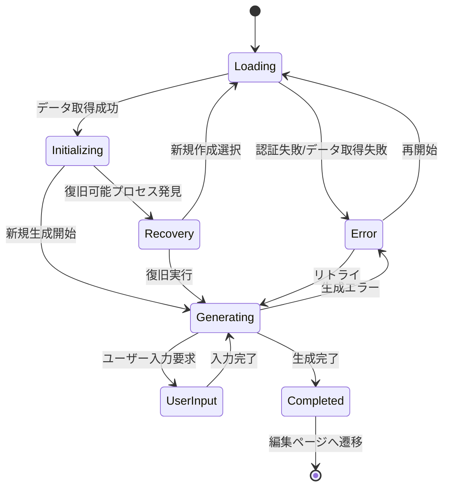

# SEO記事生成ページのUI状態（ローディング、生成中、完了）ロジック

## 概要

このドキュメントでは、SEO記事生成ページにおけるUI状態の遷移ロジックについて詳細に解説します。初期データのローディング状態、生成プロセス中の進行表示、エラー状態の処理、そして完了時のアニメーション表示まで、ユーザー体験を向上させる包括的なUI状態管理システムを説明します。

## UI状態の分類と定義

### 1. 基本UI状態

#### 状態定義

```typescript
// 基本的なローディング状態
const [isLoading, setIsLoading] = useState(true);

// 接続状態
const [connectionState, setConnectionState] = useState({
  isInitializing: false,
  hasStarted: false,
  isDataSynced: false,
});

// 思考メッセージ（AIの処理状況）
const [thinkingMessages, setThinkingMessages] = useState<string[]>([]);

// 復旧情報
const [recoveryInfo, setRecoveryInfo] = useState<any>(null);
const [showRecoveryDialog, setShowRecoveryDialog] = useState(false);

// エラー処理
const [retryCount, setRetryCount] = useState(0);
```

#### 計算されたUI状態

```typescript
// 生成中状態の判定
const isGenerating = state.currentStep !== 'completed' && state.currentStep !== 'error';

// 進捗パーセンテージの計算
const getProgressPercentage = () => {
  const stepProgressMap = {
    'keyword_analyzing': 12.5,
    'persona_generating': 25,
    'theme_generating': 37.5,
    'research_planning': 50,
    'researching': 62.5,
    'outline_generating': 75,
    'writing_sections': 87.5,
    'editing': 100,
  };
  
  const progress = stepProgressMap[state.currentStep as keyof typeof stepProgressMap];
  return progress !== undefined ? progress : 0;
};
```

### 2. 状態遷移マップ



## 初期ローディング状態

### 1. ページ初期化フロー

**ファイル**: `/frontend/src/features/tools/seo/generate/new-article/display/GenerationProcessPage.tsx`

#### 初期ローディング処理

```typescript
// プロセス状態の読み込み
useEffect(() => {
  const loadProcess = async () => {
    if (!user?.id || !jobId) return;
    
    setIsLoading(true);
    try {
      // プロセス情報を直接取得
      const response = await fetch(`/api/proxy/articles/generation/${jobId}`, {
        headers: {
          'Content-Type': 'application/json',
        },
        credentials: 'include',
      });
      
      if (!response.ok) {
        router.push('/seo/generate/new-article');
        return;
      }

      const processData = await response.json();
      console.log('📥 Process data loaded:', processData);
      
      // 復帰可能かチェック
      if (processData.can_resume && 
          ['user_input_required', 'paused', 'error'].includes(processData.status)) {
        setRecoveryInfo({
          can_resume: processData.can_resume,
          resume_step: processData.current_step || processData.status,
          current_data: processData.context,
          waiting_for_input: processData.is_waiting_for_input,
          input_type: processData.input_type,
          last_activity: processData.updated_at,
          status: processData.status,
          error_message: processData.error_message,
        });
        setShowRecoveryDialog(true);
      }
      
    } catch (err) {
      console.error('Error loading process:', err);
      router.push('/seo/generate/new-article');
    } finally {
      setIsLoading(false);
    }
  };

  loadProcess();
}, [user?.id, jobId, router]);
```

#### ローディングUI

```typescript
if (isLoading) {
  return (
    <div className="w-full max-w-7xl mx-auto space-y-6 p-4 min-h-screen flex items-center justify-center">
      <div className="text-center space-y-4">
        <div className="animate-spin rounded-full h-12 w-12 border-b-2 border-blue-600 mx-auto"></div>
        <p className="text-lg text-gray-600">プロセス情報を読み込んでいます...</p>
      </div>
    </div>
  );
}
```

### 2. 認証状態の確認

#### Clerk認証状態のデバッグ

```typescript
// 認証状態の確認
useEffect(() => {
  console.log('🔍 [DEBUG] Clerk authentication state:', {
    isLoaded,
    hasUser: !!user,
    userId: user?.id,
    isSignedIn: !!user?.id,
    jobId,
    shouldConnect: isLoaded && !!user?.id && !!jobId,
    userObject: user ? {
      id: user.id,
      emailAddresses: user.emailAddresses?.length || 0,
      createdAt: user.createdAt
    } : null
  });
}, [user, jobId, isLoaded]);
```

#### 認証エラー処理

```typescript
if (!isLoaded) {
  return (
    <div className="w-full max-w-7xl mx-auto space-y-6 p-4 min-h-screen flex items-center justify-center">
      <div className="text-center space-y-4">
        <div className="animate-pulse rounded-full h-12 w-12 bg-gray-300 mx-auto"></div>
        <p className="text-lg text-gray-600">認証情報を確認しています...</p>
      </div>
    </div>
  );
}

if (!user) {
  return (
    <div className="w-full max-w-7xl mx-auto space-y-6 p-4 min-h-screen flex items-center justify-center">
      <div className="text-center space-y-4">
        <AlertCircle className="h-12 w-12 text-red-500 mx-auto" />
        <p className="text-lg text-red-600">認証が必要です。サインインしてください。</p>
        <Button onClick={() => router.push('/sign-in')}>
          サインインページへ
        </Button>
      </div>
    </div>
  );
}
```

## 生成中状態の管理

### 1. 思考メッセージシステム

#### ステップ別メッセージ生成

```typescript
// 思考メッセージの更新
useEffect(() => {
  const messages = [];
  
  if (state.currentStep === 'keyword_analyzing') {
    messages.push('キーワードを分析し、競合記事を調査しています...');
  } else if (state.currentStep === 'persona_generating') {
    messages.push('ターゲットペルソナの詳細プロファイルを生成しています...');
  } else if (state.currentStep === 'theme_generating') {
    messages.push('SEO効果の高い記事テーマを考案しています...');
  } else if (state.currentStep === 'research_planning') {
    messages.push('記事の信頼性を高めるリサーチ計画を策定しています...');
  } else if (state.currentStep === 'researching') {
    if (state.researchProgress) {
      messages.push(`Web上から最新の情報を収集・分析しています... (${state.researchProgress.currentQuery}/${state.researchProgress.totalQueries})`);
    } else {
      messages.push('Web上から最新の情報を収集・分析しています...');
    }
  } else if (state.currentStep === 'research_synthesizing') {
    messages.push('収集した情報を整理し、記事に活用できる形にまとめています...');
  } else if (state.currentStep === 'outline_generating') {
    messages.push('読者に価値を提供する記事構成を設計しています...');
  } else if (state.currentStep === 'writing_sections') {
    if (state.sectionsProgress) {
      messages.push(`専門性と読みやすさを両立した記事を執筆しています... (${state.sectionsProgress.currentSection}/${state.sectionsProgress.totalSections})`);
    } else {
      messages.push('専門性と読みやすさを両立した記事を執筆しています...');
    }
  } else if (state.currentStep === 'editing') {
    messages.push('記事全体を校正し、最終調整を行っています...');
  } else if (state.currentStep === 'error' || state.error || state.steps.some((step: any) => step.status === 'error')) {
    messages.push('記事生成中にエラーが発生しました。再試行してください。');
  } else if (state.currentStep === 'completed') {
    messages.push('記事生成が完了しました！');
  }
  
  setThinkingMessages(messages);
}, [state.currentStep, state.researchProgress, state.sectionsProgress, state.steps, state.error]);
```

#### AIの思考表示コンポーネント

```typescript
// AiThinkingBox コンポーネント
function AiThinkingBox({ message, isVisible }: { message?: string; isVisible: boolean }) {
  if (!isVisible || !message) return null;

  return (
    <motion.div
      initial={{ opacity: 0, y: 10 }}
      animate={{ opacity: 1, y: 0 }}
      exit={{ opacity: 0, y: -10 }}
      className="bg-gradient-to-r from-blue-50 to-purple-50 border border-blue-200 rounded-lg p-4 mb-4"
    >
      <div className="flex items-center space-x-3">
        <div className="flex-shrink-0">
          <Brain className="h-5 w-5 text-blue-600 animate-pulse" />
        </div>
        <div className="flex-1">
          <p className="text-sm text-blue-800 font-medium">AI思考中</p>
          <p className="text-sm text-blue-700 mt-1">{message}</p>
        </div>
        <div className="flex space-x-1">
          <div className="w-2 h-2 bg-blue-400 rounded-full animate-bounce"></div>
          <div className="w-2 h-2 bg-blue-400 rounded-full animate-bounce" style={{ animationDelay: '0.1s' }}></div>
          <div className="w-2 h-2 bg-blue-400 rounded-full animate-bounce" style={{ animationDelay: '0.2s' }}></div>
        </div>
      </div>
    </motion.div>
  );
}
```

### 2. プログレス表示システム

#### CompactGenerationFlow コンポーネント

**ファイル**: `/frontend/src/features/tools/seo/generate/new-article/component/CompactGenerationFlow.tsx`

```typescript
interface CompactGenerationFlowProps {
  steps: GenerationStep[];
  currentStep: string;
  isConnected: boolean;
  isGenerating: boolean;
  progressPercentage: number;
  finalArticle?: {
    title: string;
    content: string;
  };
  currentMessage?: string;
  generatedContent?: string;
  currentSection?: {
    index: number;
    heading: string;
    content: string;
  };
  outline?: any;
  researchProgress?: ResearchProgress;
  sectionsProgress?: SectionsProgress;
  imageMode?: boolean;
  imagePlaceholders?: ImagePlaceholder[];
  completedSections?: CompletedSection[];
}

export default function CompactGenerationFlow({
  steps,
  currentStep,
  isConnected,
  isGenerating,
  progressPercentage,
  finalArticle,
  currentMessage,
  generatedContent,
  outline,
  researchProgress,
  sectionsProgress,
  imageMode,
  imagePlaceholders,
  completedSections
}: CompactGenerationFlowProps) {
  // ステップ状態による表示切り替え
  const getStepIcon = (step: GenerationStep) => {
    switch (step.status) {
      case 'completed':
        return <Check className="h-4 w-4 text-green-600" />;
      case 'in_progress':
        return <div className="animate-spin rounded-full h-4 w-4 border-b-2 border-blue-600"></div>;
      case 'error':
        return <AlertCircle className="h-4 w-4 text-red-600" />;
      default:
        return <Clock className="h-4 w-4 text-gray-400" />;
    }
  };

  return (
    <Card className="w-full">
      <CardContent className="p-6">
        {/* 接続状態表示 */}
        <div className="flex items-center justify-between mb-6">
          <h2 className="text-xl font-semibold text-gray-900">記事生成プロセス</h2>
          <ConnectionStatus 
            isConnected={isConnected}
            isConnecting={false}
            error={null}
          />
        </div>

        {/* 進捗バー */}
        <div className="mb-6">
          <div className="flex justify-between text-sm text-gray-600 mb-2">
            <span>進捗状況</span>
            <span>{Math.round(progressPercentage)}%</span>
          </div>
          <Progress value={progressPercentage} className="h-3" />
        </div>

        {/* AI思考表示 */}
        <AiThinkingBox 
          message={currentMessage} 
          isVisible={isGenerating && !!currentMessage} 
        />

        {/* ステップ表示 */}
        <div className="space-y-3">
          {steps.map((step, index) => (
            <motion.div
              key={step.id}
              initial={{ opacity: 0, x: -20 }}
              animate={{ opacity: 1, x: 0 }}
              transition={{ delay: index * 0.1 }}
              className={`flex items-center space-x-3 p-3 rounded-lg transition-colors ${
                step.id === currentStep 
                  ? 'bg-blue-50 border border-blue-200' 
                  : step.status === 'completed'
                  ? 'bg-green-50 border border-green-200'
                  : step.status === 'error'
                  ? 'bg-red-50 border border-red-200'
                  : 'bg-gray-50'
              }`}
            >
              <div className="flex-shrink-0">
                {getStepIcon(step)}
              </div>
              <div className="flex-1">
                <p className={`font-medium ${
                  step.status === 'completed' ? 'text-green-800' :
                  step.status === 'error' ? 'text-red-800' :
                  step.id === currentStep ? 'text-blue-800' : 'text-gray-600'
                }`}>
                  {step.name}
                </p>
                {step.message && (
                  <p className="text-sm text-gray-500 mt-1">{step.message}</p>
                )}
              </div>
            </motion.div>
          ))}
        </div>

        {/* 進捗詳細表示 */}
        <AnimatePresence>
          {researchProgress && (
            <motion.div
              initial={{ opacity: 0, height: 0 }}
              animate={{ opacity: 1, height: 'auto' }}
              exit={{ opacity: 0, height: 0 }}
              className="mt-4 p-4 bg-blue-50 rounded-lg border border-blue-200"
            >
              <div className="flex items-center space-x-2 mb-2">
                <Search className="h-4 w-4 text-blue-600" />
                <span className="text-sm font-medium text-blue-800">リサーチ進捗</span>
              </div>
              <div className="text-sm text-blue-700">
                進行中: {researchProgress.query}
              </div>
              <div className="mt-2">
                <Progress 
                  value={(researchProgress.currentQuery / researchProgress.totalQueries) * 100} 
                  className="h-2" 
                />
                <div className="text-xs text-blue-600 mt-1">
                  {researchProgress.currentQuery} / {researchProgress.totalQueries} クエリ完了
                </div>
              </div>
            </motion.div>
          )}
        </AnimatePresence>

        <AnimatePresence>
          {sectionsProgress && (
            <motion.div
              initial={{ opacity: 0, height: 0 }}
              animate={{ opacity: 1, height: 'auto' }}
              exit={{ opacity: 0, height: 0 }}
              className="mt-4 p-4 bg-purple-50 rounded-lg border border-purple-200"
            >
              <div className="flex items-center space-x-2 mb-2">
                <PenTool className="h-4 w-4 text-purple-600" />
                <span className="text-sm font-medium text-purple-800">執筆進捗</span>
              </div>
              <div className="text-sm text-purple-700">
                現在執筆中: {sectionsProgress.sectionHeading}
              </div>
              <div className="mt-2">
                <Progress 
                  value={(sectionsProgress.currentSection / sectionsProgress.totalSections) * 100} 
                  className="h-2" 
                />
                <div className="text-xs text-purple-600 mt-1">
                  {sectionsProgress.currentSection} / {sectionsProgress.totalSections} セクション完了
                </div>
              </div>
            </motion.div>
          )}
        </AnimatePresence>
      </CardContent>
    </Card>
  );
}
```

### 3. 接続状態の表示

#### ConnectionStatus コンポーネント

```typescript
interface ConnectionStatusProps {
  isConnected: boolean;
  isConnecting: boolean;
  error?: string | null;
}

export function ConnectionStatus({ isConnected, isConnecting, error }: ConnectionStatusProps) {
  if (error) {
    return (
      <div className="flex items-center space-x-2 px-3 py-1 rounded-full text-sm bg-red-100 text-red-800">
        <XCircle className="h-4 w-4" />
        <span>接続エラー</span>
      </div>
    );
  }

  if (isConnecting) {
    return (
      <div className="flex items-center space-x-2 px-3 py-1 rounded-full text-sm bg-yellow-100 text-yellow-800">
        <div className="animate-spin rounded-full h-3 w-3 border-b-2 border-yellow-600"></div>
        <span>接続中</span>
      </div>
    );
  }

  if (isConnected) {
    return (
      <div className="flex items-center space-x-2 px-3 py-1 rounded-full text-sm bg-green-100 text-green-800">
        <div className="h-3 w-3 bg-green-600 rounded-full"></div>
        <span>接続済み</span>
      </div>
    );
  }

  return (
    <div className="flex items-center space-x-2 px-3 py-1 rounded-full text-sm bg-gray-100 text-gray-800">
      <div className="h-3 w-3 bg-gray-400 rounded-full"></div>
      <span>未接続</span>
    </div>
  );
}
```

## エラー状態処理

### 1. エラー表示システム

#### エラー表示UI

```typescript
{/* エラー表示 */}
<AnimatePresence>
  {error && (
    <motion.div
      initial={{ opacity: 0, height: 0 }}
      animate={{ opacity: 1, height: 'auto' }}
      exit={{ opacity: 0, height: 0 }}
    >
      <Alert className="border-red-200 bg-red-50">
        <AlertCircle className="h-4 w-4 text-red-600" />
        <AlertDescription className="text-red-800">
          {error}
        </AlertDescription>
      </Alert>
    </motion.div>
  )}
</AnimatePresence>
```

#### エラー回復アクション

**ファイル**: `/frontend/src/features/tools/seo/generate/new-article/component/ErrorRecoveryActions.tsx`

```typescript
interface ErrorRecoveryActionsProps {
  error: string;
  currentStep: string;
  processId: string;
  onRetry: () => void;
  onRestart: () => void;
  retryCount: number;
  maxRetries: number;
}

export default function ErrorRecoveryActions({
  error,
  currentStep,
  processId,
  onRetry,
  onRestart,
  retryCount,
  maxRetries
}: ErrorRecoveryActionsProps) {
  const canRetry = retryCount < maxRetries;

  return (
    <Card className="border-red-200 bg-red-50">
      <CardContent className="p-6">
        <div className="flex items-start space-x-4">
          <div className="flex-shrink-0">
            <AlertCircle className="h-8 w-8 text-red-600" />
          </div>
          <div className="flex-1">
            <h3 className="text-lg font-semibold text-red-900 mb-2">
              エラーが発生しました
            </h3>
            <p className="text-red-800 mb-4">
              {error}
            </p>
            <div className="text-sm text-red-700 mb-4">
              現在のステップ: {currentStep} | 試行回数: {retryCount}/{maxRetries}
            </div>
            
            <div className="flex space-x-3">
              {canRetry && (
                <Button
                  onClick={onRetry}
                  variant="outline"
                  className="border-red-300 text-red-700 hover:bg-red-100"
                >
                  <RotateCcw className="h-4 w-4 mr-2" />
                  再試行 ({maxRetries - retryCount}回まで)
                </Button>
              )}
              <Button
                onClick={onRestart}
                className="bg-red-600 hover:bg-red-700"
              >
                <ArrowLeft className="h-4 w-4 mr-2" />
                新規作成に戻る
              </Button>
            </div>

            {!canRetry && (
              <div className="mt-4 p-3 bg-red-100 rounded-lg">
                <p className="text-sm text-red-800">
                  最大試行回数に達しました。新規作成から再開してください。
                </p>
              </div>
            )}
          </div>
        </div>
      </CardContent>
    </Card>
  );
}
```

### 2. エラー処理ロジック

#### リトライ処理

```typescript
const handleRetry = async () => {
  setRetryCount(prev => prev + 1);
  try {
    if (!isConnected && !isConnecting) {
      // Supabase Realtime接続を再試行
      connect();
    } else {
      // 既に接続済みの場合、プロセス再開APIを呼び出し
      if (resumeGeneration) {
        await resumeGeneration();
      }
    }
  } catch (err) {
    console.error('Retry failed:', err);
  }
};

const handleRestartFromError = () => {
  router.push('/seo/generate/new-article');
};
```

#### エラー状態の判定

```typescript
// エラー処理
<AnimatePresence>
  {state.currentStep === 'error' && state.error && (
    <motion.div
      initial={{ opacity: 0, y: 20 }}
      animate={{ opacity: 1, y: 0 }}
      exit={{ opacity: 0, y: -20 }}
    >
      <ErrorRecoveryActions
        error={state.error}
        currentStep={state.currentStep}
        processId={jobId}
        onRetry={handleRetry}
        onRestart={handleRestartFromError}
        retryCount={retryCount}
        maxRetries={3}
      />
    </motion.div>
  )}
</AnimatePresence>
```

## 完了状態とアニメーション

### 1. 完了検出ロジック

#### 完了条件の判定

```typescript
// 生成完了後に編集ページへ遷移（エラー状態でない場合のみ）
useEffect(() => {
  if (state.currentStep === 'completed' && 
      state.articleId && 
      !state.error && 
      !state.steps.some((step: any) => step.status === 'error')) {
    const timer = setTimeout(() => {
      router.push(`/seo/generate/edit-article/${state.articleId}`);
    }, 2000);
    return () => clearTimeout(timer);
  }
}, [state.currentStep, state.articleId, state.error, state.steps, router]);
```

### 2. 完了アニメーション

#### CompletedArticleView コンポーネント

```typescript
interface CompletedArticleViewProps {
  article: {
    title: string;
    content: string;
  };
  articleId?: string;
  onEdit: () => void;
  onViewFull: () => void;
}

export default function CompletedArticleView({
  article,
  articleId,
  onEdit,
  onViewFull
}: CompletedArticleViewProps) {
  return (
    <motion.div
      initial={{ opacity: 0, scale: 0.95 }}
      animate={{ opacity: 1, scale: 1 }}
      transition={{ duration: 0.5 }}
      className="w-full"
    >
      <Card className="border-green-200 bg-green-50">
        <CardContent className="p-6">
          {/* 成功アニメーション */}
          <motion.div
            initial={{ scale: 0 }}
            animate={{ scale: 1 }}
            transition={{ delay: 0.2, type: "spring", stiffness: 200 }}
            className="flex justify-center mb-6"
          >
            <div className="relative">
              <CheckCircle className="h-16 w-16 text-green-600" />
              <motion.div
                initial={{ scale: 0, opacity: 0 }}
                animate={{ scale: 1.5, opacity: 0 }}
                transition={{ delay: 0.5, duration: 1 }}
                className="absolute inset-0 rounded-full bg-green-200"
              />
            </div>
          </motion.div>

          <motion.div
            initial={{ opacity: 0, y: 20 }}
            animate={{ opacity: 1, y: 0 }}
            transition={{ delay: 0.4 }}
            className="text-center mb-6"
          >
            <h2 className="text-2xl font-bold text-green-900 mb-2">
              記事生成が完了しました！
            </h2>
            <p className="text-green-700">
              高品質なSEO記事が生成されました。編集や公開の準備ができています。
            </p>
          </motion.div>

          {/* 記事プレビュー */}
          <motion.div
            initial={{ opacity: 0, y: 20 }}
            animate={{ opacity: 1, y: 0 }}
            transition={{ delay: 0.6 }}
            className="bg-white rounded-lg border border-green-200 p-4 mb-6"
          >
            <h3 className="font-semibold text-gray-900 mb-2">{article.title}</h3>
            <div 
              className="prose prose-sm max-w-none text-gray-700"
              dangerouslySetInnerHTML={{ 
                __html: article.content.substring(0, 300) + '...' 
              }}
            />
          </motion.div>

          {/* アクションボタン */}
          <motion.div
            initial={{ opacity: 0, y: 20 }}
            animate={{ opacity: 1, y: 0 }}
            transition={{ delay: 0.8 }}
            className="flex space-x-3 justify-center"
          >
            <Button
              onClick={onViewFull}
              variant="outline"
              className="border-green-300 text-green-700 hover:bg-green-100"
            >
              <Eye className="h-4 w-4 mr-2" />
              全文プレビュー
            </Button>
            <Button
              onClick={onEdit}
              className="bg-green-600 hover:bg-green-700"
            >
              <Edit3 className="h-4 w-4 mr-2" />
              編集ページへ
            </Button>
          </motion.div>

          {/* 自動遷移カウントダウン */}
          <motion.div
            initial={{ opacity: 0 }}
            animate={{ opacity: 1 }}
            transition={{ delay: 1 }}
            className="text-center mt-4"
          >
            <p className="text-sm text-green-600">
              2秒後に自動的に編集ページに移動します...
            </p>
          </motion.div>
        </CardContent>
      </Card>
    </motion.div>
  );
}
```

## プロセス復旧機能

### 1. 復旧ダイアログ

#### ProcessRecoveryDialog コンポーネント

```typescript
interface ProcessRecoveryDialogProps {
  processId: string;
  recoveryInfo: any;
  onResume: () => void;
  onRestart: () => void;
  onCancel: () => void;
  isLoading: boolean;
}

export default function ProcessRecoveryDialog({
  processId,
  recoveryInfo,
  onResume,
  onRestart,
  onCancel,
  isLoading
}: ProcessRecoveryDialogProps) {
  const [isOpen, setIsOpen] = useState(!!recoveryInfo);

  useEffect(() => {
    setIsOpen(!!recoveryInfo);
  }, [recoveryInfo]);

  if (!recoveryInfo) return null;

  return (
    <Dialog open={isOpen} onOpenChange={setIsOpen}>
      <DialogContent className="sm:max-w-md">
        <div className="flex items-start space-x-4">
          <div className="flex-shrink-0">
            <Clock className="h-8 w-8 text-blue-600" />
          </div>
          <div className="flex-1">
            <h3 className="text-lg font-semibold text-gray-900 mb-2">
              継続可能なプロセスが見つかりました
            </h3>
            <p className="text-gray-600 mb-4">
              前回の記事生成プロセスが中断されています。継続して生成を行いますか？
            </p>
            
            <div className="bg-gray-50 rounded-lg p-4 mb-4">
              <div className="grid grid-cols-2 gap-4 text-sm">
                <div>
                  <span className="font-medium text-gray-700">プロセスID:</span>
                  <p className="text-gray-600 font-mono text-xs">{processId}</p>
                </div>
                <div>
                  <span className="font-medium text-gray-700">状態:</span>
                  <p className="text-gray-600">{recoveryInfo.status}</p>
                </div>
                <div>
                  <span className="font-medium text-gray-700">現在のステップ:</span>
                  <p className="text-gray-600">{recoveryInfo.resume_step}</p>
                </div>
                <div>
                  <span className="font-medium text-gray-700">最終活動:</span>
                  <p className="text-gray-600">
                    {new Date(recoveryInfo.last_activity).toLocaleString()}
                  </p>
                </div>
              </div>
              
              {recoveryInfo.waiting_for_input && (
                <div className="mt-3 p-2 bg-yellow-50 border border-yellow-200 rounded">
                  <p className="text-sm text-yellow-800">
                    ユーザー入力待ち: {recoveryInfo.input_type}
                  </p>
                </div>
              )}
              
              {recoveryInfo.error_message && (
                <div className="mt-3 p-2 bg-red-50 border border-red-200 rounded">
                  <p className="text-sm text-red-800">
                    エラー: {recoveryInfo.error_message}
                  </p>
                </div>
              )}
            </div>
            
            <div className="flex space-x-3">
              <Button
                onClick={onCancel}
                variant="outline"
                disabled={isLoading}
              >
                キャンセル
              </Button>
              <Button
                onClick={onRestart}
                variant="outline"
                disabled={isLoading}
              >
                新規作成
              </Button>
              <Button
                onClick={onResume}
                disabled={isLoading}
                className="bg-blue-600 hover:bg-blue-700"
              >
                {isLoading ? (
                  <>
                    <div className="animate-spin rounded-full h-4 w-4 border-b-2 border-white mr-2"></div>
                    復旧中...
                  </>
                ) : (
                  <>
                    <ChevronRight className="h-4 w-4 mr-2" />
                    プロセスを継続
                  </>
                )}
              </Button>
            </div>
          </div>
        </div>
      </DialogContent>
    </Dialog>
  );
}
```

### 2. 復旧処理ロジック

#### 復旧実行

```typescript
const handleResume = async () => {
  // ローディング状態を表示
  setThinkingMessages(['プロセスを復帰中...']);
  setShowRecoveryDialog(false);
  
  try {
    // Supabase Realtimeが自動的に状態を同期するため、接続を確認するだけ
    if (!isConnected && !isConnecting) {
      connect();
    }
    
    // 復帰成功をユーザーに示す
    setThinkingMessages(['プロセスが正常に復帰されました。リアルタイム更新を開始します。']);
    
    // 2秒後に通常の状態表示に戻す
    setTimeout(() => {
      setThinkingMessages([]);
    }, 2000);
    
  } catch (err) {
    console.error('Resume error:', err);
    setThinkingMessages(['プロセスの復帰に失敗しました。新規作成をお試しください。']);
  }
};

const handleRestart = () => {
  router.push('/seo/generate/new-article');
};

const handleCancelRecovery = () => {
  router.push('/seo/generate/new-article');
};
```

## アニメーション設計

### 1. 基本的なアニメーションパターン

#### フェードインアニメーション

```typescript
<motion.div
  initial={{ opacity: 0, y: 20 }}
  animate={{ opacity: 1, y: 0 }}
  exit={{ opacity: 0, y: -20 }}
  transition={{ duration: 0.3 }}
>
  {/* コンテンツ */}
</motion.div>
```

#### ステップ遷移アニメーション

```typescript
<AnimatePresence mode="wait">
  {state.currentStep !== 'start' && (
    <motion.div
      key={state.currentStep}
      initial={{ opacity: 0, x: 50 }}
      animate={{ opacity: 1, x: 0 }}
      exit={{ opacity: 0, x: -50 }}
      transition={{ duration: 0.4 }}
      className="space-y-6"
    >
      {/* ステップコンテンツ */}
    </motion.div>
  )}
</AnimatePresence>
```

#### スケールアニメーション

```typescript
<motion.div
  whileHover={{ scale: 1.02 }}
  whileTap={{ scale: 0.98 }}
  transition={{ type: "spring", stiffness: 400, damping: 17 }}
>
  {/* インタラクティブ要素 */}
</motion.div>
```

### 2. 進捗アニメーション

#### プログレスバーのアニメーション

```typescript
<motion.div
  className="bg-blue-600 h-full rounded-full"
  initial={{ width: 0 }}
  animate={{ width: `${progressPercentage}%` }}
  transition={{ duration: 0.5, ease: "easeOut" }}
/>
```

#### ステップアイコンのアニメーション

```typescript
const StepIcon = ({ status }: { status: StepStatus }) => {
  return (
    <motion.div
      initial={false}
      animate={{ 
        scale: status === 'in_progress' ? [1, 1.2, 1] : 1,
        rotate: status === 'completed' ? 360 : 0 
      }}
      transition={{ 
        scale: { repeat: status === 'in_progress' ? Infinity : 0, duration: 1 },
        rotate: { duration: 0.5 }
      }}
    >
      {status === 'completed' && <Check className="h-4 w-4 text-green-600" />}
      {status === 'in_progress' && <div className="animate-spin rounded-full h-4 w-4 border-b-2 border-blue-600"></div>}
      {status === 'error' && <AlertCircle className="h-4 w-4 text-red-600" />}
      {status === 'pending' && <Clock className="h-4 w-4 text-gray-400" />}
    </motion.div>
  );
};
```

## 結論

このSEO記事生成ページのUI状態ロジックにより、以下の特徴を実現しています：

1. **直感的な状態表示**: ローディング、生成中、完了の明確な状態遷移
2. **リアルタイムフィードバック**: AI思考表示と進捗の詳細な可視化
3. **エラー処理**: 包括的なエラー表示と回復アクション
4. **滑らかなアニメーション**: Framer Motionによる洗練されたユーザー体験
5. **復旧機能**: 中断されたプロセスの適切な復元処理
6. **応答性**: リアルタイム接続状態の監視と表示

この設計により、ユーザーは記事生成プロセスの状況を常に把握でき、エラーが発生した場合も適切に対処できる、優れたユーザー体験を提供します。