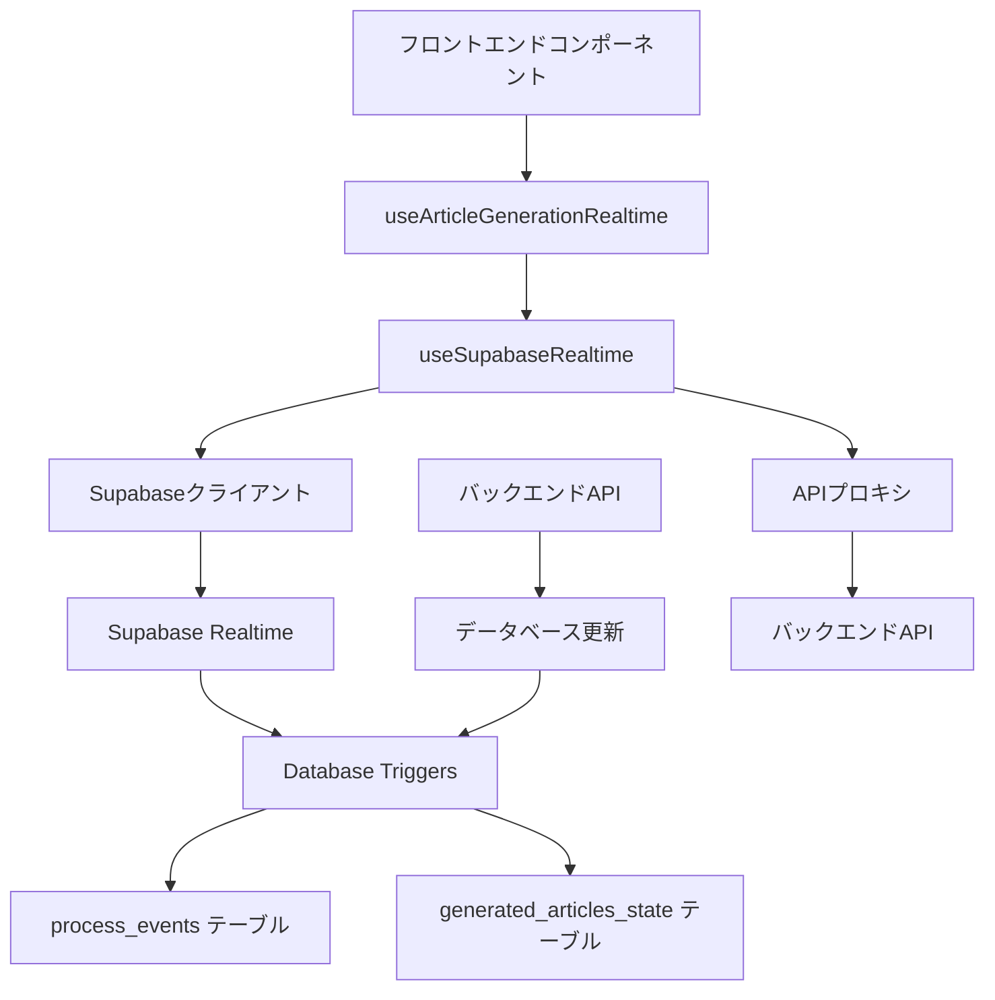

# フロントエンドにおけるSupabase Realtime購読仕様

## 概要

このドキュメントでは、フロントエンドにおけるSupabase Realtimeの購読メカニズムについて詳細に解説します。`useSupabaseRealtime`カスタムフックによるリアルタイム通信の実装、イベント処理パターン、接続状態管理、およびSEO記事生成ページでの実際の活用方法を包括的に説明します。

## アーキテクチャ概要

### 1. Realtime購読システムの構成



### 2. レイヤー分離

1. **コンポーネント層**: UI状態とユーザーインタラクション
2. **アプリケーション層**: `useArticleGenerationRealtime` - ビジネスロジック
3. **インフラ層**: `useSupabaseRealtime` - 低レベルRealtime管理
4. **通信層**: Supabaseクライアント - データベース接続

---

## 1. Supabaseクライアント設定

### 1.1 ブラウザ用クライアント

**ファイル**: `/frontend/src/libs/supabase/supabase-client.ts`

```typescript
import { Database } from '@/libs/supabase/types';
import { getEnvVar } from '@/utils/get-env-var';
import { createBrowserClient } from '@supabase/ssr';

export const supabase = createBrowserClient<Database>(
  getEnvVar(process.env.NEXT_PUBLIC_SUPABASE_URL, 'NEXT_PUBLIC_SUPABASE_URL'),
  getEnvVar(process.env.NEXT_PUBLIC_SUPABASE_ANON_KEY, 'NEXT_PUBLIC_SUPABASE_ANON_KEY')
);
```

**設定の特徴**:
- **@supabase/ssr**: Next.js SSRとの互換性確保
- **型安全性**: TypeScript型定義の適用
- **環境変数管理**: 安全な設定値の管理
- **シングルトンパターン**: アプリ全体で単一インスタンス使用

---

## 2. useSupabaseRealtime: 汎用Realtimeフック

### 2.1 基本インターフェース

```typescript
interface UseSupabaseRealtimeOptions {
  processId: string;
  userId: string;
  onEvent?: (event: ProcessEvent) => void;
  onError?: (error: Error) => void;
  onStatusChange?: (status: string) => void;
  onDataSync?: (data: GeneratedArticleState) => void;
  onConnectionStateChange?: (isConnected: boolean, metrics: ConnectionMetrics) => void;
  autoConnect?: boolean;
  enableDataSync?: boolean;
  syncInterval?: number; // seconds
}
```

### 2.2 ProcessEvent型定義

```typescript
export interface ProcessEvent {
  id: string;
  process_id: string;
  event_type: string;
  event_data: any;
  event_sequence: number;
  created_at: string;
}
```

**イベント種別**:
- `process_created`: プロセス開始
- `process_state_updated`: 状態更新（最重要）
- `status_changed`: ステータス変更
- `step_changed`: ステップ遷移
- `progress_updated`: 進捗更新
- `input_required`: ユーザー入力要求
- `input_resolved`: 入力完了

### 2.3 接続管理メカニズム

#### チャンネルサブスクリプション

```typescript
const connect = useCallback(async () => {
  const channel = (supabase as any)
    .channel(`process_events:process_id=eq.${processId}`)
    .on(
      'postgres_changes',
      {
        event: 'INSERT',
        schema: 'public',
        table: 'process_events',
        filter: `process_id=eq.${processId}`,
      },
      (payload: any) => {
        const event = payload.new as ProcessEvent;
        console.log('📥 Realtime event received:', event);
        
        if (event.event_sequence > lastEventSequence) {
          setLastEventSequence(event.event_sequence);
          onEvent?.(event);
        }
      }
    )
    .on(
      'postgres_changes',
      {
        event: 'UPDATE',
        schema: 'public',
        table: 'generated_articles_state',
        filter: `id=eq.${processId}`,
      },
      (payload: any) => {
        const processState = payload.new;
        const syntheticEvent: ProcessEvent = {
          id: `state_${Date.now()}`,
          process_id: processId,
          event_type: 'process_state_updated',
          event_data: processState,
          event_sequence: lastEventSequence + 1,
          created_at: new Date().toISOString(),
        };
        
        setLastEventSequence(syntheticEvent.event_sequence);
        onEvent?.(syntheticEvent);
      }
    )
}, []);
```

#### 購読対象テーブル

1. **process_events**: イベントストリームの主要ソース
   - `INSERT`イベントを購読
   - `filter: process_id=eq.${processId}` による絞り込み

2. **generated_articles_state**: プロセス状態の直接監視
   - `UPDATE`イベントを購読
   - 合成イベントとして `process_state_updated` を生成

### 2.4 イベント順序保証とデータ整合性

#### シーケンス管理

```typescript
const [lastEventSequence, setLastEventSequence] = useState(0);

// イベント受信時の順序チェック
if (event.event_sequence > lastEventSequence) {
  setLastEventSequence(event.event_sequence);
  onEvent?.(event);
} else {
  console.warn('Out-of-order or duplicate event received:', 
    event.event_sequence, 'last:', lastEventSequence);
}
```

#### 見逃しイベントの取得

```typescript
const fetchMissedEvents = useCallback(async () => {
  try {
    const token = await getToken();
    const response = await fetch(
      `/api/proxy/articles/generation/${processId}/events?since_sequence=${lastEventSequence}&limit=50`,
      {
        headers: {
          'Content-Type': 'application/json',
          'Authorization': `Bearer ${token}`,
        },
        credentials: 'include',
      }
    );

    if (response.ok) {
      const events: ProcessEvent[] = await response.json();
      events.forEach(event => {
        if (event.event_sequence > lastEventSequence) {
          setLastEventSequence(event.event_sequence);
          onEvent?.(event);
        }
      });
    }
  } catch (err) {
    console.warn('Failed to fetch missed events:', err);
  }
}, [processId, onEvent, getToken, lastEventSequence]);
```

### 2.5 接続状態管理

#### 接続メトリクス

```typescript
interface ConnectionMetrics {
  connectionAttempts: number;
  lastConnectionTime?: Date;
  totalDowntime: number;
  lastError?: string;
  dataConsistencyChecks: number;
}
```

#### 自動再接続メカニズム

```typescript
const scheduleReconnect = useCallback(() => {
  if (isManuallyDisconnectedRef.current || reconnectInProgressRef.current) {
    return;
  }
  
  const delay = Math.min(1000 * Math.pow(2, reconnectAttempts.current), 30000); // 指数バックオフ
  reconnectAttempts.current += 1;
  
  reconnectTimeoutRef.current = setTimeout(() => {
    if (channelRef.current) {
      channelRef.current.unsubscribe();
      channelRef.current = null;
    }
    connect();
  }, delay);
}, []);
```

### 2.6 データ同期とバリデーション

#### データバリデーション

```typescript
const validateData = useCallback((data: any): DataValidationResult => {
  const errors: string[] = [];
  const warnings: string[] = [];

  if (!data) {
    errors.push('Data is null or undefined');
    return { isValid: false, errors, warnings };
  }

  // 必須フィールドチェック
  if (!data.id) errors.push('Missing process ID');
  if (!data.user_id) errors.push('Missing user ID in data');
  
  // ユーザーID照合
  if (data.user_id !== userId) {
    errors.push(`User ID mismatch: expected "${userId}", got "${data.user_id}"`);
  }

  // ステータス値チェック
  const validStatuses = ['pending', 'in_progress', 'completed', 'error', 'paused', 'cancelled', 'user_input_required'];
  if (data.status && !validStatuses.includes(data.status)) {
    warnings.push(`Unknown status: ${data.status}`);
  }

  return { isValid: errors.length === 0, errors, warnings };
}, [userId]);
```

#### APIプロキシによるデータ取得

```typescript
const fetchProcessData = useCallback(async (): Promise<GeneratedArticleState | null> => {
  try {
    setIsSyncing(true);
    const token = await getToken();
    const response = await fetch(`/api/proxy/articles/generation/${processId}`, {
      headers: {
        'Content-Type': 'application/json',
        'Authorization': `Bearer ${token}`,
      },
      credentials: 'include',
    });

    if (!response.ok) {
      throw new Error(`API call failed: ${response.status} ${response.statusText}`);
    }

    const data = await response.json();
    
    const validation = validateData(data);
    if (!validation.isValid) {
      throw new Error(`Invalid data: ${validation.errors.join(', ')}`);
    }

    setCurrentData(data);
    setLastSyncTime(new Date());
    onDataSync?.(data);
    
    return data;
  } catch (err) {
    const errorMessage = err instanceof Error ? err.message : 'Failed to fetch process data';
    setError(errorMessage);
    onError?.(err instanceof Error ? err : new Error(errorMessage));
    return null;
  } finally {
    setIsSyncing(false);
  }
}, []);
```

### 2.7 アクションキューイング

#### オフライン時のアクション管理

```typescript
const queueAction = useCallback(async (action: () => Promise<void>) => {
  if (isConnected) {
    // オンライン時は即座に実行
    try {
      await action();
    } catch (error) {
      console.error('Action execution failed:', error);
      throw error;
    }
  } else {
    // オフライン時はキューに追加
    console.log('📋 Queuing action due to disconnected state');
    setQueuedActions(prev => [...prev, action]);
    
    // 再接続を試行
    if (!isConnecting && !isManuallyDisconnectedRef.current) {
      connect();
    }
  }
}, []);
```

#### キューアクションの処理

```typescript
const processQueuedActions = useCallback(async () => {
  if (!isConnected || queuedActions.length === 0) return;

  console.log(`🔄 Processing ${queuedActions.length} queued actions`);
  const actionsToProcess = [...queuedActions];
  setQueuedActions([]);

  for (const action of actionsToProcess) {
    try {
      await action();
      console.log('✅ Queued action processed successfully');
    } catch (error) {
      console.error('❌ Queued action failed:', error);
      setQueuedActions(prev => [...prev, action]);
    }
  }
}, []);
```

---

## 3. useArticleGenerationRealtime: 記事生成専用フック

### 3.1 GenerationState管理

```typescript
interface GenerationState {
  currentStep: string;
  steps: GenerationStep[];
  isWaitingForInput: boolean;
  inputType?: string;
  personas?: PersonaData[];
  themes?: ThemeData[];
  researchPlan?: any;
  outline?: any;
  generatedContent?: string;
  finalArticle?: { title: string; content: string };
  articleId?: string;
  error?: string;
  researchProgress?: ResearchProgress;
  sectionsProgress?: SectionsProgress;
  completedSections: CompletedSection[];
  imagePlaceholders: any[];
}
```

### 3.2 ステップマッピング

#### バックエンドステップからUIステップへの変換

```typescript
const mapBackendStepToUIStep = (backendStep: string, status?: string): string => {
  const stepMapping: Record<string, string> = {
    'start': 'keyword_analyzing',
    'keyword_analyzing': 'keyword_analyzing',
    'keyword_analyzed': 'persona_generating',
    'persona_generating': 'persona_generating',
    'persona_generated': 'persona_generating',
    'persona_selected': 'theme_generating',
    'theme_generating': 'theme_generating',
    'theme_proposed': 'theme_generating',
    'theme_selected': 'research_planning',
    'research_planning': 'research_planning',
    'research_plan_generated': 'research_planning',
    'research_plan_approved': 'researching',
    'researching': 'researching',
    'research_synthesizing': 'researching',
    'research_report_generated': 'outline_generating',
    'outline_generating': 'outline_generating',
    'outline_generated': 'outline_generating',
    'outline_approved': 'writing_sections',
    'writing_sections': 'writing_sections',
    'all_sections_completed': 'editing',
    'editing': 'editing',
    'editing_completed': 'editing',
    'completed': 'editing',
  };
  
  return stepMapping[backendStep] || 'keyword_analyzing';
};
```

### 3.3 イベント処理とデデュープリケーション

#### イベント重複排除

```typescript
const handleRealtimeEvent = useCallback((event: ProcessEvent) => {
  // グローバルイベント重複排除
  const eventKey = `${event.event_type}-${event.id || event.event_sequence}-${JSON.stringify(event.event_data).substring(0, 100)}`;
  
  if (processedEventIds.has(eventKey)) {
    console.log('⏭️  Skipping duplicate event:', event.event_type);
    return;
  }
  
  setProcessedEventIds(prev => new Set([...prev].slice(-100)).add(eventKey));
  
  // 状態更新イベントの時間ベース調整
  if (event.event_type === 'process_state_updated') {
    const stateFingerprint = `${data.current_step_name}-${data.status}-${data.is_waiting_for_input}`;
    const timeSinceLastProcess = Date.now() - lastProcessedTime;
    
    if (stateFingerprint === lastProcessedState && timeSinceLastProcess < 500) {
      console.log('⏭️  Skipping duplicate state update (throttled)');
      return;
    }
    
    setLastProcessedState(stateFingerprint);
    setLastProcessedTime(Date.now());
  }
  
  // イベント処理...
}, [processedEventIds, lastProcessedState, lastProcessedTime]);
```

### 3.4 ステップ進行制御

#### 後戻り防止メカニズム

```typescript
// ステップ進行制御
const currentStepOrder = ['keyword_analyzing', 'persona_generating', 'theme_generating', 
  'research_planning', 'researching', 'outline_generating', 'writing_sections', 'editing'];
const currentIndex = currentStepOrder.indexOf(newState.currentStep);
const newIndex = currentStepOrder.indexOf(uiStep);

// 遅延完了イベントの処理
const isDelayedCompletionEvent = [
  'research_plan_generated', 
  'persona_generated',
  'theme_proposed'
].includes(backendStep) && newIndex < currentIndex;

if (isDelayedCompletionEvent) {
  console.log('⏭️ Skipped delayed completion event (already progressed)');
} else if (isLatestDatabaseState || newIndex >= currentIndex || newState.currentStep === 'keyword_analyzing') {
  newState.currentStep = uiStep;
  console.log('✅ Step updated:', { from: newState.currentStep, to: uiStep });
}
```

#### 自動進行ロジック

```typescript
// 自動進行ステップ判定
const autoProgressSteps = [
  'keyword_analyzed',
  'persona_selected', 
  'theme_selected',
  'research_plan_approved',
  'research_report_generated',
  'outline_approved',
  'all_sections_completed'
];

if (autoProgressSteps.includes(backendStep) && !processData.is_waiting_for_input) {
  const nextStepMap: Record<string, string> = {
    'keyword_analyzed': 'persona_generating',
    'persona_selected': 'theme_generating',
    'theme_selected': 'research_planning', 
    'research_plan_approved': 'researching',
    'research_report_generated': 'outline_generating',
    'outline_approved': 'writing_sections',
    'all_sections_completed': 'editing'
  };
  
  const nextUIStep = nextStepMap[backendStep];
  if (nextUIStep) {
    console.log('🔄 Auto-progressing step:', { backendStep, nextUIStep });
    newState.currentStep = nextUIStep;
  }
}
```

### 3.5 データ抽出と状態更新

#### article_contextからのデータ抽出

```typescript
if (processData.article_context) {
  const context = processData.article_context;
  
  // ペルソナデータの設定
  if (context.generated_detailed_personas) {
    newState.personas = context.generated_detailed_personas.map((persona: any, index: number) => ({
      id: index,
      description: persona.description || persona.persona_description || JSON.stringify(persona)
    }));
  }
  
  // テーマデータの設定
  if (context.generated_themes) {
    newState.themes = context.generated_themes;
  }
  
  // リサーチ計画の設定
  if (context.research_plan) {
    newState.researchPlan = context.research_plan;
  }
  
  // アウトラインの設定（複数のキーをチェック）
  const outlineData = context.outline || context.generated_outline;
  if (outlineData) {
    newState.outline = outlineData;
  }
  
  // 生成済みコンテンツの設定
  if (context.generated_sections_html && Array.isArray(context.generated_sections_html)) {
    newState.generatedContent = context.generated_sections_html.join('\n\n');
    newState.completedSections = context.generated_sections_html.map((content: string, index: number) => ({
      index: index + 1,
      heading: `Section ${index + 1}`,
      content: content,
      imagePlaceholders: []
    }));
  }
  
  // 最終記事の設定
  if (context.final_article_html) {
    newState.finalArticle = {
      title: 'Generated Article',
      content: context.final_article_html
    };
  }
}
```

---

## 4. APIプロキシ通信

### 4.1 Next.js APIルート

**ファイル**: `/frontend/src/app/api/proxy/[...path]/route.ts`

```typescript
const API_BASE_URL = process.env.NEXT_PUBLIC_API_BASE_URL || 'http://localhost:8000';

export async function GET(
  request: NextRequest,
  { params }: { params: Promise<{ path: string[] }> }
) {
  const { path: pathArray } = await params;
  const pathString = pathArray.join('/');
  const searchParams = request.nextUrl.searchParams.toString();
  const url = `${API_BASE_URL}/${pathString}${searchParams ? `?${searchParams}` : ''}`;

  const headers: Record<string, string> = {
    'Content-Type': 'application/json',
  };
  
  const authHeader = request.headers.get('Authorization');
  if (authHeader) {
    headers.Authorization = authHeader;
  }

  try {
    const response = await fetch(url, {
      method: 'GET',
      headers,
    });

    const data = await response.json();
    return NextResponse.json(data, { 
      status: response.status,
      headers: {
        'Access-Control-Allow-Origin': '*',
        'Access-Control-Allow-Methods': 'GET, POST, PUT, DELETE, OPTIONS',
        'Access-Control-Allow-Headers': 'Content-Type, Authorization',
      },
    });
  } catch (error) {
    return NextResponse.json(
      { error: 'Failed to fetch from backend API' },
      { status: 500 }
    );
  }
}
```

### 4.2 認証ヘッダーの転送

```typescript
// Clerkトークンの取得と転送
const token = await getToken();
const response = await fetch('/api/proxy/articles/generation/start', {
  method: 'POST',
  headers: {
    'Content-Type': 'application/json',
    'Authorization': `Bearer ${token}`,
  },
  body: JSON.stringify(requestData),
});
```

---

## 5. 実装例: 記事生成ページ

### 5.1 コンポーネントでの使用

**ファイル**: `/frontend/src/features/tools/seo/generate/new-article/display/GenerationProcessPage.tsx`

```typescript
export default function GenerationProcessPage({ jobId }: GenerationProcessPageProps) {
  const { user, isLoaded } = useUser();
  
  const {
    state,
    isConnected,
    isConnecting,
    error,
    connect,
    disconnect,
    startArticleGeneration,
    selectPersona,
    selectTheme,
    approvePlan,
    approveOutline,
    pauseGeneration,
    resumeGeneration,
    cancelGeneration,
  } = useArticleGenerationRealtime({
    processId: jobId,
    userId: isLoaded && user?.id ? user.id : undefined,
  });

  // 認証状態のデバッグ
  useEffect(() => {
    console.log('🔍 Clerk authentication state:', {
      isLoaded,
      hasUser: !!user,
      userId: user?.id,
      shouldConnect: isLoaded && !!user?.id && !!jobId,
    });
  }, [user, jobId, isLoaded]);

  // プロセス状態の初期読み込み
  useEffect(() => {
    const loadProcess = async () => {
      if (!user?.id || !jobId) return;
      
      try {
        const response = await fetch(`/api/proxy/articles/generation/${jobId}`, {
          headers: { 'Content-Type': 'application/json' },
          credentials: 'include',
        });
        
        if (!response.ok) {
          router.push('/seo/generate/new-article');
          return;
        }

        const processData = await response.json();
        console.log('📥 Process data loaded:', processData);
      } catch (error) {
        console.error('Failed to load process:', error);
      }
    };

    loadProcess();
  }, [user?.id, jobId, router]);

  return (
    <div className="min-h-screen bg-gray-50">
      {/* ユーザーインタラクション */}
      {state.isWaitingForInput && (
        <CompactUserInteraction
          currentStep={state.currentStep}
          inputType={state.inputType}
          personas={state.personas}
          themes={state.themes}
          researchPlan={state.researchPlan}
          outline={state.outline}
          onSelectPersona={selectPersona}
          onSelectTheme={selectTheme}
          onApprovePlan={approvePlan}
          onApproveOutline={approveOutline}
          isLoading={isConnecting}
        />
      )}
      
      {/* 生成プロセスフロー */}
      <CompactGenerationFlow
        state={state}
        isConnected={isConnected}
        isConnecting={isConnecting}
      />
    </div>
  );
}
```

### 5.2 ユーザーアクション例

#### ペルソナ選択

```typescript
const selectPersona = useCallback(async (personaId: number): Promise<ActionResult> => {
  if (!isConnected) {
    return { 
      success: false, 
      error: 'リアルタイム接続が切断されています。再接続してから再試行してください。' 
    };
  }
  
  try {
    await submitUserInput({
      response_type: 'select_persona',
      payload: { selected_id: personaId },
    });
    return { success: true };
  } catch (error) {
    setState((prev: GenerationState) => ({
      ...prev,
      isWaitingForInput: true,
      inputType: 'select_persona',
      error: error instanceof Error ? error.message : 'ペルソナ選択に失敗しました'
    }));
    return { success: false, error: error instanceof Error ? error.message : 'ペルソナ選択に失敗しました' };
  }
}, [submitUserInput, isConnected]);
```

#### ユーザー入力の送信

```typescript
const submitUserInput = useCallback(async (inputData: any) => {
  if (!processId) {
    throw new Error('No process ID available');
  }

  const response = await fetch(`/api/proxy/articles/generation/${processId}/user-input`, {
    method: 'POST',
    headers: {
      'Content-Type': 'application/json',
      'Authorization': `Bearer ${await getToken()}`,
    },
    body: JSON.stringify(inputData),
  });

  if (!response.ok) {
    throw new Error(`Failed to submit user input: ${response.statusText}`);
  }

  // 即座に待機状態を解除（Realtimeイベントで確認）
  setState((prev: GenerationState) => ({
    ...prev,
    isWaitingForInput: false,
    inputType: undefined,
  }));

  return await response.json();
}, [processId, getToken]);
```

---

## 6. エラーハンドリングと復旧

### 6.1 接続エラー対応

#### 自動再接続戦略

```typescript
const scheduleReconnect = useCallback(() => {
  if (isManuallyDisconnectedRef.current) return;
  
  // 指数バックオフによる再接続遅延
  const delay = Math.min(1000 * Math.pow(2, reconnectAttempts.current), 30000);
  reconnectAttempts.current += 1;
  
  console.log(`📡 Scheduling reconnect attempt ${reconnectAttempts.current} in ${delay}ms`);
  
  reconnectTimeoutRef.current = setTimeout(() => {
    if (channelRef.current) {
      channelRef.current.unsubscribe();
      channelRef.current = null;
    }
    connect();
  }, delay);
}, []);
```

#### 接続状態の監視

```typescript
.subscribe(async (status: any, error?: any) => {
  console.log('📡 Realtime subscription status:', status);
  
  if (status === 'SUBSCRIBED') {
    setIsConnected(true);
    setIsConnecting(false);
    reconnectAttempts.current = 0;
    
    // 包括的データ同期の実行
    await fetchProcessData();
    // 見逃しイベントの取得
    await fetchMissedEvents();
    // キューされたアクションの処理
    await processQueuedActions();
    
  } else if (status === 'CHANNEL_ERROR' || status === 'TIMED_OUT') {
    setError(error?.message || `Subscription ${status.toLowerCase()}`);
    setIsConnected(false);
    
    if (reconnectAttempts.current < maxReconnectAttempts) {
      scheduleReconnect();
    }
  }
});
```

### 6.2 データ整合性の確保

#### 競合解決

```typescript
// データ取得時の競合チェック
if (currentData && data.updated_at) {
  const fetchedTime = new Date(data.updated_at);
  const currentTime = new Date(currentData.updated_at);
  
  if (fetchedTime < currentTime) {
    console.warn('Fetched data is older than current data - potential conflict');
    // 実際のアプリケーションでは競合解決ロジックを実装
  }
}
```

#### データ検証

```typescript
const validation = validateData(data);
if (!validation.isValid) {
  console.error('Data validation failed:', validation.errors);
  throw new Error(`Invalid data: ${validation.errors.join(', ')}`);
}

if (validation.warnings.length > 0) {
  console.warn('Data validation warnings:', validation.warnings);
}
```

---

## 7. パフォーマンス最適化

### 7.1 イベント処理の最適化

#### デバウンシングとスロットリング

```typescript
// 時間ベースのスロットリング
const timeSinceLastProcess = now - lastProcessedTime;
if (stateFingerprint === lastProcessedState && timeSinceLastProcess < 500) {
  console.log('⏭️  Skipping duplicate state update (throttled)');
  return;
}
```

#### イベントキューの管理

```typescript
// 処理済みイベントIDの上限管理
setProcessedEventIds(prev => new Set([...prev].slice(-100)).add(eventKey));
```

### 7.2 メモリ管理

#### useCallback最適化

```typescript
// 依存関係を最小化したuseCallback
const connect = useCallback(async () => {
  // 実装...
}, []); // 依存関係なしで安定したリファレンス
```

#### クリーンアップ処理

```typescript
useEffect(() => {
  return () => {
    console.log('🧹 Cleaning up connection on unmount');
    if (channelRef.current) {
      channelRef.current.unsubscribe();
      channelRef.current = null;
    }
    
    if (reconnectTimeoutRef.current) {
      clearTimeout(reconnectTimeoutRef.current);
    }
    
    if (syncIntervalRef.current) {
      clearInterval(syncIntervalRef.current);
    }
  };
}, []);
```

---

## 8. セキュリティ考慮事項

### 8.1 認証とアクセス制御

#### JWT トークンの管理

```typescript
const authHeader = request.headers.get('Authorization');
if (authHeader) {
  headers.Authorization = authHeader;
}
```

#### RLS ポリシーとの連携

```sql
-- データベース側のRLSポリシー
CREATE POLICY "Users can view events for their processes" ON process_events
  FOR SELECT USING (
    EXISTS (
      SELECT 1 FROM generated_articles_state 
      WHERE id = process_events.process_id 
        AND user_id = current_setting('request.jwt.claims', true)::json->>'sub'
    )
  );
```

### 8.2 データバリデーション

```typescript
// ユーザーIDの厳密な検証
if (data.user_id !== userId) {
  errors.push(`User ID mismatch: expected "${userId}", got "${data.user_id}"`);
}
```

---

## 9. 監視とデバッグ

### 9.1 ログ出力

#### 構造化ログ

```typescript
console.log('📥 Realtime event received:', {
  eventType: event.event_type,
  processId: event.process_id,
  sequence: event.event_sequence,
  dataKeys: Object.keys(event.event_data)
});
```

#### デバッグ情報の提供

```typescript
return {
  // ... 通常の戻り値
  debugInfo: {
    currentData,
    dataVersion,
    pendingActions: Array.from(pendingActions.keys()),
    connectionMetrics: {
      isConnected,
      isConnecting,
      isSyncing,
      lastSyncTime,
      queuedActions
    }
  }
};
```

### 9.2 パフォーマンス メトリクス

```typescript
interface ConnectionMetrics {
  connectionAttempts: number;
  lastConnectionTime?: Date;
  totalDowntime: number;
  lastError?: string;
  dataConsistencyChecks: number;
}
```

---

## 10. 設計原則とベストプラクティス

### 10.1 堅牢性の原則

1. **Graceful Degradation**: オフライン時でも基本機能を維持
2. **Eventually Consistent**: 最終的にデータ整合性を確保
3. **Idempotent Operations**: 冪等性によるセーフな再実行
4. **Circuit Breaker**: 過度な負荷を防ぐ自動停止機能

### 10.2 ユーザビリティの向上

1. **Progressive Disclosure**: 段階的な情報表示
2. **Optimistic Updates**: 楽観的UI更新（ロールバック付き）
3. **Real-time Feedback**: 即座のユーザーフィードバック
4. **Error Recovery**: 明確なエラー回復手順

### 10.3 保守性の確保

1. **Type Safety**: TypeScriptによる型安全性
2. **Separation of Concerns**: 責務の明確な分離
3. **Testability**: テスタブルな設計
4. **Documentation**: 包括的なドキュメント

---

## まとめ

Marketing AutomationプラットフォームのSupabase Realtime購読システムは、以下の特徴を持つ高度なリアルタイム通信基盤を提供しています：

### 技術的優位性

1. **二層アーキテクチャ**: 汎用フック + 専用フックによる柔軟性
2. **堅牢な接続管理**: 自動再接続・エラー回復・状態監視
3. **データ整合性**: イベント順序保証・重複排除・競合解決
4. **パフォーマンス最適化**: デバウンシング・メモリ管理・効率的更新

### ビジネス価値

1. **リアルタイム体験**: ユーザーは記事生成の進捗をリアルタイムで把握
2. **信頼性**: 接続断絶やエラーからの自動回復
3. **スケーラビリティ**: 多数の同時セッションへの対応
4. **保守性**: 明確な責務分離による開発・運用効率

この設計により、エンタープライズレベルの信頼性を持つリアルタイム機能を実現し、優れたユーザーエクスペリエンスを提供しています。記事生成という長時間のプロセスにおいて、ユーザーが常に最新の状態を把握し、適切なタイミングで介入できる環境を構築しています。