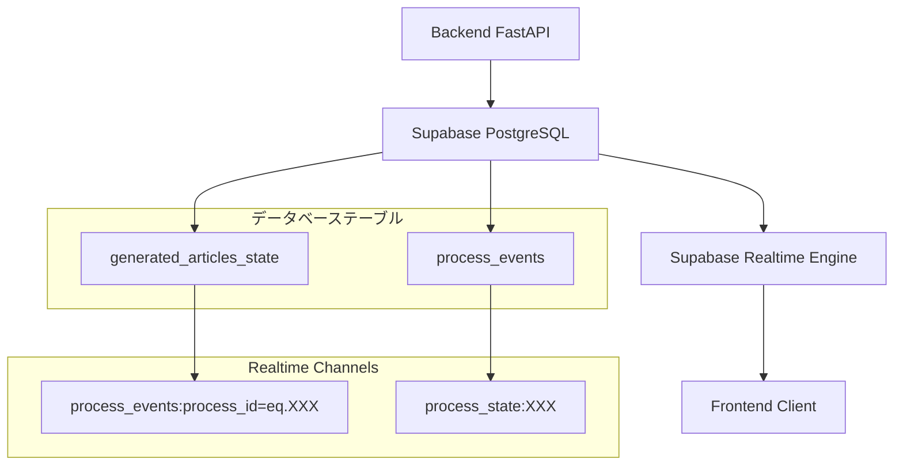

# SEO記事生成におけるSupabase Realtime連携仕様

## 概要

このドキュメントでは、SEO記事生成システムで従来のWebSocket通信に代わり導入されたSupabase Realtimeによる非同期通信の仕様について詳細に解説します。Supabase Realtimeは、PostgreSQLの変更をリアルタイムでクライアントに配信する仕組みを提供し、より信頼性が高く拡張性のあるリアルタイム通信を実現しています。

## 技術背景

### WebSocket からSupabase Realtime への移行理由

1. **接続の安定性**: WebSocketの接続断・再接続の複雑さを解消
2. **スケーラビリティ**: Supabaseのインフラを活用した自動スケーリング
3. **データ整合性**: データベース変更との完全な同期保証
4. **開発効率**: WebSocketサーバーの管理が不要
5. **障害復旧**: 自動的な接続復旧とメッセージ配信保証

### アーキテクチャ概要



## データベーステーブル構造

### 1. process_events テーブル

プロセスの各イベントを時系列で記録し、フロントエンドにリアルタイム配信します。

```sql
CREATE TABLE process_events (
  id UUID PRIMARY KEY DEFAULT gen_random_uuid(),
  process_id UUID NOT NULL REFERENCES generated_articles_state(id) ON DELETE CASCADE,
  
  -- Event details
  event_type TEXT NOT NULL,
  event_data JSONB NOT NULL DEFAULT '{}'::jsonb,
  event_sequence INTEGER NOT NULL,
  
  -- Event metadata
  created_at TIMESTAMP WITH TIME ZONE DEFAULT NOW(),
  published_at TIMESTAMP WITH TIME ZONE,
  acknowledged_by TEXT[] DEFAULT '{}', -- User IDs who acknowledged this event
  delivery_attempts INTEGER DEFAULT 0,
  
  -- Event categorization
  event_category TEXT DEFAULT 'system',
  event_priority INTEGER DEFAULT 5,
  event_source TEXT DEFAULT 'backend',
  
  -- Retention and cleanup
  expires_at TIMESTAMP WITH TIME ZONE,
  archived BOOLEAN DEFAULT FALSE,
  
  -- Ensure unique sequence per process
  CONSTRAINT unique_process_sequence UNIQUE(process_id, event_sequence)
);
```

#### インデックス構成

```sql
-- 効率的なクエリのためのインデックス
CREATE INDEX idx_process_events_process_id ON process_events(process_id);
CREATE INDEX idx_process_events_created_at ON process_events(created_at DESC);
CREATE INDEX idx_process_events_type ON process_events(event_type);
CREATE INDEX idx_process_events_category ON process_events(event_category);
CREATE INDEX idx_process_events_published ON process_events(published_at DESC) 
  WHERE published_at IS NOT NULL;
CREATE INDEX idx_process_events_undelivered ON process_events(process_id, event_sequence) 
  WHERE delivery_attempts < 3 AND acknowledged_by = '{}';
```

### 2. generated_articles_state テーブル（拡張フィールド）

既存テーブルにRealtime対応のフィールドを追加しています。

```sql
-- Realtime対応フィールドの追加
ALTER TABLE generated_articles_state 
ADD COLUMN realtime_channel TEXT,
ADD COLUMN last_realtime_event JSONB,
ADD COLUMN realtime_subscriptions JSONB DEFAULT '[]'::jsonb,
ADD COLUMN executing_step TEXT,
ADD COLUMN step_execution_start TIMESTAMP WITH TIME ZONE,
ADD COLUMN step_execution_metadata JSONB DEFAULT '{}'::jsonb,
ADD COLUMN background_task_id TEXT,
ADD COLUMN task_priority INTEGER DEFAULT 5,
ADD COLUMN retry_count INTEGER DEFAULT 0,
ADD COLUMN max_retries INTEGER DEFAULT 3,
ADD COLUMN user_input_timeout TIMESTAMP WITH TIME ZONE,
ADD COLUMN input_reminder_sent BOOLEAN DEFAULT FALSE,
ADD COLUMN interaction_history JSONB DEFAULT '[]'::jsonb,
ADD COLUMN process_type TEXT DEFAULT 'article_generation',
ADD COLUMN parent_process_id UUID REFERENCES generated_articles_state(id),
ADD COLUMN process_tags TEXT[] DEFAULT '{}',
ADD COLUMN step_durations JSONB DEFAULT '{}'::jsonb,
ADD COLUMN total_processing_time INTERVAL,
ADD COLUMN estimated_completion_time TIMESTAMP WITH TIME ZONE;
```

## イベント配信仕様

### イベント種類一覧

| イベント種類 | 説明 | 送信タイミング | ペイロード例 |
|-------------|------|---------------|-------------|
| `process_created` | プロセス開始 | プロセス初期化完了時 | `{"process_id": "...", "initial_request": {...}}` |
| `step_update` | ステップ更新 | 各ステップ開始時 | `{"step": "keyword_analyzing", "message": "キーワード分析中..."}` |
| `step_completed` | ステップ完了 | 各ステップ完了時 | `{"step": "persona_generating", "result": {...}}` |
| `user_input_required` | ユーザー入力待ち | 入力待機開始時 | `{"input_type": "SELECT_THEME", "options": [...]}` |
| `user_input_received` | ユーザー入力受信 | 入力処理完了時 | `{"input_type": "SELECT_THEME", "selected": {...}}` |
| `research_progress` | リサーチ進捗 | 各検索クエリ実行時 | `{"query_index": 1, "total_queries": 3, "query": "..."}` |
| `section_chunk` | セクション執筆進捗 | ストリーミング出力時 | `{"section_index": 0, "chunk": "...", "is_complete": false}` |
| `section_completed` | セクション完了 | セクション執筆完了時 | `{"section_index": 0, "content": "...", "images": [...]}` |
| `image_placeholder_generated` | 画像プレースホルダー生成 | 画像指示生成時 | `{"placeholder_id": "...", "description": "...", "prompt": "..."}` |
| `image_generated` | 画像生成完了 | 画像生成・アップロード完了時 | `{"placeholder_id": "...", "image_url": "...", "gcs_path": "..."}` |
| `process_paused` | プロセス一時停止 | ユーザー一時停止要求時 | `{"reason": "user_request", "resume_available": true}` |
| `process_resumed` | プロセス再開 | 一時停止からの復旧時 | `{"resumed_from_step": "outline_generating"}` |
| `process_completed` | プロセス完了 | 記事生成完了時 | `{"article_id": "...", "final_content": "...", "statistics": {...}}` |
| `process_error` | エラー発生 | エラー発生時 | `{"error_type": "recoverable", "step": "...", "message": "...", "recovery_options": [...]}` |
| `heartbeat` | 生存確認 | 定期的（30秒間隔） | `{"timestamp": "...", "active_connections": 1}` |

### イベントペイロード構造

#### 基本イベント構造
```json
{
  "id": "event-uuid",
  "process_id": "process-uuid",
  "event_type": "step_update",
  "event_sequence": 15,
  "event_category": "system",
  "event_priority": 5,
  "event_source": "backend",
  "created_at": "2025-01-31T12:00:00Z",
  "event_data": {
    // イベント固有のデータ
  }
}
```

#### 具体的なイベント例

**step_update イベント**
```json
{
  "id": "550e8400-e29b-41d4-a716-446655440000",
  "process_id": "123e4567-e89b-12d3-a456-426614174000",
  "event_type": "step_update",
  "event_sequence": 5,
  "event_category": "process",
  "event_priority": 3,
  "event_source": "generation_flow_manager",
  "created_at": "2025-01-31T12:00:15Z",
  "event_data": {
    "step": "theme_generating",
    "previous_step": "persona_selected",
    "message": "テーマ案を生成中...",
    "progress": {
      "completed_steps": 3,
      "total_steps": 8,
      "percentage": 37.5
    },
    "estimated_completion": "2025-01-31T12:02:30Z",
    "image_mode": false
  }
}
```

**user_input_required イベント**
```json
{
  "id": "550e8400-e29b-41d4-a716-446655440001",
  "process_id": "123e4567-e89b-12d3-a456-426614174000",
  "event_type": "user_input_required",
  "event_sequence": 8,
  "event_category": "interaction",
  "event_priority": 1,
  "event_source": "user_interaction_manager",
  "created_at": "2025-01-31T12:01:45Z",
  "event_data": {
    "input_type": "SELECT_THEME",
    "timeout": "2025-01-31T12:31:45Z",
    "options": [
      {
        "index": 0,
        "title": "札幌で子育て世代が選ぶべき自然素材注文住宅の完全ガイド",
        "description": "札幌の厳しい冬でも快適に過ごせる自然素材住宅の特徴、選び方、地域に適した設計のポイントを、子育て世代の視点から徹底解説。",
        "keywords": ["札幌", "注文住宅", "自然素材", "子育て", "断熱性能", "健康住宅"]
      },
      {
        "index": 1,
        "title": "自然素材で建てる札幌の注文住宅：子供の健康を守る家づくりのすべて",
        "description": "化学物質を避け、子供の健康を最優先にした自然素材住宅の建築事例と、札幌エリアでの実践的な家づくりノウハウを紹介。",
        "keywords": ["自然素材", "健康住宅", "子供", "札幌", "注文住宅", "無添加"]
      }
    ],
    "additional_actions": ["regenerate", "edit", "skip"]
  }
}
```

**section_chunk イベント（ストリーミング）**
```json
{
  "id": "550e8400-e29b-41d4-a716-446655440002",
  "process_id": "123e4567-e89b-12d3-a456-426614174000",
  "event_type": "section_chunk",
  "event_sequence": 25,
  "event_category": "generation",
  "event_priority": 4,
  "event_source": "section_writer_agent",
  "created_at": "2025-01-31T12:05:12Z",
  "event_data": {
    "section_index": 2,
    "section_heading": "札幌の冬を快適に過ごす自然素材住宅の設計ポイント",
    "html_chunk": "<p>札幌の厳しい冬季においては、自然素材を使用した住宅でも高い断熱性能が不可欠です。</p>",
    "is_complete": false,
    "total_chars_generated": 145,
    "estimated_section_length": 800,
    "generation_progress": 18.1,
    "image_mode": false
  }
}
```

## バックエンド実装仕様

### イベント送信メカニズム

#### ProcessEventPublisher クラス
```python
class ProcessEventPublisher:
    """プロセスイベントの配信を管理するクラス"""
    
    def __init__(self, supabase_client: Client):
        self.supabase = supabase_client
        self.event_sequence_counters: Dict[str, int] = {}
    
    async def publish_event(
        self, 
        process_id: str, 
        event_type: str, 
        event_data: Dict[str, Any],
        event_category: str = "system",
        event_priority: int = 5
    ) -> str:
        """イベントをprocess_eventsテーブルに挿入してRealtime配信"""
        
        # シーケンス番号を生成
        sequence = self._get_next_sequence(process_id)
        
        # イベントレコードを作成
        event_record = {
            "process_id": process_id,
            "event_type": event_type,
            "event_data": event_data,
            "event_sequence": sequence,
            "event_category": event_category,
            "event_priority": event_priority,
            "event_source": "backend",
            "published_at": datetime.now(timezone.utc).isoformat()
        }
        
        # データベースに挿入（自動的にRealtime配信される）
        result = self.supabase.table("process_events").insert(event_record).execute()
        
        if result.data:
            event_id = result.data[0]["id"]
            logger.info(f"Event published: {event_type} for process {process_id} (sequence: {sequence})")
            return event_id
        else:
            logger.error(f"Failed to publish event: {event_type} for process {process_id}")
            raise Exception("Failed to publish event")
    
    def _get_next_sequence(self, process_id: str) -> int:
        """プロセスごとのシーケンス番号を管理"""
        if process_id not in self.event_sequence_counters:
            # データベースから最新のシーケンス番号を取得
            result = self.supabase.table("process_events")\
                .select("event_sequence")\
                .eq("process_id", process_id)\
                .order("event_sequence", desc=True)\
                .limit(1)\
                .execute()
            
            last_sequence = result.data[0]["event_sequence"] if result.data else 0
            self.event_sequence_counters[process_id] = last_sequence
        
        self.event_sequence_counters[process_id] += 1
        return self.event_sequence_counters[process_id]
```

#### GenerationUtils内の実装

```python
class GenerationUtils:
    async def send_server_event(self, context: ArticleContext, payload: Any):
        """Supabase Realtimeイベント送信（旧WebSocket送信から移行）"""
        
        if not context.process_id:
            logger.warning("Process ID not found, skipping event publication")
            return
        
        # ペイロードをJSON形式に変換
        if hasattr(payload, 'model_dump'):
            event_data = payload.model_dump()
        elif hasattr(payload, 'dict'):
            event_data = payload.dict()
        else:
            event_data = dict(payload) if payload else {}
        
        # イベントタイプを決定
        event_type = self._determine_event_type(payload)
        
        # Realtime経由で配信
        await self.event_publisher.publish_event(
            process_id=context.process_id,
            event_type=event_type,
            event_data=event_data,
            event_category="generation"
        )
    
    def _determine_event_type(self, payload: Any) -> str:
        """ペイロードの型からイベントタイプを決定"""
        payload_type = type(payload).__name__
        
        type_mapping = {
            "StatusUpdatePayload": "step_update",
            "ThemeProposalPayload": "user_input_required",
            "ResearchProgressPayload": "research_progress",
            "SectionChunkPayload": "section_chunk",
            "FinalResultPayload": "process_completed",
            "ErrorPayload": "process_error"
        }
        
        return type_mapping.get(payload_type, "generic_event")
```

### プロセス状態同期

#### ProcessPersistenceService の拡張
```python
async def save_context_to_db(
    self, 
    context: ArticleContext, 
    process_id: str = None, 
    user_id: str = None
):
    """ArticleContextをデータベースに保存（Realtime対応）"""
    
    if not process_id:
        process_id = context.process_id
    
    # 基本的なコンテキスト保存
    update_data = {
        "article_context": context.model_dump(exclude={"websocket", "user_response_event"}),
        "status": self._determine_status_from_step(context.current_step),
        "current_step": context.current_step,
        "updated_at": datetime.now(timezone.utc).isoformat(),
        "realtime_channel": f"process_{process_id}",
        "executing_step": context.executing_step,
        "step_execution_metadata": {
            "step_start_time": getattr(context, 'step_execution_start', None),
            "expected_user_input": context.expected_user_input,
            "is_waiting_for_input": bool(context.expected_user_input)
        }
    }
    
    # データベース更新（自動的にRealtime配信される）
    result = self.supabase.table("generated_articles_state")\
        .update(update_data)\
        .eq("id", process_id)\
        .execute()
    
    if result.data:
        logger.info(f"Context saved for process {process_id}, step: {context.current_step}")
        
        # 状態変更イベントを明示的に送信
        await self.event_publisher.publish_event(
            process_id=process_id,
            event_type="state_updated",
            event_data={
                "current_step": context.current_step,
                "status": update_data["status"],
                "is_waiting_for_input": update_data["step_execution_metadata"]["is_waiting_for_input"]
            },
            event_category="state"
        )
    else:
        logger.error(f"Failed to save context for process {process_id}")
        raise Exception("Failed to save context")
```

## フロントエンド実装仕様

### Supabase Realtime 購読

#### useSupabaseRealtime フック
```typescript
import { useEffect, useState, useCallback } from 'react';
import { supabase } from '@/libs/supabase/supabase-client';
import { RealtimeChannel, REALTIME_LISTEN_TYPES } from '@supabase/supabase-js';

export interface ProcessEvent {
  id: string;
  process_id: string;
  event_type: string;
  event_data: any;
  event_sequence: number;
  created_at: string;
  event_category: string;
  event_priority: number;
}

export interface ProcessState {
  id: string;
  current_step: string;
  status: string;
  article_context: any;
  updated_at: string;
  is_waiting_for_input?: boolean;
  expected_user_input?: string;
}

export const useSupabaseRealtime = ({ 
  processId, 
  userId,
  onProcessEvent,
  onProcessStateUpdate,
  autoConnect = true 
}: {
  processId?: string;
  userId?: string;
  onProcessEvent?: (event: ProcessEvent) => void;
  onProcessStateUpdate?: (state: ProcessState) => void;
  autoConnect?: boolean;
}) => {
  const [isConnected, setIsConnected] = useState(false);
  const [isConnecting, setIsConnecting] = useState(false);
  const [connectionError, setConnectionError] = useState<string | null>(null);
  const [channel, setChannel] = useState<RealtimeChannel | null>(null);
  const [stateChannel, setStateChannel] = useState<RealtimeChannel | null>(null);

  const connect = useCallback(async () => {
    if (!processId || isConnecting || isConnected) return;

    try {
      setIsConnecting(true);
      setConnectionError(null);

      // Process events channel
      const eventsChannel = supabase
        .channel(`process_events:process_id=eq.${processId}`)
        .on(
          'postgres_changes' as REALTIME_LISTEN_TYPES,
          {
            event: 'INSERT',
            schema: 'public',
            table: 'process_events',
            filter: `process_id=eq.${processId}`,
          },
          (payload) => {
            const event = payload.new as ProcessEvent;
            console.log('📨 Process event received:', event.event_type, event);
            onProcessEvent?.(event);
          }
        )
        .on('system', (status) => {
          console.log('📡 Events channel status:', status);
          if (status === 'SUBSCRIBED') {
            setIsConnected(true);
            setIsConnecting(false);
          }
        });

      // Process state channel
      const processStateChannel = supabase
        .channel(`process_state:${processId}`)
        .on(
          'postgres_changes' as REALTIME_LISTEN_TYPES,
          {
            event: 'UPDATE',
            schema: 'public',
            table: 'generated_articles_state',
            filter: `id=eq.${processId}`,
          },
          (payload) => {
            const state = payload.new as ProcessState;
            console.log('🔄 Process state updated:', state.current_step, state);
            onProcessStateUpdate?.(state);
          }
        );

      // Subscribe to channels
      await eventsChannel.subscribe();
      await processStateChannel.subscribe();

      setChannel(eventsChannel);
      setStateChannel(processStateChannel);

    } catch (error) {
      console.error('❌ Failed to connect to Realtime:', error);
      setConnectionError(error instanceof Error ? error.message : 'Connection failed');
      setIsConnecting(false);
    }
  }, [processId, isConnecting, isConnected, onProcessEvent, onProcessStateUpdate]);

  const disconnect = useCallback(() => {
    if (channel) {
      supabase.removeChannel(channel);
      setChannel(null);
    }
    if (stateChannel) {
      supabase.removeChannel(stateChannel);
      setStateChannel(null);
    }
    setIsConnected(false);
    setIsConnecting(false);
  }, [channel, stateChannel]);

  useEffect(() => {
    if (autoConnect && processId) {
      connect();
    }

    return () => {
      disconnect();
    };
  }, [autoConnect, processId, connect, disconnect]);

  return {
    isConnected,
    isConnecting,
    connectionError,
    connect,
    disconnect,
    channel,
    stateChannel
  };
};
```

#### useArticleGenerationRealtime フック（統合版）
```typescript
export const useArticleGenerationRealtime = ({ 
  processId, 
  userId,
  autoConnect = true 
}: UseArticleGenerationRealtimeOptions) => {
  const [state, setState] = useState<GenerationState>(initialState);
  const [connectionState, setConnectionState] = useState({
    isConnected: false,
    isConnecting: false,
    error: null
  });

  // Process event handler
  const handleProcessEvent = useCallback((event: ProcessEvent) => {
    console.log(`🎯 Processing event: ${event.event_type}`, event);
    
    switch (event.event_type) {
      case 'step_update':
        setState(prev => ({
          ...prev,
          currentStep: event.event_data.step,
          steps: updateStepStatus(prev.steps, event.event_data.step, 'in_progress')
        }));
        break;

      case 'user_input_required':
        setState(prev => ({
          ...prev,
          isWaitingForInput: true,
          inputType: event.event_data.input_type,
          [getStateFieldForInputType(event.event_data.input_type)]: event.event_data.options
        }));
        break;

      case 'section_chunk':
        handleSectionChunk(event.event_data);
        break;

      case 'process_completed':
        setState(prev => ({
          ...prev,
          currentStep: 'completed',
          finalArticle: {
            title: event.event_data.title,
            content: event.event_data.final_content,
            article_id: event.event_data.article_id
          },
          steps: prev.steps.map(step => ({ ...step, status: 'completed' }))
        }));
        break;

      case 'process_error':
        setState(prev => ({
          ...prev,
          error: {
            message: event.event_data.message,
            step: event.event_data.step,
            recoverable: event.event_data.error_type === 'recoverable'
          }
        }));
        break;

      default:
        console.log(`🤷 Unhandled event type: ${event.event_type}`);
    }
  }, []);

  // Process state update handler
  const handleProcessStateUpdate = useCallback((state: ProcessState) => {
    console.log(`🔄 Process state updated: ${state.current_step}`);
    
    setState(prev => ({
      ...prev,
      currentStep: state.current_step as GenerationStep,
      isWaitingForInput: state.is_waiting_for_input || false,
      inputType: state.expected_user_input as any
    }));
  }, []);

  // Supabase Realtime connection
  const realtimeConnection = useSupabaseRealtime({
    processId,
    userId,
    onProcessEvent: handleProcessEvent,
    onProcessStateUpdate: handleProcessStateUpdate,
    autoConnect
  });

  // Action functions
  const selectPersona = useCallback(async (selectedId: number) => {
    if (!processId) return;
    
    try {
      const response = await fetch(`/api/articles/generation/${processId}/user-input`, {
        method: 'POST',
        headers: { 'Content-Type': 'application/json' },
        body: JSON.stringify({
          response_type: 'SELECT_PERSONA',
          payload: { selected_id: selectedId }
        })
      });
      
      if (!response.ok) throw new Error('Failed to submit persona selection');
      
      setState(prev => ({
        ...prev,
        isWaitingForInput: false,
        inputType: undefined
      }));
      
    } catch (error) {
      console.error('❌ Failed to select persona:', error);
    }
  }, [processId]);

  const selectTheme = useCallback(async (selectedIndex: number) => {
    if (!processId) return;
    
    try {
      const response = await fetch(`/api/articles/generation/${processId}/user-input`, {
        method: 'POST',
        headers: { 'Content-Type': 'application/json' },
        body: JSON.stringify({
          response_type: 'SELECT_THEME',
          payload: { selected_index: selectedIndex }
        })
      });
      
      if (!response.ok) throw new Error('Failed to submit theme selection');
      
      setState(prev => ({
        ...prev,
        isWaitingForInput: false,
        inputType: undefined
      }));
      
    } catch (error) {
      console.error('❌ Failed to select theme:', error);
    }
  }, [processId]);

  return {
    // State
    state,
    
    // Connection status
    isConnected: realtimeConnection.isConnected,
    isConnecting: realtimeConnection.isConnecting,
    connectionError: realtimeConnection.connectionError,
    
    // Actions
    selectPersona,
    selectTheme,
    
    // Connection control
    connect: realtimeConnection.connect,
    disconnect: realtimeConnection.disconnect
  };
};
```

## エラーハンドリングと復旧機能

### 接続エラーの処理

```typescript
interface ConnectionRecoveryManager {
  maxRetries: number;
  retryInterval: number;
  backoffMultiplier: number;
  
  async recoverConnection(processId: string): Promise<boolean>;
  async syncMissedEvents(processId: string, lastEventSequence: number): Promise<ProcessEvent[]>;
}

class RealtimeConnectionRecovery implements ConnectionRecoveryManager {
  maxRetries = 5;
  retryInterval = 1000; // 1 second
  backoffMultiplier = 2;
  
  async recoverConnection(processId: string): Promise<boolean> {
    let attempts = 0;
    let delay = this.retryInterval;
    
    while (attempts < this.maxRetries) {
      try {
        // Try to reconnect
        const connection = await this.establishConnection(processId);
        if (connection.isConnected) {
          console.log(`✅ Connection recovered after ${attempts + 1} attempts`);
          return true;
        }
      } catch (error) {
        console.warn(`🔄 Retry attempt ${attempts + 1} failed:`, error);
      }
      
      attempts++;
      await new Promise(resolve => setTimeout(resolve, delay));
      delay *= this.backoffMultiplier;
    }
    
    console.error(`❌ Failed to recover connection after ${this.maxRetries} attempts`);
    return false;
  }
  
  async syncMissedEvents(processId: string, lastEventSequence: number): Promise<ProcessEvent[]> {
    try {
      const response = await fetch(`/api/articles/generation/${processId}/events?since_sequence=${lastEventSequence}`);
      if (!response.ok) throw new Error('Failed to fetch missed events');
      
      const missedEvents = await response.json();
      console.log(`📥 Synced ${missedEvents.length} missed events`);
      return missedEvents;
    } catch (error) {
      console.error('❌ Failed to sync missed events:', error);
      return [];
    }
  }
  
  private async establishConnection(processId: string): Promise<{ isConnected: boolean }> {
    // Implementation of connection establishment
    return { isConnected: true };
  }
}
```

### デバウンス機能による配信最適化

```python
class RealtimeEventDebouncer:
    """イベント配信の頻度制御とデバウンス処理"""
    
    def __init__(self, min_interval: float = 0.2):
        self.min_interval = min_interval
        self.last_event_times: Dict[str, float] = {}
        self.pending_events: Dict[str, Dict] = {}
        self.debounce_tasks: Dict[str, asyncio.Task] = {}
    
    async def debounced_publish(
        self, 
        process_id: str, 
        event_type: str, 
        event_data: Dict[str, Any],
        force_immediate: bool = False
    ):
        """デバウンス処理付きイベント配信"""
        
        event_key = f"{process_id}:{event_type}"
        current_time = time.time()
        
        # 強制即座配信または最小間隔経過の場合は即座に配信
        if force_immediate or self._should_publish_immediately(event_key, current_time):
            await self._publish_immediately(process_id, event_type, event_data)
            return
        
        # デバウンス処理：後続イベントで上書き
        self.pending_events[event_key] = {
            "process_id": process_id,
            "event_type": event_type,
            "event_data": event_data
        }
        
        # 既存のタスクをキャンセルして新しいタスクを作成
        if event_key in self.debounce_tasks:
            self.debounce_tasks[event_key].cancel()
        
        delay = self.min_interval - (current_time - self.last_event_times.get(event_key, 0))
        self.debounce_tasks[event_key] = asyncio.create_task(
            self._delayed_publish(event_key, max(0, delay))
        )
    
    def _should_publish_immediately(self, event_key: str, current_time: float) -> bool:
        """即座配信の判定"""
        last_time = self.last_event_times.get(event_key, 0)
        return (current_time - last_time) >= self.min_interval
    
    async def _delayed_publish(self, event_key: str, delay: float):
        """遅延配信の実行"""
        try:
            await asyncio.sleep(delay)
            
            if event_key in self.pending_events:
                event_info = self.pending_events.pop(event_key)
                await self._publish_immediately(
                    event_info["process_id"],
                    event_info["event_type"],
                    event_info["event_data"]
                )
                
        except asyncio.CancelledError:
            # タスクがキャンセルされた場合は何もしない
            pass
        finally:
            # タスクを辞書から削除
            self.debounce_tasks.pop(event_key, None)
    
    async def _publish_immediately(self, process_id: str, event_type: str, event_data: Dict[str, Any]):
        """即座配信の実行"""
        event_key = f"{process_id}:{event_type}"
        
        await self.event_publisher.publish_event(
            process_id=process_id,
            event_type=event_type,
            event_data=event_data
        )
        
        self.last_event_times[event_key] = time.time()
```

## パフォーマンス考慮事項

### データベース最適化

#### パーティショニング戦略
```sql
-- process_events テーブルの月次パーティション
CREATE TABLE process_events (
    id UUID PRIMARY KEY DEFAULT gen_random_uuid(),
    process_id UUID NOT NULL,
    event_type TEXT NOT NULL,
    event_data JSONB NOT NULL DEFAULT '{}'::jsonb,
    created_at TIMESTAMP WITH TIME ZONE DEFAULT NOW(),
    -- その他のカラム
) PARTITION BY RANGE (created_at);

-- 月次パーティションの作成
CREATE TABLE process_events_2025_01 PARTITION OF process_events
    FOR VALUES FROM ('2025-01-01') TO ('2025-02-01');

CREATE TABLE process_events_2025_02 PARTITION OF process_events
    FOR VALUES FROM ('2025-02-01') TO ('2025-03-01');
```

#### 自動クリーンアップ
```sql
-- 古いイベントの自動削除（3ヶ月経過後）
CREATE OR REPLACE FUNCTION cleanup_old_process_events()
RETURNS void AS $$
BEGIN
    DELETE FROM process_events 
    WHERE created_at < NOW() - INTERVAL '3 months'
      AND archived = false;
    
    -- アーカイブフラグをセット（重要なイベントは保持）
    UPDATE process_events 
    SET archived = true 
    WHERE created_at < NOW() - INTERVAL '1 month'
      AND event_category IN ('system', 'debug');
END;
$$ LANGUAGE plpgsql;

-- 日次実行のcronジョブ設定
SELECT cron.schedule('cleanup-process-events', '0 2 * * *', 'SELECT cleanup_old_process_events();');
```

### フロントエンド最適化

#### イベント処理の最適化
```typescript
// メモ化による再レンダリング抑制
const ProcessEventHandler = memo(({ event }: { event: ProcessEvent }) => {
  const processEvent = useCallback((event: ProcessEvent) => {
    // Heavy processing
  }, []);

  useEffect(() => {
    processEvent(event);
  }, [event.id, processEvent]); // IDベースの依存関係

  return null;
});

// バッチ処理による状態更新
const useBatchedStateUpdates = () => {
  const [pendingUpdates, setPendingUpdates] = useState<StateUpdate[]>([]);
  
  useEffect(() => {
    if (pendingUpdates.length === 0) return;
    
    const timeoutId = setTimeout(() => {
      // バッチで状態更新を実行
      const batchedUpdate = pendingUpdates.reduce(combineUpdates, {});
      applyStateUpdate(batchedUpdate);
      setPendingUpdates([]);
    }, 50); // 50ms のデバウンス
    
    return () => clearTimeout(timeoutId);
  }, [pendingUpdates]);
  
  return useCallback((update: StateUpdate) => {
    setPendingUpdates(prev => [...prev, update]);
  }, []);
};
```

## 監視とデバッグ

### リアルタイム通信の監視

#### メトリクス収集
```python
class RealtimeMetricsCollector:
    """Realtime通信のメトリクス収集"""
    
    def __init__(self):
        self.metrics = {
            "events_published": 0,
            "events_failed": 0,
            "active_connections": 0,
            "average_event_size": 0,
            "event_delivery_time": []
        }
    
    async def record_event_published(self, event_size: int, delivery_time: float):
        """イベント配信の記録"""
        self.metrics["events_published"] += 1
        self.metrics["average_event_size"] = (
            (self.metrics["average_event_size"] * (self.metrics["events_published"] - 1) + event_size) 
            / self.metrics["events_published"]
        )
        self.metrics["event_delivery_time"].append(delivery_time)
        
        # 直近100件のみ保持
        if len(self.metrics["event_delivery_time"]) > 100:
            self.metrics["event_delivery_time"].pop(0)
    
    def get_performance_summary(self) -> Dict[str, Any]:
        """パフォーマンスサマリーの取得"""
        delivery_times = self.metrics["event_delivery_time"]
        
        return {
            "total_events": self.metrics["events_published"],
            "failed_events": self.metrics["events_failed"],
            "success_rate": (
                (self.metrics["events_published"] - self.metrics["events_failed"]) 
                / max(self.metrics["events_published"], 1) * 100
            ),
            "average_event_size_bytes": self.metrics["average_event_size"],
            "average_delivery_time_ms": sum(delivery_times) / len(delivery_times) if delivery_times else 0,
            "p95_delivery_time_ms": sorted(delivery_times)[int(len(delivery_times) * 0.95)] if delivery_times else 0
        }
```

#### デバッグ用ツール
```typescript
// Realtime イベントデバッガー
class RealtimeDebugger {
  private eventLog: ProcessEvent[] = [];
  private maxLogSize = 1000;
  
  logEvent(event: ProcessEvent) {
    this.eventLog.unshift({
      ...event,
      received_at: new Date().toISOString()
    });
    
    if (this.eventLog.length > this.maxLogSize) {
      this.eventLog.pop();
    }
    
    // デバッグコンソール出力
    console.group(`📨 ${event.event_type} (seq: ${event.event_sequence})`);
    console.log('Process ID:', event.process_id);
    console.log('Category:', event.event_category);
    console.log('Data:', event.event_data);
    console.log('Timestamp:', event.created_at);
    console.groupEnd();
  }
  
  getEventHistory(processId?: string, eventType?: string): ProcessEvent[] {
    return this.eventLog.filter(event => 
      (!processId || event.process_id === processId) &&
      (!eventType || event.event_type === eventType)
    );
  }
  
  exportEventLog(): string {
    return JSON.stringify(this.eventLog, null, 2);
  }
  
  clearLog() {
    this.eventLog = [];
  }
}

// グローバルデバッガーインスタンス（開発環境のみ）
export const realtimeDebugger = process.env.NODE_ENV === 'development' 
  ? new RealtimeDebugger() 
  : null;
```

このSupabase Realtime連携仕様により、従来のWebSocket通信の問題点を解決し、より信頼性が高く拡張性のあるリアルタイム通信システムを実現しています。データベースの変更を直接リアルタイム配信に活用することで、データ整合性を保証しながら効率的な非同期処理を提供します。