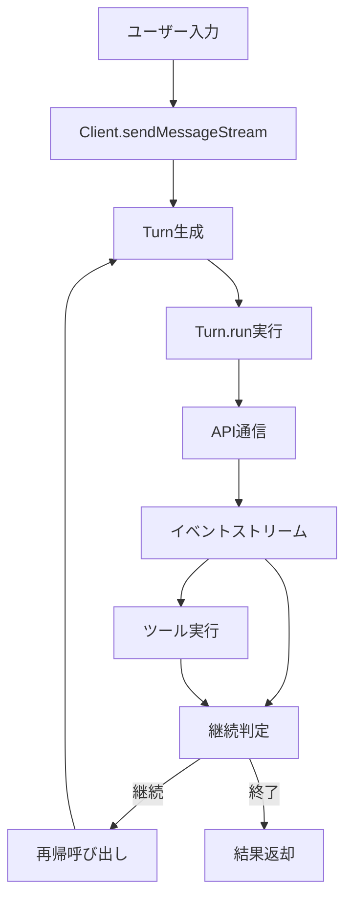
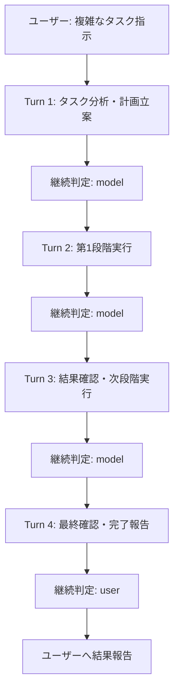

# LLM自律動作ReActループ完全解説：Gemini CLIエージェントシステムの詳細分析

## 目次
1. [ReActループの概念と理論](#react概念)
2. [Gemini CLIのアーキテクチャ概要](#アーキテクチャ概要)
3. [自律動作の核心：Turn-based ReActシステム](#turn-based-react)
4. [詳細実装解析](#詳細実装解析)
5. [プロンプトエンジニアリング戦略](#プロンプト戦略)
6. [具体的動作例](#動作例)
7. [システム制御メカニズム](#制御メカニズム)
8. [技術的考察と発展性](#技術考察)

---

## 1. ReActループの概念と理論 {#react概念}

### 1.1 ReAct（Reasoning + Acting）とは

ReActは「**Reasoning**（推論）」と「**Acting**（行動）」を組み合わせたLLMの行動パターンです。従来の単発的な質問応答とは異なり、以下のサイクルを継続的に実行します：

```
思考 → 行動（ツール使用） → 観察 → 思考 → 行動 → ...
```

### 1.2 従来の制限と解決策

**従来のLLC制限：**
- 単発的な応答で処理が完了
- 外部情報への直接アクセス不可
- 複数ステップのタスクを自律実行できない
- 実行結果に基づく動的な戦略変更が困難

**ReActによる解決：**
- **継続的思考**：各ステップで状況を再評価
- **ツール統合**：外部システムとの相互作用
- **自律判断**：次の行動を自己決定
- **適応的実行**：結果に基づく戦略修正

### 1.3 Gemini CLIのReAct実装の特徴

Gemini CLIは単純な`while`ループではなく、以下の高度な仕組みでReActを実現：

1. **Turn オブジェクト**による状態管理
2. **再帰呼び出し**による自然な継続
3. **LLM自己評価**による継続判定
4. **動的プロンプト生成**による文脈適応
5. **ストリーミング処理**によるリアルタイム応答

---

## 2. Gemini CLIのアーキテクチャ概要 {#アーキテクチャ概要}

### 2.1 システム全体構成

```
[ユーザー] ←→ [UI Layer] ←→ [Core Logic] ←→ [Gemini API]
                    ↓              ↓
               [Event System] [Tool System]
                    ↓              ↓
              [Stream Handler] [Tool Registry]
```

### 2.2 主要コンポーネント

| コンポーネント | 役割 | 実装ファイル |
|--------------|------|-------------|
| **Client** | メイン制御・再帰管理 | `client.ts` |
| **Turn** | 1サイクルの実行単位 | `turn.ts` |
| **GeminiChat** | API通信管理 | `gemini-chat.ts` |
| **ToolScheduler** | ツール実行制御 | `core-tool-scheduler.ts` |
| **NextSpeakerChecker** | 継続判定 | `nextSpeakerChecker.ts` |
| **PromptBuilder** | 動的プロンプト生成 | `prompts.ts` |

### 2.3 データフロー概要



---

## 3. 自律動作の核心：Turn-based ReActシステム {#turn-based-react}

### 3.1 Turnオブジェクトの概念

**Turn**は、ユーザーの1つの指示に対するAIの「一連の思考と行動」をカプセル化するオブジェクトです。

```typescript
class Turn {
  async* run(): AsyncGenerator<TurnEvent> {
    // 1回のReActサイクルを実行
    // APIとの通信、ツール実行要求、結果処理
  }
}
```

**Turnの特徴：**
- **状態保持**：現在の実行状況を管理
- **イベント生成**：進行状況をリアルタイムで通知
- **エラーハンドリング**：異常時の適切な処理
- **中断可能**：ユーザーによるキャンセル対応

### 3.2 再帰的継続メカニズム

Gemini CLIの自律性の核心は、`client.sendMessageStream`の**再帰呼び出し**にあります：

```typescript
async function* sendMessageStream(prompt: string): AsyncGenerator<Turn> {
  // 1. Turn生成・実行
  const turn = new Turn(prompt);
  yield* turn.run();
  
  // 2. 継続判定
  const nextSpeaker = await checkNextSpeaker();
  
  // 3. 再帰継続
  if (nextSpeaker?.speaker === 'model') {
    yield* sendMessageStream("Please continue."); // 再帰呼び出し
  }
}
```

### 3.3 継続判定の詳細メカニズム

#### 3.3.1 checkNextSpeaker関数

```typescript
async function checkNextSpeaker(): Promise<NextSpeakerResponse | null> {
  // 1. 現在の会話履歴を取得
  const history = chat.getHistory();
  
  // 2. 最後の発話者がAIかチェック
  if (lastSpeaker !== 'model') return null;
  
  // 3. 自己評価プロンプトを構築
  const evaluationPrompt = buildEvaluationPrompt(history);
  
  // 4. 軽量モデルで判定実行
  const response = await client.generateJson(evaluationPrompt, RESPONSE_SCHEMA);
  
  // 5. 結果を解析して返却
  return parseNextSpeakerResponse(response);
}
```

#### 3.3.2 自己評価プロンプト

```
あなたの直前の応答を分析してください。

# 分析対象
[現在の会話履歴]

# 判定基準
以下の場合は "model" を選択：
- タスクが未完了で追加の行動が必要
- ツール実行の結果を待っている
- ユーザーから明示的な指示があった

以下の場合は "user" を選択：
- タスクが完了した
- ユーザーの入力や確認が必要
- エラーが発生し、ユーザーの判断が必要

# 出力形式（JSON）
{
  "reasoning": "判断理由を詳細に説明",
  "next_speaker": "model" | "user"
}
```

### 3.4 完全な自律実行フロー



---

## 4. 詳細実装解析 {#詳細実装解析}

### 4.1 Client.sendMessageStream の詳細実装

```typescript
async function* sendMessageStream(
  prompt: string,
  context?: MessageContext
): AsyncGenerator<Turn> {
  try {
    // === 前処理 ===
    // 1. ループ検知システムをリセット
    loopDetectionService.resetState();
    
    // 2. 新しいTurnオブジェクトを生成
    const turn = new Turn({
      prompt,
      chat: this.chat,
      toolScheduler: this.toolScheduler,
      context
    });
    
    // === メイン処理 ===
    // 3. Turn実行（ストリーミング）
    yield* turn.run();
    
    // === 継続判定処理 ===
    // 4. 自律継続の判定
    const nextSpeakerResponse = await this.checkNextSpeaker();
    
    if (nextSpeakerResponse?.speaker === 'model') {
      // 5. 再帰的継続実行
      const continuationPrompt = "Please continue.";
      yield* this.sendMessageStream(continuationPrompt, {
        isContinuation: true,
        originalPrompt: prompt
      });
    }
    
  } catch (error) {
    // エラーハンドリング
    yield this.handleStreamError(error);
  }
}
```

### 4.2 Turn.run の詳細実装

```typescript
class Turn {
  async* run(): AsyncGenerator<TurnEvent> {
    try {
      // === チャット圧縮処理 ===
      const compressionResult = await this.tryCompressChat();
      if (compressionResult) {
        yield new CompressionEvent(compressionResult);
      }
      
      // === API通信開始 ===
      const stream = this.chat.sendMessageStream(this.prompt);
      
      // === ストリーム処理ループ ===
      for await (const chunk of stream) {
        // 中断チェック
        if (this.abortSignal?.aborted) {
          yield new UserCancelledEvent();
          return;
        }
        
        // レスポンス種別判定・イベント生成
        const event = this.processChunk(chunk);
        if (event) {
          yield event;
          
          // ツール実行要求の場合
          if (event instanceof ToolCallRequestEvent) {
            await this.scheduleToolCall(event);
          }
        }
      }
      
      // === 終了処理 ===
      yield new TurnFinishedEvent(this.getResult());
      
    } catch (error) {
      yield new TurnErrorEvent(error);
    }
  }
  
  private processChunk(chunk: GenerateContentStreamResult): TurnEvent | null {
    // Gemini APIレスポンスの解析
    const candidate = chunk.response.candidates?.[0];
    if (!candidate) return null;
    
    // 思考プロセス（Thinking）
    if (candidate.content.parts.some(part => part.thought)) {
      return new ThoughtEvent(part.thought);
    }
    
    // テキスト内容
    if (candidate.content.parts.some(part => part.text)) {
      return new ContentEvent(part.text);
    }
    
    // 関数呼び出し
    if (candidate.content.parts.some(part => part.functionCall)) {
      return new ToolCallRequestEvent({
        name: part.functionCall.name,
        args: part.functionCall.args
      });
    }
    
    // 終了理由
    if (candidate.finishReason) {
      return new FinishedEvent(candidate.finishReason);
    }
    
    return null;
  }
}
```

### 4.3 ツール実行システムの詳細

#### 4.3.1 CoreToolScheduler

```typescript
class CoreToolScheduler {
  async schedule(request: ToolCallRequest): Promise<void> {
    // 1. ツール取得・検証
    const tool = this.toolRegistry.getTool(request.name);
    const validatedArgs = this.validateToolParams(tool, request.args);
    
    // 2. 実行待ちキューに追加
    const call = new ToolCall({
      tool,
      args: validatedArgs,
      state: 'pending'
    });
    this.pendingCalls.push(call);
    
    // 3. ユーザー確認判定
    if (this.shouldConfirmExecute(tool)) {
      call.state = 'awaiting_approval';
      this.requestUserConfirmation(call);
    } else {
      call.state = 'scheduled';
      await this.executeScheduledCalls();
    }
  }
  
  private async executeScheduledCalls(): Promise<void> {
    const scheduledCalls = this.pendingCalls.filter(
      call => call.state === 'scheduled'
    );
    
    for (const call of scheduledCalls) {
      try {
        call.state = 'executing';
        
        // 非同期でツール実行
        const result = await call.tool.execute(call.args);
        
        call.state = 'success';
        call.result = result;
        
        // 結果をチャット履歴に追加
        this.addToolResultToHistory(call);
        
      } catch (error) {
        call.state = 'error';
        call.error = error;
      }
    }
  }
}
```

#### 4.3.2 ツール定義例

```typescript
class FileReadTool implements Tool {
  name = 'read_file';
  description = 'ファイルの内容を読み取ります';
  
  parameterSchema = {
    type: 'object',
    properties: {
      path: { 
        type: 'string', 
        description: '読み取るファイルのパス' 
      }
    },
    required: ['path']
  };
  
  async execute(args: { path: string }): Promise<string> {
    try {
      const content = await fs.readFile(args.path, 'utf-8');
      return `ファイル "${args.path}" の内容:\n${content}`;
    } catch (error) {
      throw new Error(`ファイル読み取りエラー: ${error.message}`);
    }
  }
}
```

### 4.4 チャット圧縮システム

```typescript
async function tryCompressChat(): Promise<CompressionResult | null> {
  // 1. 現在のトークン数計算
  const currentTokens = calculateTokenCount(this.chat.getHistory());
  const threshold = this.config.maxContextTokens * 0.7; // 70%で圧縮
  
  if (currentTokens < threshold) {
    return null; // 圧縮不要
  }
  
  // 2. 履歴を圧縮対象・保持対象に分割
  const { toCompress, toKeep } = this.splitHistory(0.3); // 古い30%を圧縮
  
  // 3. 圧縮実行
  const compressionPrompt = this.buildCompressionPrompt(toCompress);
  const summary = await this.client.generateContent(compressionPrompt);
  
  // 4. 新しいチャットセッション構築
  const newChat = this.buildNewChatSession({
    initialContext: this.config.systemPrompt,
    summary: summary,
    recentHistory: toKeep
  });
  
  // 5. 現在のチャットを置き換え
  this.chat = newChat;
  
  return {
    originalTokens: currentTokens,
    compressedTokens: calculateTokenCount(newChat.getHistory()),
    compressionRatio: summary.length / toCompress.length
  };
}
```

---

## 5. プロンプトエンジニアリング戦略 {#プロンプト戦略}

### 5.1 システムプロンプトの動的構築

```typescript
function getCoreSystemPrompt(context: SystemPromptContext): string {
  let prompt = BASE_SYSTEM_PROMPT;
  
  // === 環境適応セクション ===
  if (process.env.SANDBOX) {
    prompt += SANDBOX_SECTION;
  } else if (process.platform === 'darwin') {
    prompt += MACOS_SECTION;
  } else {
    prompt += GENERAL_ENVIRONMENT_SECTION;
  }
  
  // === Git環境セクション ===
  if (isGitRepository()) {
    prompt += GIT_REPOSITORY_SECTION;
  }
  
  // === ユーザーメモリセクション ===
  if (context.userMemory) {
    prompt += `\n---\n# User Memory\n${context.userMemory}`;
  }
  
  // === 動的コンテキスト情報 ===
  prompt += buildDynamicContext({
    currentDate: new Date().toISOString(),
    workingDirectory: process.cwd(),
    folderStructure: getFolderStructure(),
    availableTools: getAvailableToolsList()
  });
  
  return prompt;
}
```

### 5.2 基本システムプロンプトの構造

```markdown
# Core Mandates
あなたは高度なAIアシスタントです。以下の原則を厳守してください：

## 品質原則
- 既存プロジェクトの慣習・パターンに厳密に従う
- ライブラリやフレームワークの存在を勝手に仮定しない
- 変更前に必ず現状を理解する

## 安全原則
- 危険な操作の前に必ず説明する
- 重要ファイルの変更前にバックアップを推奨
- 不可逆的な操作には慎重に取り組む

# Primary Workflows

## ソフトウェアエンジニアリングタスク
1. **理解フェーズ**
   - プロジェクト構造の把握
   - 既存コードの分析
   - 依存関係の確認

2. **計画フェーズ**
   - タスクの分解
   - 実装手順の決定
   - 影響範囲の評価

3. **実装フェーズ**
   - 段階的な変更実施
   - テストの実行
   - 動作確認

4. **検証フェーズ**
   - 結果の確認
   - 副作用のチェック
   - 文書化

## 新規アプリケーション開発
[Similar structured approach...]

# Operational Guidelines

## 実行スタイル
- 簡潔で直接的なコミュニケーション
- 段階的アプローチ（一度に多くを変更しない）
- 結果の明確な報告

## ツール利用原則
- 絶対パスの使用を推奨
- 並列実行可能な操作は並列で実施
- エラー時の適切な報告とリカバリ提案

# Examples
以下はReAct形式での思考プロセス例です：

[具体的な思考→行動→観察の例を複数提示]
```

### 5.3 継続判定用プロンプト

```typescript
const CHECK_NEXT_SPEAKER_PROMPT = `
直前のあなたの応答を分析し、次に誰が行動すべきかを判断してください。

# 現在の会話履歴
${conversationHistory}

# 判定ガイドライン

**"model"を選択する場合：**
- タスクが部分的にしか完了していない
- ツール実行の結果を分析し次のアクションが必要
- ユーザーから「続けて」「もっと」等の継続指示
- エラー修正のため追加作業が必要
- 複数段階のプロセスで次の段階に進む必要

**"user"を選択する場合：**
- 要求されたタスクが完全に完了
- ユーザーの判断・確認・新しい指示が必要
- 重大なエラーが発生し、ユーザーの判断が必要
- 「完了しました」「いかがでしょうか？」で終わっている

# 応答形式
以下のJSON形式で応答してください：
{
  "reasoning": "判断理由の詳細な説明",
  "next_speaker": "model" | "user"
}
`;
```

### 5.4 チャット圧縮用プロンプト

```typescript
function getCompressionPrompt(historyToCompress: ChatMessage[]): string {
  return `
これまでの会話履歴を分析し、重要な情報を構造化して要約してください。

# 圧縮対象の履歴
${formatHistory(historyToCompress)}

# 要約方針
以下の情報を保持してください：
- ユーザーの主要な要求・目標
- 実行済みのアクション・変更内容
- 発見した重要な事実・データ
- 現在の状態・進捗状況
- 後続の作業に影響する情報

# 出力形式
<state_snapshot>
  <user_goals>
    [ユーザーの主要な目標・要求]
  </user_goals>
  
  <completed_actions>
    [実行済みのアクション一覧]
  </completed_actions>
  
  <current_state>
    [現在の状態・設定・環境]
  </current_state>
  
  <important_findings>
    [重要な発見・データ・事実]
  </important_findings>
  
  <next_considerations>
    [今後の作業で考慮すべき事項]
  </next_considerations>
</state_snapshot>
`;
}
```

---

## 6. 具体的動作例 {#動作例}

### 6.1 シナリオ：Webアプリケーションの作成

**ユーザー入力：**
```
"Node.jsとExpressでTODOアプリを作成して、テストも含めて完全に動作する状態にしてください"
```

**Turn 1: 分析・計画立案**

```
[思考]
ユーザーはTODOアプリの完全な作成を要求している。
これは複数段階のプロセスが必要：
1. プロジェクト構造の設計
2. 依存関係の設定
3. サーバー実装
4. テスト作成
5. 動作確認

まず現在の環境を確認し、プロジェクト構造を設計する。

[行動]
ls() - 現在のディレクトリ構造を確認
```

```json
継続判定結果: {
  "reasoning": "プロジェクトの設計段階が完了したが、実装はまだ開始していない。次は package.json の作成から始める必要がある。",
  "next_speaker": "model"
}
```

**Turn 2: プロジェクト初期化**

```
[思考]
現在のディレクトリが空であることを確認した。
TODOアプリのための基本構造を作成する。

[行動]
write_file({
  path: "package.json",
  content: {
    "name": "todo-app",
    "version": "1.0.0",
    "description": "A simple TODO application with Express",
    "main": "server.js",
    "scripts": {
      "start": "node server.js",
      "dev": "nodemon server.js",
      "test": "jest"
    },
    "dependencies": {
      "express": "^4.18.2",
      "cors": "^2.8.5"
    },
    "devDependencies": {
      "jest": "^29.5.0",
      "supertest": "^6.3.3",
      "nodemon": "^2.0.22"
    }
  }
})
```

```json
継続判定結果: {
  "reasoning": "package.json を作成したが、まだサーバーファイル、テストファイル、依存関係のインストールが必要。継続して実装を進める。",
  "next_speaker": "model"
}
```

**Turn 3: サーバー実装**

```
[思考]
次はExpressサーバーの実装。
RESTful APIでTODO操作を提供する。

[行動]
write_file({
  path: "server.js",
  content: `
const express = require('express');
const cors = require('cors');

const app = express();
const PORT = process.env.PORT || 3000;

// Middleware
app.use(cors());
app.use(express.json());

// In-memory storage for simplicity
let todos = [];
let nextId = 1;

// Routes
app.get('/todos', (req, res) => {
  res.json(todos);
});

app.post('/todos', (req, res) => {
  const { title, description } = req.body;
  
  if (!title) {
    return res.status(400).json({ error: 'Title is required' });
  }
  
  const todo = {
    id: nextId++,
    title,
    description: description || '',
    completed: false,
    createdAt: new Date().toISOString()
  };
  
  todos.push(todo);
  res.status(201).json(todo);
});

// ... 他のCRUD操作

if (require.main === module) {
  app.listen(PORT, () => {
    console.log(\`Server is running on port \${PORT}\`);
  });
}

module.exports = app;
`
})
```

**Turn 4: テスト実装**

```
[思考]
サーバー実装が完了。次はテストを作成して品質を保証する。

[行動]
write_file({
  path: "server.test.js",
  content: `
const request = require('supertest');
const app = require('./server');

describe('TODO API', () => {
  test('GET /todos should return empty array initially', async () => {
    const response = await request(app).get('/todos');
    expect(response.status).toBe(200);
    expect(response.body).toEqual([]);
  });
  
  test('POST /todos should create a new todo', async () => {
    const newTodo = {
      title: 'Test Todo',
      description: 'This is a test todo'
    };
    
    const response = await request(app)
      .post('/todos')
      .send(newTodo);
      
    expect(response.status).toBe(201);
    expect(response.body.title).toBe(newTodo.title);
    expect(response.body.id).toBeDefined();
  });
  
  // ... 他のテストケース
});
`
})
```

**Turn 5: 依存関係インストール・動作確認**

```
[思考]
テストが作成された。最後に依存関係をインストールしてテストを実行し、
動作を確認する。

[行動]
run_command("npm install")
```

```
[観察]
依存関係のインストールが完了。

[行動]
run_command("npm test")
```

```
[観察]
テストが全て通過。

[行動]
run_command("npm start &")
run_command("curl http://localhost:3000/todos")
```

```json
継続判定結果: {
  "reasoning": "TODOアプリの作成、テスト、動作確認が全て完了した。ユーザーの要求は満たされており、動作する状態になっている。",
  "next_speaker": "user"
}
```

**最終報告：**
```
TODOアプリケーションの作成が完了しました。

実装内容：
✅ Express.jsベースのRESTful API
✅ CRUD操作（作成、読み取り、更新、削除）
✅ Jestによる包括的テストスイート
✅ 動作確認済み

利用方法：
- `npm start` でサーバー開始
- `npm test` でテスト実行
- `npm run dev` で開発モード（自動再起動）

API エンドポイント：
- GET /todos - 全TODO取得
- POST /todos - TODO作成
- PUT /todos/:id - TODO更新
- DELETE /todos/:id - TODO削除

テストは全て通過しており、サーバーは正常に動作しています。
```

### 6.2 動作分析

この例では、以下のReActの特徴が表れています：

1. **自律的な段階分解**：複雑なタスクを適切な段階に分解
2. **継続的な判断**：各段階で次に必要な作業を自己判定
3. **適応的実行**：実行結果に基づく次の行動決定
4. **品質保証**：テスト作成・実行による確実性の確保
5. **完了判定**：全体目標の達成を自己評価

---

## 7. システム制御メカニズム {#制御メカニズム}

### 7.1 ループ検知システム

```typescript
class LoopDetectionService {
  private recentActions: string[] = [];
  private readonly MAX_RECENT_ACTIONS = 10;
  private readonly LOOP_THRESHOLD = 3;
  
  checkForLoop(action: string): boolean {
    this.recentActions.push(action);
    
    if (this.recentActions.length > this.MAX_RECENT_ACTIONS) {
      this.recentActions.shift();
    }
    
    // 同じアクションの繰り返し検知
    const actionCount = this.recentActions.filter(a => a === action).length;
    
    if (actionCount >= this.LOOP_THRESHOLD) {
      this.handleLoopDetection(action);
      return true;
    }
    
    return false;
  }
  
  private handleLoopDetection(action: string): void {
    // ループ検知時の処理
    throw new LoopDetectionError(`
      無限ループを検知しました: "${action}"
      同じアクションが${this.LOOP_THRESHOLD}回繰り返されています。
      異なるアプローチを試してください。
    `);
  }
}
```

### 7.2 エラーハンドリング・リカバリ

```typescript
class TurnErrorHandler {
  async handleError(error: Error, context: TurnContext): Promise<TurnEvent> {
    // エラー分類・適切な処理
    if (error instanceof APILimitError) {
      return this.handleAPILimitError(error, context);
    }
    
    if (error instanceof ToolExecutionError) {
      return this.handleToolError(error, context);
    }
    
    if (error instanceof LoopDetectionError) {
      return this.handleLoopError(error, context);
    }
    
    // 一般的なエラー処理
    return new TurnErrorEvent({
      error,
      suggestion: this.generateRecoverySuggestion(error, context),
      canContinue: this.assessContinuability(error)
    });
  }
  
  private generateRecoverySuggestion(error: Error, context: TurnContext): string {
    // エラー内容・コンテキストに基づく復旧提案
    return `
エラーが発生しました: ${error.message}

推奨される対処法：
${this.getContextualSuggestions(error, context)}

このエラーは一時的な問題の可能性があります。
しばらく待ってから再試行するか、異なるアプローチを試してください。
    `;
  }
}
```

### 7.3 リソース管理

```typescript
class ResourceManager {
  private tokenUsage: TokenUsageTracker;
  private apiCallLimiter: APICallLimiter;
  private memoryMonitor: MemoryMonitor;
  
  async checkResourceLimits(): Promise<ResourceStatus> {
    const status = {
      tokens: await this.tokenUsage.getCurrentUsage(),
      apiCalls: await this.apiCallLimiter.getCurrentRate(),
      memory: await this.memoryMonitor.getCurrentUsage()
    };
    
    // リソース制限の確認・警告
    if (status.tokens.remaining < 1000) {
      throw new ResourceLimitError('Token limit approaching');
    }
    
    if (status.apiCalls.remaining < 5) {
      throw new ResourceLimitError('API rate limit approaching');
    }
    
    return status;
  }
  
  async optimizeResourceUsage(): Promise<void> {
    // 自動最適化処理
    await this.compressLongHistories();
    await this.cleanupUnusedResources();
    await this.adjustRequestPriorities();
  }
}
```

### 7.4 セキュリティ制御

```typescript
class SecurityController {
  private dangerousCommands = [
    'rm -rf', 'format', 'delete', 'drop table',
    'sudo', 'chmod 777', 'mv /*'
  ];
  
  async validateToolExecution(tool: Tool, args: any): Promise<SecurityCheck> {
    // 危険なコマンド検知
    if (this.isDangerousCommand(tool, args)) {
      return {
        approved: false,
        requiresConfirmation: true,
        warningMessage: this.generateSecurityWarning(tool, args)
      };
    }
    
    // ファイルシステムアクセス検証
    if (tool.category === 'filesystem') {
      return await this.validateFileSystemAccess(args);
    }
    
    // ネットワークアクセス検証
    if (tool.category === 'network') {
      return await this.validateNetworkAccess(args);
    }
    
    return { approved: true };
  }
  
  private generateSecurityWarning(tool: Tool, args: any): string {
    return `
⚠️  危険な操作が検出されました

ツール: ${tool.name}
引数: ${JSON.stringify(args, null, 2)}

この操作は以下の影響を与える可能性があります：
${this.assessImpact(tool, args)}

実行を継続しますか？
    `;
  }
}
```

---

## 8. 技術的考察と発展性 {#技術考察}

### 8.1 ReActループの利点と制限

#### 利点

1. **自律性の実現**
   - ユーザーの継続的な指示なしに複雑なタスクを実行
   - 動的な状況変化への適応

2. **品質の向上**
   - 各段階での検証・確認による品質保証
   - エラー発生時の適切なリカバリ

3. **透明性の確保**
   - 思考プロセスのリアルタイム表示
   - 実行内容の詳細な記録

4. **柔軟性の提供**
   - 異なるタスクタイプへの適応
   - ユーザーの介入・修正の受け入れ

#### 制限と課題

1. **計算コストの増大**
   - 継続判定のための追加API呼び出し
   - 長期実行時のトークン消費

2. **無限ループのリスク**
   - 不適切な継続判定による終了しないループ
   - リソース枯渇の可能性

3. **予測可能性の低下**
   - 自律的判断による予期しない動作
   - デバッグの困難さ

### 8.2 パフォーマンス最適化戦略

#### 効率的な継続判定

```typescript
class OptimizedNextSpeakerChecker {
  private judgmentCache = new Map<string, NextSpeakerResponse>();
  
  async checkNextSpeaker(): Promise<NextSpeakerResponse | null> {
    // 履歴の要約・キャッシュキー生成
    const historyHash = this.generateHistoryHash();
    
    // キャッシュヒット確認
    if (this.judgmentCache.has(historyHash)) {
      return this.judgmentCache.get(historyHash);
    }
    
    // 軽量な事前判定
    const quickAssessment = this.performQuickAssessment();
    if (quickAssessment.confidence > 0.9) {
      return quickAssessment.result;
    }
    
    // フルLLM評価
    const result = await this.performFullEvaluation();
    this.judgmentCache.set(historyHash, result);
    
    return result;
  }
  
  private performQuickAssessment(): { confidence: number, result: NextSpeakerResponse } {
    // ルールベースの高速判定
    const lastMessage = this.getLastMessage();
    
    // 明確な終了表現
    if (lastMessage.includes('完了しました') || lastMessage.includes('いかがでしょうか')) {
      return { confidence: 0.95, result: { speaker: 'user' } };
    }
    
    // 明確な継続表現
    if (lastMessage.includes('続いて') || lastMessage.includes('次に')) {
      return { confidence: 0.9, result: { speaker: 'model' } };
    }
    
    return { confidence: 0.0, result: null };
  }
}
```

#### 適応的チャット圧縮

```typescript
class AdaptiveCompressionManager {
  async optimizeCompression(history: ChatMessage[]): Promise<CompressionStrategy> {
    // 会話内容の分析
    const analysis = this.analyzeConversationContent(history);
    
    // 圧縮戦略の選択
    if (analysis.isCodeHeavy) {
      return new CodeFocusedCompression();
    }
    
    if (analysis.isDataAnalysis) {
      return new DataPreservingCompression();
    }
    
    if (analysis.isCreativeWriting) {
      return new ContextPreservingCompression();
    }
    
    return new GeneralCompression();
  }
  
  private analyzeConversationContent(history: ChatMessage[]): ConversationAnalysis {
    const codeBlockCount = this.countCodeBlocks(history);
    const dataTableCount = this.countDataTables(history);
    const creativeWordCount = this.countCreativeWords(history);
    
    return {
      isCodeHeavy: codeBlockCount > history.length * 0.3,
      isDataAnalysis: dataTableCount > 5,
      isCreativeWriting: creativeWordCount > history.length * 0.2
    };
  }
}
```

### 8.3 将来の発展可能性

#### 1. マルチエージェント協調

```typescript
class MultiAgentOrchestrator {
  private agents: Map<string, Agent> = new Map();
  
  async delegateTask(task: ComplexTask): Promise<TaskResult> {
    // タスクを専門エージェントに分散
    const subtasks = this.decomposeTask(task);
    const assignments = this.assignToSpecializedAgents(subtasks);
    
    // 並列実行・結果統合
    const results = await Promise.all(
      assignments.map(assignment => assignment.agent.execute(assignment.task))
    );
    
    return this.integrateResults(results);
  }
}
```

#### 2. 学習・改善機能

```typescript
class LearningSystem {
  async learnFromExecution(execution: ExecutionHistory): Promise<void> {
    // 実行パターンの分析
    const patterns = this.extractPatterns(execution);
    
    // 成功・失敗要因の特定
    const insights = this.generateInsights(patterns);
    
    // プロンプト・戦略の改良
    await this.updateStrategies(insights);
  }
  
  private updateStrategies(insights: ExecutionInsights): Promise<void> {
    // 動的プロンプト改良
    // 継続判定ロジック調整
    // ツール選択戦略改善
  }
}
```

#### 3. 外部システム統合

```typescript
class ExternalSystemIntegration {
  async integrateWithWorkflow(workflowEngine: WorkflowEngine): Promise<void> {
    // 既存ワークフローとの連携
    workflowEngine.registerAIAgent(this);
    
    // 人間-AI協調プロセスの構築
    this.setupHumanAICollaboration();
    
    // リアルタイム状況認識
    this.enableRealtimeSituationAwareness();
  }
}
```

---

## まとめ

Gemini CLIのReActループシステムは、以下の革新的な要素により、従来のLLMの制限を克服し、真の自律的AIエージェントを実現しています：

### 核心技術
1. **Turn-based アーキテクチャ**：状態管理とイベント駆動による制御
2. **再帰的継続メカニズム**：自然な思考の連続性を実現
3. **LLM自己評価システム**：継続判定の自動化
4. **動的プロンプト生成**：文脈に応じた適応的指示
5. **ハイブリッド制御**：プロンプト指示とコード制御の統合

### 実現される価値
- **自律性**：複雑なタスクの無人実行
- **適応性**：動的状況変化への対応
- **信頼性**：多層的な安全機構
- **透明性**：思考プロセスの可視化
- **拡張性**：新しい能力の追加容易性

このシステムは、単なるチャットボットを超えた、真のAIアシスタント・協働パートナーへの道を示しており、将来のAI駆動型自動化システムの基盤技術として大きな可能性を持っています。

ReActループの継続的な改良と最適化により、より高度で実用的なAIエージェントシステムの実現が期待されます。